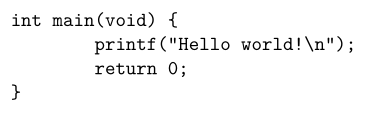
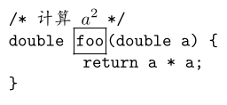
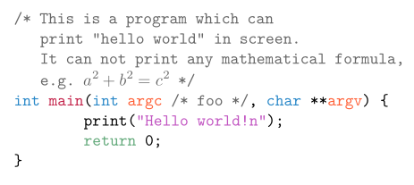

---
title: Awk：面向文本编程
subtitle:
abstract: 专业的事，交给专业的工具。
date: 02 月 15 日
...

# 前言

很多年后，我可能又一次不知道 Awk 的用法，就像此刻的你。

Awk 是小语言，能做很多小事。用 Awk 的人像农夫，平素话少，在一片土地上做着很多小事。文本，是 Awk 耕作的土地。人类不喜欢土地，故而不喜欢当农夫。人类也不喜欢文本，故而喜欢使用微软或金山的一系列办公软件和甲骨文公司的数据库，以取得与高楼大厦，宝马香车，西装革履，笙歌燕舞密切的联系，令人觉得先进，而在土地上耕作的生活，是落后的，徒劳的。

在现代化进程下，大多数时候，有一些小事，我们做不好，甚至不会做了，于是觉得这些都是小事，不会做又有何妨？这是不扫一屋也能扫天下的时代，只是想时常吃到让人放心的萝卜青菜，粗茶淡饭，却愈发变成奢求了。

应该庆幸，土地还在，耕种土地的方法还在。只要愿意花点时间，学会如何做耕种方面的一些小事，身心便可得到有益的滋养。这就是在这次学习 Awk 语言的过程中，我颇为认真写下这份笔记的原因，并希望许多年后，我还知道 Awk 怎么用。

# Awk 教程

本文档只是 Awk 语言的学习笔记，并非面面俱到的教程。我曾经写过一篇文章，介绍了 Awk 语言的基本用法，详见「[Awk 小传](https://segmentfault.com/a/1190000016745490)」。

若需要更完整且更好的教程，请阅读 Awk 语言的三位作者所著的《The Awk programming language》。这是一本很薄的书，200 多页，第一版发布于 1988 年，第二版发布于 2023 年。这本书并非只是讲述如何使用 Awk 语言编写程序——这部分内容在全书只占不到 1/3，它更多地是基于 Awk 语言描述了数据库、虚拟机、编译器以及排序算法等计算机科学中的基本原理。在国内，不仅 Awk 语言长期被低估和冷落，这本书则更是被低估和冷落，出版社从未组织翻译。该书的第一版，近年有爱好者翻译并公开，详见「<https://github.com/wuzhouhui/awk>」。

GNU 所实现的 gawk，其文档「<https://www.gnu.org/software/gawk/manual/>」内容丰富，面面俱到，在涉及 Awk 语言细节时，可作为手册查阅。

# 选择 gawk

Awk 语言的解释器有多种实现，除 Awk 语言的作者实现的 awk 之外，还有 GNU 项目 gawk，运行速度很快的 mawk 以及面向嵌入式系统的 BusyBox 环境中的 awk 等。在众多 Linux 发行版中，gawk 最为常用，只有 Debian (版本 > 6.0) / Ubuntu (版本 > 12.04) 及其衍生版本的 Linux 系统默认使用 mawk。

若不清楚自己所用的 awk 是哪个实现，可执行以下命令

```console
$ awk --version
```

然后查看该命令的输出信息。

对于 Debian/Ubuntu 及其衍生版本的 Linux 系统，若确定 awk 并非 gawk，而是 mawk，将 gawk 设为默认 awk 最简单的方法是：

```console
$ sudo apt remove mawk
$ sudo apt install gawk
```

若希望保持多个不同的 awk 实现，可使用以下命令选择 gawk 个作为默认 awk：

```console
$ sudo update-alternatives --config awk
```

更推荐 gawk 作为默认 awk 的原因是，gawk 对 Awk 语言进行了扩展，使得 Awk 语言在处理文本时更为简便。本文档中出现的 Awk 程序皆面向 gawk，但是尽量保持与 mawk 的兼容并同时指出 gawk 对 Awk 语言的扩展之处。

# Hello world!

使用 Awk 语言编写的每个程序（脚本），都假设有一份要处理的文本，故而 Awk 程序通常用以下方式执行：

```console
$ awk -f 脚本 文本文件
```

实际上，每个 Awk 程序都可以组织成以下形式：

```awk
BEGIN {...}
模式 {动作}
END {...}
```

其中，`模式 {动作}` 部分用于处理文本，而 `BEGIN` 和 `END` 块的运行时机分别是处理文本之前和结束。

倘若只在 `BEGIN` 块中写一些代码，Awk 脚本便可在无文本要处理的情况下得以运行，例如以下 Awk 脚本 hello.awk：

```awk
BEGIN {
    print "Hello world!"
}
```

执行 hello.awk 的命令是

```console
$ awk -f hello.awk
Hello world!
```

也可以将 Awk 程序写成 Shell 脚本的形式。例如，上述 Awk 语言的 Hello world 程序，可改写为 Bash 脚本 hello.sh：

```bash
#!/bin/bash
awk 'BEGIN {
    print "Hello world!"
}'
```

以下命令可为 hello.sh 添加可执行权限（让该脚本可以像程序一样运行的权限）并运行它：

```console
$ chmod +x hello.sh
$ ./hello.sh
Hello world!
```

# 源码渲染

使用 ConTeXt（若不了解 ConTeXt，可阅读《[ConTeXt 笔记](https://github.com/liyanrui/ConTeXt-notes)》）排版含有程序源码的文档时，由于 ConTeXt 用于排版源码的命令 `\starttyping ... \stoptyping` 在源码渲染方面对编程语言支持的种类过少，例如不支持 C 语言，故而只能将代码中的所有文字渲染为单一颜色。例如以下 C 语言源码：

```plain
\starttyping
int main(void) {
        printf("Hello world!\n");
        return 0;
}
\stoptyping
```

上述代码对应的 ConTeXt 排版结果如下图所示：




ConTeXt 提供了[源码渲染机制](https://segmentfault.com/a/1190000043405105)，用户可通过 Lua 语言的 lpeg 库，对能够以 BNF（巴科斯范式） 形式描述的语言进行解析，从而实现该语言的源码渲染。这种解析方式存在一个问题，它会导致无法在 `\starttyping ... \stoptyping` 环境中实现 TeX 逃逸。例如，以下代码以 TeX 逃逸的方式实现了在源码中排版数学公式：

```plain
\starttyping[escape=yes]
/* 计算 /BTEX $a^2$ /ETEX */
double /BTEX\inframed{foo}/ETEX(double a) {
        return a * a;
}
\stoptyping
```

排版结果为



在很多情况下，我既需要渲染源码，也需要在源码中插入以 TeX 逃逸方式实现的排版效果，二者如何兼得呢？很简单，只需以 TeX 逃逸的方式对源码进行渲染即可。只是含有 TeX 逃逸的源码会破坏源码所属编程语言的 BNF，无法再通过语法分析的方式渲染源码。事实上，这也是 ConTeXt 的源码渲染机制与 TeX 逃逸存在冲突的根源。我想出来的方案是不必强求语法的方案，如下：

* 渲染注释
* 渲染含有特殊标记的片段。
* 渲染字符串；
* 渲染基本类型；
* 渲染关键词；

上述方案中第 2 条，特殊标记是我自行定义的标记。例如

```plain
\starttyping
/* 计算 \m{a^2} */
double \fn{foo}(double \p{a}) {
        return a * a;
}
\stoptyping
```

上述代码中的 `\m{...}`，`\fn{...}` 以及 `\p{...}` 便是特殊标记，分别用于表示数学公式、函数名和参数名。在源码渲染过程中，若遇到特殊标记，便将其转化为相应的 TeX 逃逸语句。下面，用 Awk 语言实现上述方案。

首先，定义颜色映射文件：

<pre id="c-color.map" class="orez-snippet-with-name">
<span class="orez-snippet-name">@ c-color.map #</span>
basic_type: GreenBlue
keyword: ForestGreen
string: Fuchsia
comment: darkgray
\fn: Maroon
\t: GreenBlue
\p:OutrageousOrange
\c: darkgray
</pre>

简单起见，只为关键字、字符串、注释、函数名（\fn）、自定义类型（\t）、函数参数名（\p）以及语句内嵌注释（\c）定义了颜色。若日后需要更多的特殊标记，可对 c-color.map 进行扩充。

在 Awk 程序的 `BEGIN` 块读入颜色文件，将其内容转化为 Awk 数组 color，并定义 C 语言的基本类型和常见关键词：

<pre id="c-render.awk1" class="orez-snippet-with-name">
<span class="orez-snippet-name">@ c-render.awk #</span>
<span class="nb">BEGIN</span> <span class="p">{</span>
    <span class="nb">FS</span> <span class="o">=</span> <span class="s2">&quot;:&quot;</span>
    <span class="k">while</span> <span class="p">(</span><span class="kr">getline</span> <span class="o">&lt;</span><span class="s2">&quot;c-color.map&quot;</span> <span class="o">&gt;</span> <span class="mi">0</span><span class="p">)</span> <span class="p">{</span>
        <span class="kr">gsub</span><span class="p">(</span><span class="sr">/[ \t]+/</span><span class="p">,</span> <span class="s2">&quot;&quot;</span><span class="p">,</span> <span class="o">$</span><span class="mi">1</span><span class="p">)</span> <span class="c1"># 去除特殊标记的前后空白字符</span>
        <span class="kr">gsub</span><span class="p">(</span><span class="sr">/[ \t]+/</span><span class="p">,</span> <span class="s2">&quot;&quot;</span><span class="p">,</span> <span class="o">$</span><span class="mi">2</span><span class="p">)</span> <span class="c1"># 去除颜色名的前后空白字符</span>
        <span class="nx">color</span><span class="p">[</span><span class="o">$</span><span class="mi">1</span><span class="p">]</span> <span class="o">=</span> <span class="o">$</span><span class="mi">2</span>
    <span class="p">}</span>
    <span class="nb">FS</span> <span class="o">=</span> <span class="s2">&quot; &quot;</span>
    <span class="nx">basic_types</span> <span class="o">=</span> <span class="s2">&quot;char|double|enum|float|int|long|short|signed|struct|union|unsigned|void|const&quot;</span>
    <span class="nx">keywords</span> <span class="o">=</span> <span class="s2">&quot;static|typedef|sizeof|break|case|continue|default|do|else|for|goto|if|return|switch|while&quot;</span>
<span class="p">}</span>
</pre>

然后，探测 ConTeXt 源文件中源码排版区域，

<pre id="c-render.awk2" class="orez-snippet-with-name">
<span class="orez-snippet-name">@ c-render.awk #</span>  <span class="orez-symbol">+</span>
<span class="sr">/\\starttyping/</span> <span class="p">{</span> <span class="nx">typing</span> <span class="o">=</span> <span class="mi">1</span><span class="p">;</span> <span class="kr">print</span><span class="p">;</span> <span class="kr">next</span><span class="p">}</span>
</pre>

在源码排版区域，先对源码中的注释部分进行渲染，以防注释文本中出现与其他被渲染的元素相同的文本而被污染：

<pre id="c-render.awk3" class="orez-snippet-with-name">
<span class="orez-snippet-name">@ c-render.awk #</span>  <span class="orez-symbol">+</span>
<span class="nx">typing</span> <span class="o">&amp;&amp;</span> <span class="sr">/\/\*/</span> <span class="p">{</span>
    <span class="k">if</span> <span class="p">(</span><span class="o">!</span><span class="sr">/\*\//</span><span class="p">)</span> <span class="nx">in_comment</span> <span class="o">=</span> <span class="mi">1</span>
    <span class="kr">gsub</span><span class="p">(</span><span class="sr">/\/\*.*/</span><span class="p">,</span> <span class="s2">&quot;/BTEX\\color[&quot;</span> <span class="nx">color</span><span class="p">[</span><span class="s2">&quot;comment&quot;</span><span class="p">]</span> <span class="s2">&quot;]{&amp;}/ETEX&quot;</span><span class="p">)</span>
    <span class="o">$</span><span class="mi">0</span> <span class="o">=</span> <span class="kr">gensub</span><span class="p">(</span><span class="sr">/\\m{([^}]+)}/</span><span class="p">,</span> <span class="s2">&quot;\\\\m{\\1}&quot;</span><span class="p">,</span> <span class="s2">&quot;g&quot;</span><span class="p">)</span> <span class="c1"># 数学公式</span>
    <span class="kr">print</span><span class="p">;</span> <span class="kr">next</span>
<span class="p">}</span>
<span class="nx">typing</span> <span class="o">&amp;&amp;</span> <span class="nx">in_comment</span> <span class="p">{</span>
    <span class="k">if</span> <span class="p">(</span><span class="sr">/\*\//</span><span class="p">)</span> <span class="nx">in_comment</span> <span class="o">=</span> <span class="mi">0</span>
    <span class="kr">gsub</span><span class="p">(</span><span class="sr">/[^ \t].*/</span><span class="p">,</span> <span class="s2">&quot;/BTEX\\color[&quot;</span> <span class="nx">color</span><span class="p">[</span><span class="s2">&quot;comment&quot;</span><span class="p">]</span> <span class="s2">&quot;]{&amp;}/ETEX&quot;</span><span class="p">)</span>
    <span class="o">$</span><span class="mi">0</span> <span class="o">=</span> <span class="kr">gensub</span><span class="p">(</span><span class="sr">/\\m{([^}]+)}/</span><span class="p">,</span> <span class="s2">&quot;\\\\m{\\1}&quot;</span><span class="p">,</span> <span class="s2">&quot;g&quot;</span><span class="p">)</span> <span class="c1"># 数学公式</span>
    <span class="kr">print</span><span class="p">;</span> <span class="kr">next</span>
<span class="p">}</span>
</pre>

上述代码可对单行和多行注释进行渲染，渲染完成后，使用 `next` 让主循环无需执行后续的模式-动作语句，提前进入下一次循环。

接下来，渲染 C 语句及内嵌注释：

<pre id="c-render.awk4" class="orez-snippet-with-name">
<span class="orez-snippet-name">@ c-render.awk #</span>  <span class="orez-symbol">+</span>
<span class="nx">typing</span> <span class="p">{</span>
    <span class="c1"># 渲染函数名</span>
    <span class="o">$</span><span class="mi">0</span> <span class="o">=</span> <span class="kr">gensub</span><span class="p">(</span><span class="sr">/\\fn{([^}]+)}/</span><span class="p">,</span> <span class="s2">&quot;/BTEX\\\\color[&quot;</span> <span class="nx">color</span><span class="p">[</span><span class="s2">&quot;\\fn&quot;</span><span class="p">]</span> <span class="s2">&quot;]{\\1}/ETEX&quot;</span><span class="p">,</span> <span class="s2">&quot;g&quot;</span><span class="p">)</span>
    <span class="c1"># 渲染函数参数类型</span>
    <span class="o">$</span><span class="mi">0</span> <span class="o">=</span> <span class="kr">gensub</span><span class="p">(</span><span class="sr">/\\t{([^}]+)}/</span><span class="p">,</span> <span class="s2">&quot;/BTEX\\\\color[&quot;</span> <span class="nx">color</span><span class="p">[</span><span class="s2">&quot;\\t&quot;</span><span class="p">]</span> <span class="s2">&quot;]{\\1}/ETEX&quot;</span><span class="p">,</span> <span class="s2">&quot;g&quot;</span><span class="p">)</span>
    <span class="c1"># 渲染函数参数</span>
    <span class="o">$</span><span class="mi">0</span> <span class="o">=</span> <span class="kr">gensub</span><span class="p">(</span><span class="sr">/\\p{([^}]+)}/</span><span class="p">,</span> <span class="s2">&quot;/BTEX\\\\color[&quot;</span> <span class="nx">color</span><span class="p">[</span><span class="s2">&quot;\\p&quot;</span><span class="p">]</span> <span class="s2">&quot;]{\\1}/ETEX&quot;</span><span class="p">,</span> <span class="s2">&quot;g&quot;</span><span class="p">)</span>
    <span class="c1"># 渲染语句内嵌入的注释</span>
    <span class="o">$</span><span class="mi">0</span> <span class="o">=</span> <span class="kr">gensub</span><span class="p">(</span><span class="sr">/\\c{([^}]+)}/</span><span class="p">,</span> <span class="s2">&quot;/BTEX\\\\color[&quot;</span> <span class="nx">color</span><span class="p">[</span><span class="s2">&quot;\\c&quot;</span><span class="p">]</span> <span class="s2">&quot;]{/* \\1 */}/ETEX&quot;</span><span class="p">,</span> <span class="s2">&quot;g&quot;</span><span class="p">)</span>
    <span class="c1"># 渲染字符串常量</span>
    <span class="k">if</span> <span class="p">(</span><span class="sr">/&quot;[^&quot;]*&quot;/</span><span class="p">)</span> <span class="p">{</span>
        <span class="c1"># 处理反斜线</span>
        <span class="kr">gsub</span><span class="p">(</span><span class="sr">/\\/</span><span class="p">,</span> <span class="s2">&quot;\\backslash &quot;</span><span class="p">)</span>
        <span class="kr">gsub</span><span class="p">(</span><span class="sr">/&quot;[^&quot;]*&quot;/</span><span class="p">,</span> <span class="s2">&quot;/BTEX\\color[&quot;</span> <span class="nx">color</span><span class="p">[</span><span class="s2">&quot;string&quot;</span><span class="p">]</span> <span class="s2">&quot;]{&amp;}/ETEX&quot;</span><span class="p">)</span>
    <span class="p">}</span>
    <span class="c1"># 渲染基本类型</span>
    <span class="kr">gsub</span><span class="p">(</span><span class="s2">&quot;\\&lt;(&quot;</span> <span class="nx">basic_types</span> <span class="s2">&quot;)\\&gt;&quot;</span><span class="p">,</span> <span class="s2">&quot;/BTEX\\color[&quot;</span> <span class="nx">color</span><span class="p">[</span><span class="s2">&quot;basic_type&quot;</span><span class="p">]</span> <span class="s2">&quot;]{&amp;}/ETEX&quot;</span><span class="p">)</span>
    <span class="c1"># 渲染关键词</span>
    <span class="kr">gsub</span><span class="p">(</span><span class="s2">&quot;\\&lt;(&quot;</span> <span class="nx">keywords</span> <span class="s2">&quot;)\\&gt;&quot;</span><span class="p">,</span> <span class="s2">&quot;/BTEX\\color[&quot;</span> <span class="nx">color</span><span class="p">[</span><span class="s2">&quot;keyword&quot;</span><span class="p">]</span> <span class="s2">&quot;]{&amp;}/ETEX&quot;</span><span class="p">)</span>
    <span class="kr">print</span><span class="p">;</span> <span class="kr">next</span>
<span class="p">}</span>
</pre>

与渲染注释过程相似，渲染过程结束后，使用 `next` 让主循环提前进入下一次运转。

在遇到 `\stoptyping` 行时，将源码区域关闭：

<pre id="c-render.awk5" class="orez-snippet-with-name">
<span class="orez-snippet-name">@ c-render.awk #</span>  <span class="orez-symbol">+</span>
<span class="sr">/\\stoptyping/</span> <span class="p">{</span> <span class="nx">typing</span> <span class="o">=</span> <span class="mi">0</span><span class="p">;</span> <span class="kr">print</span><span class="p">;</span> <span class="kr">next</span><span class="p">}</span>
</pre>

对于非源码区域的内容，原样将其输出：

<pre id="c-render.awk6" class="orez-snippet-with-name">
<span class="orez-snippet-name">@ c-render.awk #</span>  <span class="orez-symbol">+</span>
<span class="p">{</span> <span class="kr">print</span> <span class="p">}</span>
</pre>

至此，支持在 ConTeXt 源码排版环境中渲染 C 语言源码的 Awk 脚本完成。

使用 [orez 工具](../orez-v1/index.html) 从本文档（假设为 awk-notes.orz）中提取 c-color.map 和 c-render.awk 文件：

```console
$ orez -t awk-notes.orz -e "c-color.map"
$ orez -t awk-notes.orz -e "c-render.map"
```

将以下 ConTeXt 源文件 foo.tex 作为示例，

```text
\usecolors[crayola]
\starttext
\starttyping[escape=yes]
/* This is a program which can
   print "hello world" in screen.
   It can not print any mathematical formula,
   e.g. \m{a^2 + b^2 = c^2} */
int \fn{main}(int \p{argc} \c{foo}, char **\p{argv}) {
        print("Hello world!\n");
        return 0;
}
\stoptyping
\stoptext
```

测试 c-render.awk 脚本：

```console
$ awk -f c-render.awk foo.tex > bar.tex
$ context bar.tex
```

所得排版结果如下图所示：



源码排版区域所使用的特殊标记，若有删除需求，可通过以下脚本实现：

<pre id="c-demark.awk" class="orez-snippet-with-name">
<span class="orez-snippet-name">@ c-demark.awk #</span>
<span class="sr">/\\starttyping/</span> <span class="p">{</span> <span class="nx">typing</span> <span class="o">=</span> <span class="mi">1</span><span class="p">;</span> <span class="kr">print</span><span class="p">;</span> <span class="kr">next</span><span class="p">}</span>
<span class="nx">typing</span> <span class="p">{</span>
    <span class="o">$</span><span class="mi">0</span> <span class="o">=</span> <span class="kr">gensub</span><span class="p">(</span><span class="sr">/\\m{([^}]+)}/</span><span class="p">,</span> <span class="s2">&quot;\\1&quot;</span><span class="p">,</span> <span class="s2">&quot;g&quot;</span><span class="p">)</span>
    <span class="o">$</span><span class="mi">0</span> <span class="o">=</span> <span class="kr">gensub</span><span class="p">(</span><span class="sr">/\\fn{([^}]+)}/</span><span class="p">,</span> <span class="s2">&quot;\\1&quot;</span><span class="p">,</span> <span class="s2">&quot;g&quot;</span><span class="p">)</span>
    <span class="o">$</span><span class="mi">0</span> <span class="o">=</span> <span class="kr">gensub</span><span class="p">(</span><span class="sr">/\\t{([^}]+)}/</span><span class="p">,</span> <span class="s2">&quot;\\1&quot;</span><span class="p">,</span> <span class="s2">&quot;g&quot;</span><span class="p">)</span>
    <span class="o">$</span><span class="mi">0</span> <span class="o">=</span> <span class="kr">gensub</span><span class="p">(</span><span class="sr">/\\p{([^}]+)}/</span><span class="p">,</span> <span class="s2">&quot;\\1&quot;</span><span class="p">,</span> <span class="s2">&quot;g&quot;</span><span class="p">)</span>
    <span class="o">$</span><span class="mi">0</span> <span class="o">=</span> <span class="kr">gensub</span><span class="p">(</span><span class="sr">/\\c{([^}]+)}/</span><span class="p">,</span> <span class="s2">&quot;\\1&quot;</span><span class="p">,</span> <span class="s2">&quot;g&quot;</span><span class="p">)</span>
    <span class="k">if</span> <span class="p">(</span><span class="sr">/&quot;[^&quot;]*&quot;/</span><span class="p">)</span> <span class="p">{</span>
        <span class="kr">gsub</span><span class="p">(</span><span class="sr">/\\backslash[ \t]*/</span><span class="p">,</span> <span class="s2">&quot;\\&quot;</span><span class="p">)</span>
    <span class="p">}</span>
    <span class="kr">print</span><span class="p">;</span> <span class="kr">next</span>
<span class="p">}</span>
<span class="sr">/\\stoptyping/</span> <span class="p">{</span> <span class="nx">typing</span> <span class="o">=</span> <span class="mi">0</span><span class="p">;</span> <span class="kr">print</span><span class="p">;</span> <span class="kr">next</span><span class="p">}</span>
<span class="p">{</span> <span class="kr">print</span> <span class="p">}</span>
</pre>

# sub、gsub 和 gensub

上一节所写的脚本，频繁使用了 gawk 内置的字符串替换函数 `gsub` 和 `gensub`，常用的还有 `sub`。使用 Awk 解决各种文本处理问题，必须熟悉这三个函数的用法。

`sub` 函数接受 3 个参数。第一个参数正则表达式。第二个参数是替换文本。第三个参数是可选的，即目标字符串，若未提供，`sub` 函数会将当前读入的一行文本 `$0` 作为该参数。例如，以下 Awk 脚本可去除文件中任何一行的前导空白字符：

```awk
{ sub(/^[ \t]*/, ""); print }
```

上述代码与以下代码等价

```awk
{ sub(/^[ \t]*/, "", $0); print $0 }
```

例如，对于 foo.txt 文件：

```plain
a
    b
        c
```

执行以下命令

```console
$ awk '{ sub(/^[ \t]*/, ""); print }' foo.txt
```

输出为

```plain
a
b
c
```

未向 `print` 函数提供参数时，它会打印 `$0`。始终都要记住，`$0` 是当前正在处理的文本行，在 `sub`、`gsub`、`gensub` 以及 `print` 函数中，它可以作为默认的输入参数，使得 Awk 代码更为简约，当然在不熟悉 Awk 语言的情况下，也会更让人觉得难懂。不必为此苛责 Awk 语言不友好，不直观，毕竟任何一种语言都有许多初学者不明就里的惯用法。

上述代码中，`sub` 从 `$0` 中搜索第一次与正则表达式 `/^[ \t]*/` 匹配的部分，将其替换为空字符串。`/^[ \t]*/` 表示以一个或多个（`*`）空格或制表符（`\t`）作为开头（`^`）。关于正则表达式，我无力讲太多，因为关于它的知识足以写一本 700 多页的书。我建议在实际问题中去学习它的用法。需要注意的是，在 Awk 语言中，正则表达式可以写成 `/.../` 的形式，也可以写为字符串的形式，例如 `"^[ \t]*"`。

`sub` 只能替换目标字符串中第一次与正则表达式匹配的部分，而 `gsub` 和 `gensub` 可以替换目标字符串中所有与正则表达式匹配的部分。gawk 实现的这三个 `sub` 函数，有着其他 Awk 语言的实现所不具备的功能，即正则表达式匹配过程中的捕获功能。例如，对于上述的 foo.txt，以下示例可为文件中每一行被捕获的部分增加花扩号：

```awk
$ awk '{ sub(/[^ \t]+/, "{&}"); print }' foo.txt
{a}
    {b}
        {c}
```

上述代码中的正则表达式 `/[^ \t]+/` 表示一个或多个非空白字符，`sub` 函数匹配到的部分，在替换文本中表示为 `&`。

现在，有文件 bar.txt：

```plain
A B C
a b c
1 2 3
```

以下命令使用 `gsub` 函数，为每个字符都增加花扩号：

```console
$ awk '{ gsub(/[^ \t]+/, "{&}"); print }' bar.txt
{A} {B} {C}
{a} {b} {c}
{1} {2} {3}
```

`gensub` 函数与 `gsub` 相似，能够替换目标字符串中所有与正则表达式匹配的部分，但是扩展了捕获功能。`gensub` 在正则表达式中可使用 `(...)` 设置捕获区域，且捕获区域可以是多个，在替换文本中，使用 `\1`，`\2` ... 依序获得每个捕获区域匹配的文本，例如

```console
$ awk '{ print gensub(/([^ \t]+)[ \t]+(.*)/, "{\\1} {\\2}", "g") }' bar.txt
{A} {B C}
{a} {b c}
{1} {2 3}
```

对于目标字符串，上述正则表达式中的 `([^ \t]+)` 用于捕获一个或个非空白字符构成的文本，`[ \t]+` 用于匹配 1 个或多个空白字符构成的文本，而 `(.*)` 用于捕获剩下的所有文本。`gensub` 第三个参数用于选择与正则表达式第 n 次匹配的文本参与替换，该参数为 "g" 表示与正则表达式匹配的文本全部参与替换。`gensub` 第 4 个参数是目标字符串，若未提供，则该参数为 `$0`。需要注意的是，`gensub` 与 `sub` 和 `gsub` 还有一点不同，它不修改目标字符串，而是返回替换结果，故而上例直接将其结果作为 `print` 的参数。还需要注意的是，获取捕获区域文本的符号 `\1`，`\2`，...，在 `gensub` 中需要对 `\` 进行转义，故而形式是 `\\1`，`\\2`，...倘若未对 `\` 转义，awk 会认为像 `\1` 这样的形式是对 `1` 进行转义，结果为 `1`。

标准的 Awk 实现，没有 `gensub`，另外 `sub` 和 `gsub` 皆不具备捕获功能。若使用标准 Awk 语言实现与以下命令等价的功能

```console
$ awk '{ sub(/^[ \t]*/, ""); print }' foo.txt
```

需要使用 `match` 函数进行文本匹配，获得与正则表达式匹配的文本的开始位置和文本长度。awk 解释器维护的全局变量 `RSTART` 和 `RLENGTH`，它们分别表示与正则表达式匹配的文本的开始位置和文本长度，由 `match` 函数予以设定。基于这两个全局变量，使用 `substr` 提取文本，从而模拟捕获。例如

```awk
{
    if (match($0, /^[ \t]*/)) {
        print substr($0, RSTART + RLENGTH)
    }
}
```

执行以下命令，便可消除 foo.txt 中每一行的前导空白：

```console
$ awk '{
    if (match($0, /^[ \t]*/)) {
        print substr($0, RSTART + RLENGTH)
    }
}' foo.txt
a
b
c
```

基于 `match` 和 `substr` 也可以模拟 `gsub`，但是需要借助循环结构，逐步消解目标字符串，每一步都获得一个匹配结果并对其进行处理。在标准 Awk 实现中模拟 `gensub` 会更为困难。从应用 Awk 语言解决问题的角度，没必要为难自己，建议使用 gawk，让其他 Awk 实现安其天命。

最后，观察上一节的 Awk 代码，在 `gensub` 的替换文本参数中，出现了 `\\\\color` 的形式，虽然它对应的替换后的文本是 `\corlor`，但是在参数中必须写成至少 4 个 `\`，否则替换后的文本就是 `color`。原因是，`gensub` 的参数会被多次处理，每次处理便会丢失一个用于逃逸的 `\`，详情见「[More about ‘\’ and ‘&’ with sub(), gsub(), and gensub()](https://www.gnu.org/software/gawk/manual/gawk.html#Gory-Details)」，但是，对此也无需过于严肃，在实践中，尝试几次便可获得够用的经验了。
