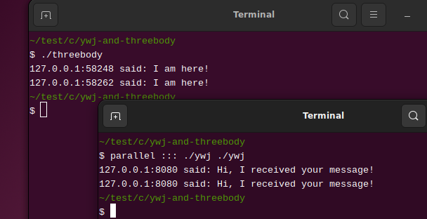

---
title: 阻塞
abstract: 你能同时接听两个电话吗？
date: 2025 年 03 月 09 日
...

# 前言

这份不守江湖规矩的网络编程指南，实际上已经几乎完结了。一台计算机上作为服务端的进程 A，能够与另一台计算机上作为客户端的进程 B 通信，这几乎就是网络编程的全部内容了。不过，我们的头上飘荡着一朵乌云。假设还有一台计算机上的进程 C，令它也作为客户端，与进程 A 通信，此时进程 A 该如何设计呢？

# 接受两个连接

[network.h](../wrapper/network.h) 和 [network.c](../wrapper/network.c) 让我们编写实验性的网络代码更为容易，只需将 threebody 程序写为以下形式，便可实现与两个客户端通信：

```c
/* threebody.c */
#include "network.h"

int main(void) {
        Socket *x = server_socket("localhost", "8080");
        /* 接受 1 个连接 */
        server_socket_accept(x);
        { /* 从 x 读取信息 */
                char *msg = socket_receive(x);
                printf("%s:%s said: %s\n", x->host, x->port, msg);
                free(msg);
        }
        socket_send(x, "Hi, I received your message!");
        close(x->connection);
        /* 再接受 1 个连接 */
        server_socket_accept(x);
        { /* 从 x 读取信息 */
                char *msg = socket_receive(x);
                printf("%s:%s said: %s\n", x->host, x->port, msg);
                free(msg);
        }
        socket_send(x, "Hi, I received your message!");
        close(x->connection);
        /* 关闭监听 socket 并释放 x */
        close(x->listen);
        socket_free(x);
        return 0;
}
```

编译 threebody.c，运行所得程序 threebody：

```console
$ gcc network.c threebody.c -o threebody
$ ./threebody
```

然后同时运行两次 ywj 程序：

```console
$ parallel ::: ./ywj ./ywj
```

parallel 是可以并行执行命令的 perl 脚本程序，我曾为它的一些基本用法写过一篇笔记，详见「[GNU parallel](https://segmentfault.com/a/1190000007687963)」。上述命令是这篇笔记未曾提及的简单用法，它同时运行了两个 ywj 进程。若你用的 Linux 是 Ubuntu 或其衍生版本，且无 parallel 程序，可使用以下命令安装：

```console
$ sudo apt install parallel
```

threebody 和并行运行的两个 ywj 的运行结果如下图所示，threebody 进程接受到了两个 ywj 进程发来的信息，每个 ywj 进程也得到了 threebody 进程发来的信息。



若需要让 threebody 接受无数个客户端的连接，只需将 threebody.c 修改为

```c
/* threebody.c */
#include "network.h"

int main(void) {
        Socket *x = server_socket("localhost", "8080");
        /* 接受无数个连接 */
        while (1) {
                server_socket_accept(x);
                { /* 从 x 读取信息 */
                        char *msg = socket_receive(x);
                        printf("%s:%s said: %s\n", x->host, x->port, msg);
                        free(msg);
                }
                socket_send(x, "Hi, I received your message!");
                close(x->connection);
        }
        /* 关闭监听 socket 并释放 x */
        close(x->listen);
        socket_free(x);
        return 0;
}
```

此时，threebody 进程便是一个永不休息的服务端了。

# 阻塞

对永不停息的 threebody 的源码略作修改，在其 `while` 循环中增加一行代码：

```c
while (1) {
        server_socket_accept(x);
        { /* 从 x 读取信息 */
                char *msg = socket_receive(x);
                printf("%s:%s said: %s\n", x->host, x->port, msg);
                free(msg);
        }
        socket_send(x, "Hi, I received your message!");
        sleep(3);  /* <---- 新增代码 */
        close(x->connection);
}
```

增加的代码是故意让 threebody 与每个客户端通信的时间延长 3 秒。运行修改后的 threebody 程序，再同时运行两次 ywj 程序，可以发现，虽然两个 ywj 程序是同时运行的，但它们是先后收到 threebody 给它们发送的信息且间隔时间约为 3 秒。这意味着什么呢？

意味着，threebody 是逐一与客户端通信的，即与第一个 ywj 进程通信完毕后，再与第二个 ywj 进程通信。这种形式的通信，称为阻塞式通信。这种通信形式，在 threebody 看来，是非常自然的。有很多人给我发信息，我自然是要逐一进行处理的。但是在最后与 threebody 建立连接的 ywj 看来，非常不合理，我是与其他 ywj 同时发起的通信，它们很快得到了回复，而我需要等待很久？

在服务端造成通信阻塞的 socket API 函数是封装在 `server_socket_accept` 中的 `accept`，该函数在默认情况下，会逐一接受客户端的连接，从而构造与客户端通信的 socket。实际上，用于接受信息的 `recv` 也是阻塞的，因为该函数要等待位于 socket 另一端的进程发送信息。

一些非 socket API 函数也会造成进程阻塞，例如上一节使用的 `sleep` 函数，等待用户输入信息的 `scanf` 函数。进程被阻塞时，操作系统会将其由「运行」状态切换为「等待」状态，此时进程不会占用 CPU，直到特定事件发生（例如有客户端发起网络连接），使其能够继续运行。

实际上，并非是某些函数导致进程阻塞，而是文件的状态设置成阻塞模式时，在一些特殊情况下，会导致读写文件的进程进入等待状态，只是当时恰好该进程的某个函数正在读写文件，从而形成了是该函数阻塞了进程——可能只是我有这种错觉。文件阻塞模式导致的进程阻塞，是被动的。由 `sleep` 函数以及其他一些时间延迟函数导致的进程阻塞，是主动的。

# 不阻塞会如何？

在大致理解进程的阻塞机制之后，我们需要考虑的问题是，在网络通信中，若将服务端的一些 socket（它们也是文件啊）设置称非阻塞状态，会发生什么？

在 Linux 系统（或其他遵守 POSIX 协议的操作系统），使用 `fcntl` 函数可修改文件状态。我不打算认真介绍这个函数的用法，原因是，很多应用软件层面的开发者（我也是其中一员）往往对操作系统层面的文件概念并不熟悉，引入过多细节，可能会破坏学习信心。对于网络编程而言，若将一个 socket 设为非阻塞状态，只需调用下面这个封装好的函数：

```c
/* 参数 x 是一个 socket */
int socket_nonblock(int x) {
    return fcntl(x, F_SETFL, fcntl(x, F_GETFL) | O_NONBLOCK);
}
```

其中，`fcntl(x, F_GETFL) | O_NONBLOCK` 用于获取 `x` 的当前状态标志并将其与 `O_NONBLOCK` 合并，这样便拥有了非阻塞状态标志，并且包含 `x` 原有的状态标志，然后通过 `fcntl(x, F_SETFL, 新标志)` 将新标志赋予 `x`。

真正令初学者沮丧的是这段代码中的缩写。首先，`fcntl`，是 `file control` 的意思，即控制文件状态。`F_GETFL` 和 `F_SETFL` 都是操作指令，分别是 `FILE GET FLAGS` 与 `FILE SET FLAGS` 的缩写，可驱使 `fcntl` 获取或设定文件状态标志。文件状态标志是一组简单的二进制位，它们可以通过位运算符 `|` 进行组合，从而为文件设定多种状态。

像 `fcntl` 这样的函数，它的参数以及所用的位运算，都散发着古奥的气息。原因是这类函数在早期的 Unix 系统诞生时就存在了。函数名与操作指令之所以简写，犹如在纸张尚未发明的年代，古人在竹简上写着简洁但难懂的语句。理解它们，然后用更为现代的名字封装它们吧。

将上述 `socket_nonblock` 函数的定义添加到 [network.c](../wrapper/network.c)，然后在 [network.h](../wrapper/network.h) 增加 `fcntl` 所需的头文件包含语句和 `socket_nonblock` 的声明：

```c
#include <fcntl.h>

int socket_nonblock(int x);
```

现在重写 threebody.c，将监听 socket 和通信 socket 皆增加 `O_NONBLOCK` 标志：

```c
/* threebody.c */
#include "network.h"

int main(void) {
        Socket *x = server_socket("localhost", "8080");
        socket_nonblock(x->listen); /* 为监听 socket 设定非阻塞标志 */
        /* 接受无数个连接 */
        while (1) {
                server_socket_accept(x);
                socket_nonblock(x->connection); /* 为通信 socket 设定非阻塞标志 */
                { /* 从 x 读取信息 */
                        char *msg = socket_receive(x);
                        printf("%s:%s said: %s\n", x->host, x->port, msg);
                        free(msg);
                }
                socket_send(x, "Hi, I received your message!");
                close(x->connection);
        }
        /* 关闭监听 socket 并释放 x */
        close(x->listen);
        socket_free(x);
        return 0;
}
```

重新编译 threebody.c，运行所得程序 threebody：

```console
$ gcc network.c threebody.c -o threebody
$ ./threebody
```

然后并行运行两个 ywj 程序：

```console
$ parallel ::: ./ywj ./ywj
```

会发生什么奇迹……或灾难呢？结果是，我还没来得及运行 ywj 程序，threebody 进程便失败退出了，给出的错误信息是：

```plain
failed to accept!
```

原因是，`server_socket_accept` 中的 `accept` 函数基于非阻塞状态的监听 socket 以及客户端的连接构造通信 socket 时，因为该过程是非阻塞的，但是却没有客户端连接过来，故而 `accept` 只能返回 `-1`，即与客户端的连接失败。对此，老子微笑着说，孩子们，看到了吧，这就是欲速则不达！

# 主动阻塞

操作系统将文件的状态默认设定为阻塞，是为了保证访问文件的进程不会出错。若我们决定将文件状态设定为非阻塞，便需要在进程某处主动设置一个阻塞，以保证程序不会因失去阻塞而无法遏制地迅速消亡。

前文说过，`sleep` 之类的函数能实现进程的主动阻塞。倘若在上一节的 threebody.c 的 while 循环的开始增加 `sleep` 主动阻塞：

```c
while (1) {
        sleep(10); /* 主动阻塞进程 10 秒 */
        server_socket_accept(x);
        socket_nonblock(x->connection); /* 为通信 socket 设定非阻塞标志 */
        ... ... ...
}
```

那么在改写的 threebody 程序运行后的 10 秒内，并行运行两个 ywj 程序，则双方能够正常通信，但是在 10 秒之后 threebody 依然会因没有新的连接而出错退出。

现在，我们的头上依然还飘荡着那朵乌云，可是似乎已经看到可以将其驱散的希望了。

# 总结

请怀念这一刻吧，这大概是我们最后的田园时光了。作为服务端的进程，很快要进化得令我们这些旧时代的人觉得它面目全非，难以理解，难以调试。
