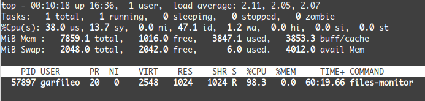

---
title: 同步 I/O 多路复用
abstract: 拒绝内耗，见机行事。
date: 03 月 15 日
...

# 前言

网络编程的那两朵乌云，驱散之道不在网络层面，而在网络中的每台计算机的操作系统层面。操作系统提供了一些监视文件内容是否发生变化的功能。

假设存在两个文件 a.txt 和 b.txt，基于操作系统的 `select` 机制能够编写一个可以监视 a.txt 和 b.txt 的内容是否发生变化的程序。这种程序所实现的功能即 I（输入）/O（输出）多路复用，即操作系统提供的 `select` 函数，能够监视多个 I/O 设备。a.txt 和 b.txt 与 I/O 设备有什么关系呢？在 Unix 或 Linux 系统中，I/O 设备皆表示为文件，我只是这两个文件表示 I/O 设备。

# 重温文件

熟悉 C 语言的人，肯定知道，打开一份文件，需要使用 C 标准库提供的 `fopen` 函数，但是现在我们需要掌握更底层的 `open`，它也能打开文件，而且它是 POSIX 系统（Unix 或 Linux）暴露给用户的接口。像 `open` 这样的函数亦称系统调用，而 `fopen` 则称为库函数，后者可基于前者实现，且功能更为丰富。实际上，socket API 函数也是系统调用。

以下代码可打开 a.txt 文件：

```c
int fd_a = open("a.txt", O_RDONLY | O_NONBLOCK);
if (fd_a == -1) {
        fprintf(stderr, "failed to open a.txt");
        exit(-1);
}
```

上述代码以只读（`O_RDONLY`）和非阻塞（`O_NONBLOCK`）模式打开 a.txt 文件。若打开文件失败，`open` 返回 `-1`，否则返回所打开的文件的描述符。对于普通文件——通常是位于硬盘上的那些，`O_NONBLOCK` 是没必要的，因为对普通文件都是非阻塞的，亦即随时可以读取其内容，亦可随时向其写入数据。

我们是用 a.txt 指代一个文件，而对于操作系统而言，它会用 `fd_a` 这样的文件描述符指代一个文件。还记得「[网络地址](../getaddrinfo/index.html)」吗？人类总是习惯用文字指代某物，而操作系统则习惯使用数字指代某物。两者同出，异名同谓。玄之又玄，众妙之门。

`open` 与 `fopen` 的行为有一些相似性。例如以下代码使用 `fopen` 打开文件：

```c
FILE *fp_a = fopen("a.txt", "r");
if (!fp_a) {
        fprintf(stderr, "failed to open a.txt");
        exit(-1);
}
```

`open` 返回的是文件描述符，而 `fopen` 返回的是文件指针。顺便多说一点，若使用 `fopen` 打开文件，但是有时又需要文件描述符，可使用 `fileno` 获取，例如：

```c
int fd_a = fileno(fp_a);
```

打开的文件，可使用 `read` 和 `write` 读写，只是需要我们在内存中备好一个缓冲区，然后使用 `close` 予以关闭。以下示例 foo.c 是向文件写入数据：

```c
/* foo.c */
#include <stdio.h>
#include <stdlib.h>
#include <fcntl.h>    /* 声明了 open 和 close 函数 */
#include <unistd.h>   /* 声明了 read 和 write 函数 */

int main(void) {
        /* 以只写（write only）模式打开文件 */
        int fd_a = open("a.txt", O_WRONLY);
        if (fd_a == -1) {
                fprintf(stderr, "failed to open file!\n");
                exit(-1);
        }
        /* 备好缓冲区 */
        char buffer[] = "你好，文件！";
        /* 向文件写入数据 */
        ssize_t n = write(fd_a, buffer, sizeof(buffer));
        if (n == -1) {
                fprintf(stderr, "failed to write file!\n");
                exit(-1);
        }
        close(fd_a); /* 关闭文件 */
        return 0;
}
```

`write` 函数若未出错，返回值是向文件写入的字节数，若出错，则返回 -1。`close` 用于关闭文件，实质上是向操作系统归还文件描述符。对于操作系统而言，与内存相似，文件描述符也是一种资源，借用了，需要归还。不过，即使不主动归还，在程序终止运行后，操作系统也会自动回收，不过为了严谨，建议主动归还。

编译 foo.c：

```console
$ gcc foo.c -o foo
```

要运行 foo 程序，需要先建立文件 a.txt，在 Linux 系统中使用 `touch` 命令可创建一份空文件：

```console
$ touch a.txt
```

然后运行 foo：

```console
$ ./foo
```

要查看 foo 是否向 a.txt 写入了数据，不必用文件编辑器，可使用 cat 命令（more 或 less 命令亦可）：

```console
$ cat a.txt
你好，文件！
```

文件内容的读取，略为繁琐，因为文件内容可能会超过我们为它准备的缓冲区，需要多次读取。看以下示例 bar.c：

```c
/* bar.c */
#include <stdio.h>
#include <stdlib.h>
#include <fcntl.h>
#include <unistd.h>

int main(void) {
        /* 以只读（write only）模式打开文件 */
        int fd_a = open("a.txt", O_RDONLY);
        if (fd_a == -1) {
                fprintf(stderr, "failed to open file!\n");
                exit(-1);
        }
        /* 备好缓冲区 */
        char buffer[1];
        /* 从文件读入数据 */
        while (1) {
                ssize_t n = read(fd_a, buffer, sizeof(buffer));
                if (n == 0) break;
                else if (n == -1) {
                        fprintf(stderr, "failed to read file!\n");
                        exit(-1);
                } else {
                        /* 将读取的数据显示在标准输出设备 */
                        write(STDOUT_FILENO, buffer, n);
                }
        }
        close(fd_a); /* 关闭文件 */
        return 0;
}
```

上述示例中，为了展示文件的数据量超出缓冲区的情况，我故意将缓冲区的长度设成 1 个字节了。`read` 函数读取到的数据，若在屏幕上显示，可使用 `write` 函数向标准输出设备——`STDOUT_FILENO` 写入数据。通常情况下，计算机屏幕是标准输出设备。`STDOUT_FILENO` 实际上是 1。类似地，`STDIN_FILENO` 是标准输入设备，值为 0，默认是键盘。再者，标准错误设备 `STDERR_FILENO`，值为 2，默认是屏幕，用于输出错误信息。

在库函数层面，像 `fgets` 和 `fprintf` 这样的函数，所用的标准输入、标准输出和标准错误设备分别是 `stdin`，`stdout` 和 `stderr`。我也一直习惯用 `fprintf` 向 `stderr` 输出错误信息。

现在，你应该不再害怕 Unix 或 Linux 系统层面的文件读写操作了。

# 文件描述符集合

为了监视打开的多个文件，亦即多路 I/O，需要为 `select` 函数（它也是系统调用）准备一个集合，用于存储文件描述符。

POSIX 系统调用层面为文件描述符集合定义了数据结构 `fd_set`，并围绕该结构实现了一组集合n预算宏，诸如 `FD_ZERO`、`FD_SET`、`FD_CLR` 以及 `FD_ISSET`。使用这些宏操作文件描述符集合，可以让我们无需关心 `fd_set` 的定义。可能没有什么事情比无需关心底层如何实现更令人觉得快乐了。

以下代码，将打开的 a.txt 和 b.txt 文件对应的描述符 `fd_a` 和 `fd_b` 添加到文件描述符集合：

```c
fd_set fds;
FD_ZERO(&fds);
FD_SET(fd_a, &fds);
FD_SET(fd_b, &fds);
```

`FD_ZERO` 将文件描述符集合清空，亦即将其所占空间的数据皆初始化为 0。`FD_SET` 将文件描述符加入集合。

`FD_CLR` 可从文件描述符集合中移除给定的文件描述符，例如：

```c
FC_CLR(fd_b, &fds);
```

`FD_ISSET` 用于判断给定的文件描述符是否在集合中，例如

```c
if (FD_ISSET(fd_a, &fds)) {
        printf("fd_a is in fds.\n");
} else {
        printf("fd_a is not in fds.\n");
}
```

# 阻塞式轮询

`select` 的作用很简单，它能够轮循一组文件——以文件描述符集合表示，从中获得符合需求的子集。不过，理解 `select` 函数的作用，犹如从牛顿力学跃迁到广义相对论，因为它能够让你看到，cpu 的速度是不变的，但时间却可以膨胀或收缩，同时空间在收缩或膨胀，这就是同步 I/O 多路复用的魅力所在。

`select` 的声明为

```c
#include <sys/select.h>

int select(int nfds, fd_set *_Nullable restrict readfds,
           fd_set *_Nullable restrict writefds,
           fd_set *_Nullable restrict exceptfds,
           struct timeval *_Nullable restrict timeout);
```

现在我们已经看惯了来自 man 的函数声明，就像之前的 socket API 函数那样，先主动略过 `_Nullable` 和 `restrict` 这样的定语，这样就可以清晰看到，`select` 接收 5 个参数，第一个参数表示文件描述符的最大值，第二、三、四个参数，都是文件描述符集合，第五个参数表示超时时间值。对于本文要解决的问题，我们只需关心前两个参数，后三个参数皆设为 `NULL` 即可，而且函数声明里的 `_Nullable` 也明确标定了这些参数是可以为 `NULL` 的。

`select` 的第一个参数也许是最不好懂的，它的作用是让 `select` 有机会终止轮询文件描述符集合。以下构造文件描述符集合的过程顺便记录了集合中的文件描述符的最大值：

```c
fd_set fds;
int fd_max = (fd_a > fd_b) ? fd_a : fd_b;
FD_ZERO(&fds);
FD_SET(fd_a, &fds);
FD_SET(fd_b, &fds);
```

我们可以写出以下代码，遍历 `fds`：

```c
for (int i = 0; i < fd_max + 1; i++) {
        if (FD_ISSET(i, &fds)) {
                /* i 是文件描述符，可基于它读写文件  */
        }
}
```

`select` 函数也像上述循环语句这般遍历文件描述符集合，故而它的第一个参数是集合中文件描述符最大值加上 1。倘若我们只让 `select` 轮循文件是否可读的文件描述符集合，在上述构建文件描述符集合 `fds` 之后，可像下面这样调用它：

```c
int ret = select(fd_max + 1, &fds, NULL, NULL, NULL);
```

若 `select` 成功，返回值是文件描述符集合中有多少个文件描述符指代的文件是可读的（属于第 2 个参数），可写的（属于第 3 个参数），出现异常的（属于第 4 个参数），上例只关心可读的。若 `select` 返回 -1，表示轮询文件过程出错。

注意，重点来了。上述 `select` 函数调用语句里，`fds` 即是输入，也是输出。`select` 会将 `fds` 中不可读的文件描述符剔除，剩下的皆为可读的。

注意，又一个重点来了。`select` 函数，若其第五个亦即最后一个参数若为 `NULL`，则意味着它是阻塞的。在上例中，`select` 函数一直等到文件描述符集合内出现可读的描述符方能结束。不过，`select` 阻塞行为可通过最后一个参数予以控制，能够让它像 `sleep` 函数那样阻塞一个时段，甚至也能让它变成非阻塞的——让超时时间为 0。例如

```c
/* 阻塞模式（timeout = NULL） */
select(nfds, &fds, NULL, NULL, NULL);

/* 非阻塞模式（timeout = 0）*/
struct timeval timeout = {0, 0};
select(nfds, &fds, NULL, NULL, &timeout);

/* 超时阻塞模式（timeout = 5秒）*/
struct timeval timeout = {5, 0};
select(nfds, &fds, NULL, NULL, &timeout);
```

# 文件可读监视器

现在，可以着手写一个简单的文件可读监视器程序了。该程序能够监控与其位于相同目录下的 a.txt 和 b.txt 文件是否可读，若可读，则读取其中全部内容并显示。下面的 files-monitor.c 实现了该程序：

```c
/* files-monitor.c */
#include <stdio.h>
#include <stdlib.h>
#include <fcntl.h>
#include <sys/select.h>
#include <unistd.h>

int main(void) {
        /* 打开 a.txt 和 b.txt */
        int fd_a = open("a.txt", O_RDONLY);
        if (fd_a == -1) {
                fprintf(stderr, "failed to open a.txt");
                exit(-1);
        }
        int fd_b = open("b.txt", O_RDONLY);
        if (fd_b == -1) {
                fprintf(stderr, "failed to open b.txt");
                exit(-1);
        }
        /* 构建文件描述符集合 */
        int fd_max = (fd_a > fd_b) ? fd_a : fd_b;
        fd_set fds;
        FD_ZERO(&fds);
        FD_SET(fd_a, &fds);
        FD_SET(fd_b, &fds);
        /* 阻塞式轮询文件描述符集 */
        fd_set fds_copy = fds;
        char buffer[1024];
        while (1) {
                fds = fds_copy;
                int a = select(fd_max + 1, &fds, NULL, NULL, NULL);
                if (a == -1) {
                        fprintf(stderr, "select error!\n");
                        exit(-1);
                }
                /* 读取文件内容 */
                for (int i = 0; i < fd_max + 1; i++) {
                        if (FD_ISSET(i, &fds)) { /* 找到一个可读文件 */
                                ssize_t n;
                                while ((n = read(i, buffer, sizeof(buffer))) > 0) {
                                        write(STDOUT_FILENO, buffer, n);
                                }
                                if (n == -1) {
                                        fprintf(stderr, "read failed!\n");
                                        exit(-1);
                                }
                        }
                }
        }
        close(fd_b);
        close(fd_a);
        return 0;
}
```

编译 files-monitor.c：

```console
$ gcc files-monitor.c -o files-monitor
```

下面是验证 files-monitor 能否正常工作的过程：

```console
$ touch a.txt b.txt
$ ./files-monitor
```

打开另一个终端（命令行窗口），以 files-monitor 所在目录为工作目录，执行以下命令：

```console
$ echo "你好，a.txt！" >> a.txt
$ echo "你好，b.txt！" >> b.txt
```

上述 echo 命令所用的 `>>` 符号，是 Shell 的输出重定向符号，它可以将前面的命令的输出，添加到后面指定的文件里，且不会覆盖文件的原有内容，只是添加到文件原有内容之后。要使用输出重定向覆盖文件内容，可使用 `>` 符号。若不明白我在说什么，那你需要花一点时间，熟悉一下 Shell 的基本用法。有很多种 Shell，我用的是 Bash。不懂 Shell，在 Unix 或 Linux 的世界里，像是不会用腿走路。

files-monitor 应该会输出

```console
你好，a.txt！
你好，b.txt！
```

然后它会继续运行，等待 a.txt 和 b.txt 里有新的内容出现，读取后将其输出到屏幕。

假设 files-monitor 持续运行，下面设法查看该进程的资源占用情况。首先获取 files-monitor 进程 ID：

```console
$ pgrep -l files-monitor
57897 files-monitor
```

在我的机器上，目前正在运行的 files-monitor 的 ID 是 57897。使用 top 命令便可查看该进程对 CPU 和内存的占用情况：

```console
$ top -p 57897
```

结果如下图所示：



可以看到，files-monitor 正在疯狂地霸占着 CPU，在 98.3% 的时间里，它独占 CPU。

# select 可堪大用？

在「[两朵乌云](../blocking/index.html)」里说过，我们需要设法让主动阻塞变得更灵活一些，即不像 `sleep` 函数这样机械，便可以实现一个低功耗的服务端，它可以处理无数个客户端的连接。看来，`select` 函数并不能满足我们的需求。

也许你开始有些疑惑了。这篇文章只是致力写了一个监视文件的程序，它与网络编程有什么关系呢？有关系。因为 socket 也是文件描述符啊，亦即它指代的对象也是文件，至少在 Unix 或 Linux 中如此。不过，socket 对应的文件，并非上文中 a.txt 和 b.txt 这样的普通文件，它是 socket API 在内存中构造的一种像文件的数据结构。

普通文件总是可读的，socket 文件未必如此，不过后者只是我的猜想。下一步工作，我们需要基于 select 为网络程序的服务端构建同步 I/O 多路复用机制，验证它是否能避免过度消耗 CPU。

# 总结

乌云犹在，可是你意外学会了不少 Linux 命令。
