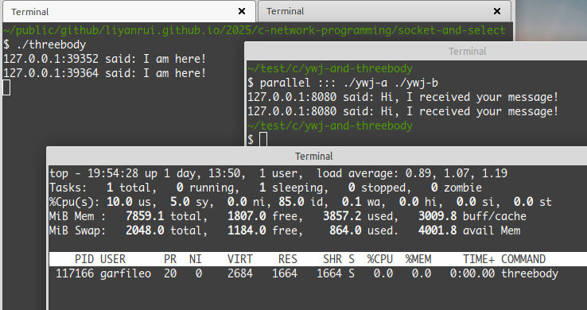

---
title: 第一朵乌云，散了！
abstract: 我们有了初步拥抱这个世界的能力。
date: 03 月 16 日
...

# 前言

同志们，请拿起 [network.h](../blocking/network.h) 和 [network.c](../blocking/network.c) 中储藏的武器，唤醒刚学会的 I/O 多路复用精神，吹响号角，与第一朵乌云战斗吧！

# 节能减排

新的 threebody.c 代码有些长，不过我颇为认真地写了许多注释，只要对前两章的内容还有印象，理解它应该不难，试试看。

```c
/* threebody.c */
#include <sys/select.h>
#include "network.h"

int main(void) {
        /* 准备文件描述符集合 */
        fd_set fds;
        FD_ZERO(&fds);
        /* 构造用于监听的 socket */
        Socket *x = server_socket("localhost", "8080");
         /* 监听（socket）非阻塞 */
        socket_nonblock(x->listen);
        /* 将监听（socket）作为监视对象 */
        FD_SET(x->listen, &fds);
        /* 连接客户端并与之通信 */
        fd_set fds_copy;
        int fd_max = x->listen;
        while (1) {
                /* 获得可读的监听和连接，该过程是阻塞的 */
                fds_copy = fds;
                int a = select(fd_max + 1, &fds_copy, NULL, NULL, NULL);
                if (a == -1) {
                        fprintf(stderr, "select error!\n");
                        exit(-1);
                }
                for (int i = 0; i < fd_max + 1; i++) {
                        if (FD_ISSET(i, &fds_copy)) {
                                if (i == x->listen) { /* 与客户端建立连接 */
                                        /* 建立连接 */
                                        server_socket_accept(x);
                                        /* 通信非阻塞 */
                                        socket_nonblock(x->connection);
                                        /* 将连接（socket）作为监视对象 */
                                        FD_SET(x->connection, &fds);
                                        /* 更新 fd_max */
                                        if (x->connection > fd_max) {
                                                fd_max = x->connection;
                                        }
                                } else {
                                        /* 将x->connection 搭接到 i 上 */
                                        x->connection = i;
                                        /* 读取客户端发来的信息 */
                                        char *msg = socket_receive(x);
                                        printf("%s:%s said: %s\n", x->host, x->port, msg);
                                        free(msg);
                                        /* 向客户端发送信息 */
                                        socket_send(x, "Hi, I received your message!");
                                        /* 从描述符集合移除连接并将其关闭 */
                                        FD_CLR(i, &fds);
                                        close(i);
                                }
                        }
                }
                /* 更新 fd_max */
                int n = fd_max; 
                fd_max = -1;
                for (int i = 0; i < n + 1; i++) {
                        if (FD_ISSET(i, &fds)) {
                                if (i > fd_max) fd_max = i;
                        }
                }
        }
        /* 关闭监听 socket 并释放 x */
        close(x->listen);
        socket_free(x);
        return 0;
}
```

重新编译 threebody.c，运行所得 threebody。无论有多少个 ywj 进程与 threebody 通信，后者的 `while` 无限循环在等待客户端接入的时候，几乎不会占用 CPU，故而我们实现了一个低功耗的服务端。



# 封装

上一节的示例代码较为繁琐，在编写有用处的程序时，我们肯定无法忍受这种暴露太多细节的代码，因此需要继续采用面向对象编程范式，将繁琐之处封装起来，亦即需要改进 [network.h](../blocking/network.h) 和 [network.c](../blocking/network.c)。

首先，在 network.h 的 `Socket` 的定义里增加文件描述符集合：

```c
typedef struct {
        int listen;
        int connection;
        char *host;
        size_t host_size;
        char *port;
        size_t port_size;
        fd_set fds;
        int fd_max;
} Socket;
```

并在 network.h 增加

```c
#include <sys/select.h>
```

原因是 `fd_set` 类型是在 select.h 中定义的。

然后，在 `Socket` 对象的构造函数 `socket_new` 初始化 `fds`：

```c
static Socket *socket_new(void) {
        Socket *result = malloc(sizeof(Socket));
        result->listen = -1;
        result->connection = -1;
        result->host_size = NI_MAXHOST * sizeof(char);
        result->host = malloc(result->host_size);
        result->port_size = NI_MAXSERV * sizeof(char);
        result->port = malloc(result->port_size);
        FD_ZERO(&result->fds);
        result->fd_max = -1;
        return result;
}
```

由于同步 I/O 多路复用机制只在服务端使用，只需对 `server_socket` 进行修改。将 `Socket` 对象的监听（socket）设为非阻塞模式，并将其加入到文件描述符集合中：

```c
Socket *server_socket(const char *host, const char *port) {
        struct addrinfo *addr_list = get_address_list(host, port);
        int fd = -1;
        for (struct addrinfo *it = addr_list; it; it = it->ai_next) {
                fd = socket(it->ai_family, it->ai_socktype, it->ai_protocol);
                if (fd == -1) continue;
                if (bind(fd, it->ai_addr, it->ai_addrlen) == -1) {
                        close(fd);
                        continue;
                }
                break;
        }
        freeaddrinfo(addr_list);
        
        if (fd == -1) {
                fprintf(stderr, "failed to bind!\n");
                exit(-1);
        }
        if (listen(fd, 10) == -1) {
                fprintf(stderr, "failed to listen!\n");
                exit(-1);
        }
        
        Socket *result = socket_new();
        result->listen = fd;
        socket_nonblock(result->listen);
        FD_SET(result->listen, &result->fds);
        if (result->fd_max < result->listen) {
                result->fd_max = result->listen;
        }
        return result;
}
```

上述对 network.h 和 network.c 的修改，已将文件描述符集合的维护和 `select` 机制的少量代码封装到原有的函数里了，且未改变这些函数的用法。

服务端与客户端通信的代码，较为复杂，涉及到一些难以固定的过程，难以封装。我们不得不考虑一个新的途径——回调函数。

# 函数式编程

与客户端通信的代码，只有具体通信的过程无法确定，而文件描述符集合的遍历以及描述符最大值的更新，这两个过程是可以确定的，故而先将它们封装为一个函数：

```c
void socket_communicate(Socket *x) {
        fd_set fds = x->fds;
        int a = select(x->fd_max + 1, &fds, NULL, NULL, NULL);
        if (a == -1) {
                fprintf(stderr, "select error!\n");
                exit(-1);
        }
        for (int i = 0; i < x->fd_max + 1; i++) {
                if (FD_ISSET(i, &fds)) {
                        if (i == x->listen) {
                                server_socket_accept(x);
                                socket_nonblock(x->connection);
                                FD_SET(x->connection, &x->fds);
                                if (x->connection > x->fd_max) {
                                        x->fd_max = x->connection;
                                }
                        } else {
                                x->connection = i;
                                /* ... 此处注释代表无法确定的过程 ... */
                                FD_CLR(i, &fds);
                                close(i);
                        }
                }
        }
        int n = x->fd_max;
        x->fd_max = -1;
        for (int i = 0; i < n + 1; i++) {
                if (FD_ISSET(i, &x->fds)) {
                        if (i > x->fd_max) x->fd_max = i;
                }
        }
}
```

无法确定的过程，可以用函数予以实现，然后将该函数作为参数传给 `socket_run`。该函数的形式为

```c
void user_action(Socket *x, void *user_data) {
        /* 用户根据需要定义自己的通信过程 */
}
```

为了方便，我们为上述类似 `user_action` 这样的函数定义一个类型 `SocketAction`：

```c
typedef void (*SocketAction)(Socket *x, void *user_data);
```

这就是 C 语言的函数指针的类型化，亦即 `SocketAction` 是一个函数指针类型，它能指向一切像 `user_action` 这样的函数。基于该函数指针类型，对 `socket_communicate` 略作修改：

```c
void socket_communicate(Socket *x, SocketAction action, void *user_data) {
        fd_set fds = x->fds;
        int a = select(x->fd_max + 1, &fds, NULL, NULL, NULL);
        if (a == -1) {
                fprintf(stderr, "select error!\n");
                exit(-1);
        }
        for (int i = 0; i < x->fd_max + 1; i++) {
                if (FD_ISSET(i, &fds)) {
                        if (i == x->listen) {
                                server_socket_accept(x);
                                socket_nonblock(x->connection);
                                FD_SET(x->connection, &x->fds);
                                if (x->connection > x->fd_max) {
                                        x->fd_max = x->connection;
                                }
                        } else {
                                x->connection = i;
                                action(x, user_data);
                                FD_CLR(i, &x->fds);
                                close(i);
                        }
                }
        }
        int n = x->fd_max;
        x->fd_max = -1;
        for (int i = 0; i < n + 1; i++) {
                if (FD_ISSET(i, &x->fds)) {
                        if (i > x->fd_max) x->fd_max = i;
                }
        }
}
```

假设，函数 `foo` 是用户自定义的通信过程：

```c
void foo(Socket *x, void *user_data) {
        /* 读取客户端发来的信息 */
        char *msg = socket_receive(x);
        printf("%s:%s said: %s\n", x->host, x->port, msg);
        free(msg);
        /* 向客户端发送信息 */
        socket_send(x, "Hi, I received your message!");
}
```

`foo` 没有用到 `user_data`，无妨。如果我们像下面这样调用 `socket_communicate`：

```c
socket_communicate(x, foo, NULL);
```

便可建立一个完整的服务端-客户端的通信过程。

# 世界再度清静

现在，基于上述封装，即新的 [network.h](network.h) 和 [network.c](network.c)，再度重写 threebody.c：

```c
/* threebody.c */
#include "network.h"

void with_ywj(Socket *x, void *user_data) {
        /* 读取客户端发来的信息 */
        char *msg = socket_receive(x);
        printf("%s:%s said: %s\n", x->host, x->port, msg);
        free(msg);
        /* 向客户端发送信息 */
        socket_send(x, "Hi, I received your message!");
}

int main(void) {
        /* 构造用于监听的 socket */
        Socket *x = server_socket("localhost", "8080");
        /* 通信 */
        while (1) {
                socket_communicate(x, with_ywj, NULL);
        }
        /* 关闭监听 socket 并释放 x */
        close(x->listen);
        socket_free(x);
        return 0;
}
```

乱糟糟的 threebody，又一次获得了清净。

# 作弊之处

threebody.c 反复重写了多次，但是在我颇为无知时出现的一处不足一直如影随形，它就在上文定义的 `socket_communicate` 函数里。`socket_communicate` 在处理完与客户端的通信后，会执行以下操作：

```c
FD_CLR(i, &x->fds);
close(i);
```

`i` 是服务端与客户端的通信 socket。亦即，服务端在完成与一个客户端通信后，会将通信 socket 从用于同步 I/O 多路复用的文件描述符集合中剔除并关闭，亦即服务端主动断开与客户端的连接。这种做法会让服务器的用途变得偏狭，因为连接被关闭后，若客户端并未退出，反而继续通过原先的通信 socket 向服务端发送信息，但服务端却无法处理了，除非客户端再度发起连接请求，重建通信 socket。但是，若将上述代码从 `socket_communicate` 定义中删除，会出现另一个问题，即客户端可能会主动关闭，导致服务端给它发送消息时失败。

解决上述这个两难问题的一个简单方法是，每次在与某个客户端通信之前，先试着用 `recv` 从该客户端接收信息，若 `recv` 返回值为 0，则表示该连接对应的 socket 无效了，需要将其从文件描述符集合中剔除并关闭。亦即，将 `socket_communicate` 中的以下代码片段

```c
x->connection = i;
action(x, user_data);
FD_CLR(i, &x->fds);
close(i);
```

修改为

```c
char try[1];
if (recv(i, try, sizeof(try), MSG_PEEK) == 0) {
        FD_CLR(i, &x->fds);
        close(i);
} else {
        x->connection = i;
        action(x, user_data);
}
```

注意，上述调用 `recv` 时，它的最后一个参数，之前用的时候是不关心它的，所以用的是 0，而现在用的是 `MSG_PEEK`。这个参数值是一个标志，它要求 `recv` 只是从 `i` 这个 socket 里读取数据，但不要将所读的部分移除。默认情况下，`recv` 会将自己读取的部分从 socket 中移除的。

# 总结

我们胜利了！胜利的成果已全部写在最新的 [network.h](network.h)、[network.c](network.c) 和 [threebody.c](threebody.c) 中了。
