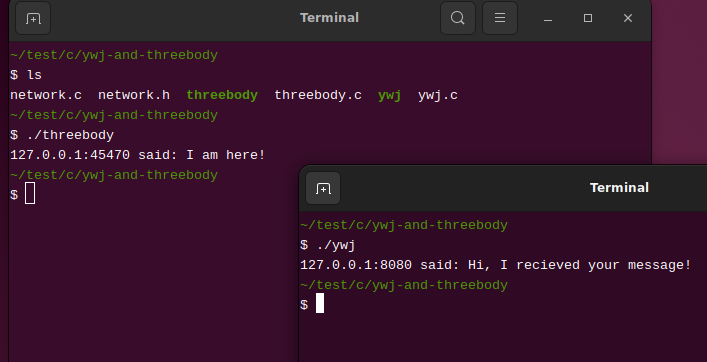

---
title: 封装
abstract: 收纳桌子上那些乱七八糟的电线。
date: 2025 年 03 月 05 日
...

# 前言

现在，你已经实现了一个简单的 C/S 架构的程序，这个程序分为两个部分，一个是 ywj，它是客户端（Client），另一个是 threebody，它是服务端（Server），这两部分通过 socket 合为一体。不妨再勇敢一些，Internet 也不过是使用不计其数的 socket 将各个部分连接起来的一个程序。你想到了……量子力学么？通信即测量，网络即量子。

不过，还是尽快从无尽的遐想中回归，看一看 ywj.c 和 threebody.c 中的 `main` 函数，它们的代码已经有些不清晰了，像桌面上连接计算机的电源线以及乱七八糟的信号线和数据线，我们需要尝试用面向对象的办法收纳这些代码。

# 类与方法

C 语言在语法上不能像 C++、Java、Java 等语言那样优雅地支持面向对象编程，但是若将面向对象编程视为一种编程范式，C 在一定程度上可以实现它，例如可以用结构体模拟类，将类名作为一些函数名的前缀以模拟类的方法。

首先，定义一个类 `Socket`：

```c
typedef struct {
        int listen;
        int connection;
        char *host;
        size_t host_size;
        char *port;
        size_t port_size;
} Socket;
```

这个类表达的是一个通用的 socket，即可用于客户端，也可用于服务端，同时它还能以文字的形式记录对方的 IP 地址和端口——若是客户端的 socket，则记录服务端的 IP 地址和端口；若是服务端的 socket，则记录客户端的 IP 地址和端口。

有两种方法为类 `Socket` 创建对象，分别面向客户端和服务端：

```c
Socket *client_socket(const char *host, const char *port);
Socket *server_socket(const char *host, const char *port);
```

服务端的 `Socket` 对象，还需要一个 `accept` 方法：

```c
void server_socket_accept(Socket *x);
```

顾名思义，该方法主要是基于 `x->listen` 建立 `x->connection`，前者为服务端的监听 socket，后者是与某个客户端通信的 socket。

拥有可通信的 `Socket` 对象后，可基于以下两个方法发送和接受信息：

```c
void socket_send(Socket *x, const char *message);
char *socket_recieve(Socket *x);
```

`socket_free` 释放 `Socket` 对象占用的内存：

```c
void socket_free(Socket *x);
```

一个 socket 用毕后，需要关闭，而上述方法未为 `Socket` 对象的 `listen` 和 `connection` 成员提供 `close` 方法。这是我故意而为之，因为 socket API 中的 `close` 函数的用法已经非常简单，没有必要再将其封装为一个函数。假设 `Socket *x` 指向某个服务器端的 `Socket` 对象，可使用以下代码关闭该对象的两个 socket：

```c
close(x->connection);
close(x->listen);
```

对于面向客户端的 `Socket` 对象只需关闭 `connection`。

# 构造网络地址列表

为了简化客户端或服务端的 `Socket` 对象的创建过程，需要先将网路地址列表的构造过程封装为函数：

```c
static struct addrinfo *
get_address_list(const char *host, const char *port) {
        struct addrinfo hints, *addr_list;
        memset(&hints, 0, sizeof(struct addrinfo));
        hints.ai_family = AF_UNSPEC;
        hints.ai_socktype = SOCK_STREAM;
        int a = getaddrinfo(host, port, &hints, &addr_list);
        if(a != 0) {
                fprintf(stderr, "getaddrinfo error: %s\n", gai_strerror(a));
                exit(-1);
        }
        return addr_list;
}
```

上述函数定义中的一切，皆已在「[网络地址](getaddrinfo/index.html)」中给出了详细讲解，需要注意的是，该函数是私有的，即除了我之外，我不打算让任何人使用它，故而使用 `static` 修饰它。

# Socket 对象

以下私有函数，用于构造一个暂且无法使用的 `Socket` 对象：

```c
static Socket *socket_new(void) {
        Socket *result = malloc(sizeof(Socket));
        result->listen = -1;
        result->connection = -1;
        result->host_size = NI_MAXHOST * sizeof(char);
        result->host = malloc(result->host_size);
        result->port_size = NI_MAXSERV * sizeof(char);
        result->port = malloc(result->port_size);
        return result;
}
```

# 客户端 Socket 对象

客户端 `Socket` 对象的创建过程颇为简单：

```c
Socket *client_socket(const char *host, const char *port) {
        Socket *result = socket_new();
        struct addrinfo *addr_list = get_address_list(host, port);
        int fd = -1;
        for (struct addrinfo *it = addr_list; it; it = it->ai_next) {
                fd = socket(it->ai_family, it->ai_socktype, it->ai_protocol);
                if (fd == -1) continue;
                if (connect(fd, it->ai_addr, it->ai_addrlen) == -1) {
                        close(fd);
                        continue;
                }
                getnameinfo(it->ai_addr, it->ai_addrlen,
                            result->host, result->host_size,
                            result->port, result->port_size,
                            NI_NUMERICHOST | NI_NUMERICSERV);
                break;
        }
        freeaddrinfo(addr_list);
        
        result->connection = fd;
        return result;
}
```

客户端的 `Socket` 对象的两个 socket，只有 `connection` 有意义。

# 服务端 Socket 对象

服务端的 `Socket` 对象构造过程如下：

```c
Socket *server_socket(const char *host, const char *port) {
        struct addrinfo *addr_list = get_address_list(host, port);
        int fd = -1;
        for (struct addrinfo *it = addr_list; it; it = it->ai_next) {
                fd = socket(it->ai_family, it->ai_socktype, it->ai_protocol);
                if (fd == -1) continue;
                if (bind(fd, it->ai_addr, it->ai_addrlen) == -1) {
                        close(fd);
                        continue;
                }
                break;
        }
        freeaddrinfo(addr_list);
        
        if (fd == -1) {
                fprintf(stderr, "failed to bind!\n");
                exit(-1);
        }
        if (listen(fd, 10) == -1) {
                fprintf(stderr, "failed to listen!\n");
                exit(-1);
        }
        
        Socket *result = socket_new();
        result->listen = fd;
        return result;
}
```

由于服务端的 `Socket` 对象，其 `connection` 成员需要与具体的客户端连接时方能确定，故而上述代码仅构造了用于监听的 socket，即 `listen` 成员（不要与 socket API 中的 `listen` 函数混淆）。

服务端 `Socket` 对象接受客户端连接的过程如下：

```c
void server_socket_accept(Socket *x) {
        struct sockaddr_storage addr;
        socklen_t addr_len = sizeof(addr);
        x->connection = accept(x->listen, (struct sockaddr *)(&addr), &addr_len);
        if (x->connection == -1) {
                fprintf(stderr, "failed to accept!\n");
                exit(-1);
        }
        getnameinfo((struct sockaddr *)&addr, addr_len,
                    x->host, x->host_size,
                    x->port, x->port_size,
                    NI_NUMERICHOST | NI_NUMERICSERV);
}
```

# 信息收发

通过 `Socket` 对象的 `connection` 成员发送信息，过程较为简单：

```c
void socket_send(Socket *x, const char *message) {
        if (send(x->connection, message, strlen(message), 0) == -1) {
                fprintf(stderr, "send error!\n");
                exit(-1);
        }
}
```

从 `Socket` 对象的 `connection` 成员接受信息，需要一点技巧。因为无法预知接受的信息长度（字节数），故而需要用一个定长的缓冲区，从 socket 中循环读取信息，并将每次读取的信息合并到一个动态增长的字符串中：

```c
char *socket_recieve(Socket *x) {
        size_t m = 1024;
        char *buffer = malloc(m * sizeof(char));
        size_t n = 0;
        char *total = NULL;
        while (1) {
                ssize_t h = recv(x->connection, buffer, m, 0);
                if (h == -1) {
                        fprintf(stderr, "recv error!\n");
                        exit(-1);
                } else if (h == 0) break;
                else {
                        total = realloc(total, n + h);
                        memcpy(total + n, buffer, h);
                        n += h;
                        if (h < m) break;
                }
        }
        if (total) { /* 为字符串增加终止符 */
                total = realloc(total, n + 1);
                *(total + n) = '\0';
                n += 1;
        }
        free(buffer);
        return total;
}
```

理解上述代码的关键是，若 `recv` 函数一次无法读取 socket 中的全部信息，可继续调用它读取剩余信息。

# 释放 Socket 对象

无论是客户端还是服务端的 `Socket` 对象，皆可使用以下函数释放其全部内存：

```c
void socket_free(Socket *x) {
        free(x->host);
        free(x->port);
        free(x);
}
```

# 重写 ywj 和 threebody

将上述 `Socket` 类的定义与方法的声明皆在 [network.h](network.h) 文件，所有方法的定义皆在 [network.c](network.c) 文件。

基于 `Socket` 类与方法，重写 ywj 程序：

```c
/* ywj.c */
#include "network.h"

int main(void) {
        Socket *x = client_socket("www.threebody.com", "8080");
        socket_send(x, "I am here!");
        { /* 从 x 读取信息 */
                char *msg = socket_recieve(x);
                printf("%s:%s said: %s\n", x->host, x->port, msg);
                free(msg);
        }
        close(x->connection);
        socket_free(x);
        return 0;
}
```

编译：

```console
$ gcc network.c ywj.c -o ywj
```

重写 threebody 程序：

```c
/* threebody.c */
#include "network.h"

int main(void) {
        Socket *x = server_socket("localhost", "8080");
        server_socket_accept(x);
        { /* 从 x 读取信息 */
                char *msg = socket_recieve(x);
                printf("%s:%s said: %s\n", x->host, x->port, msg);
                free(msg);
        }
        socket_send(x, "Hi, I recieved your message!");
        close(x->connection);
        close(x->listen);
        socket_free(x);
        return 0;
}
```

编译：

```console
$ gcc network.c threebody.c -o threebody
```

以下是 threebody 和 ywj 程序的运行结果截图：



# 总结

虽然我不喜欢 C++，Java 以及 C# 之类的面向对象编程语言，但我需要承认，面向对象编程范式，是个了不起的发明。
