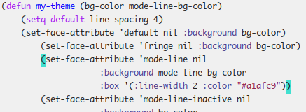
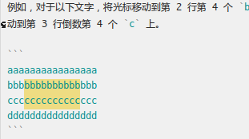

---
title: 本能
abstract: 虽有荣观，燕处超然。
date: 2025 年 05 月 29 日
...

# 前言

配置了字体，修改了颜面，你的 Emacs 此时已颇为体面。

也许你早已迫不及待，像很多学习 Emacs 的人那样，希望尽快为自己的 Emacs 安装一些强大的插件，使之从编辑器之神跃迁为神之编辑器。

我希望你能安静下来，守着你的 init.el，如无必要，勿增配置。

# 制动键

要学会开车，需要先学会如何刹车。

当你让 Emacs 执行某个命令或某个组合键时，中途突然需要放弃，此时可使用 `C-g`，它可以强行终止 Emacs 正在进行的几乎任何任务。若 `C-g` 未起效果，可重复执行几次。

有时，你的 Emacs 可能会进入一种僵死状态，例如它在完成一项计算量很大且需要耗费很长时间的任务，在这种情况下，如果你需要 Emacs 终止该任务，你可以摁下 `C-g` 不放，直至 Emacs 恢复正常。

# 光标

编辑文本时，会经常移动光标。在 Emacs 的图形界面模式里，你可以用鼠标直接将光标定位到某处。若在小范围内精确移动光标，可以用键盘上的四个方向键。若将光标快速移动到一行文字的首部或尾部，可以用 Home 或 End 键。

若将光标移动到缓冲区的首部或尾部，可以用组合键 `M-<`（即 Alt + Shift + , 键）或 `M->`（即 Alt + Shift + . 键）。

现在，你已经写过一些 Elisp 程序，领略了 Lisp 这门以层层括号编写程序的另类语言。也许你已经发现了，在使用 Emacs 编写 Elisp 代码时，每当光标移动到某个括号上，与之配对的括号便会自动加亮。实际上，此时你也可以通过 `C-M-f` 和 `C-M-b` 在这对括号之间来回跳转。即便用 Emacs 编辑其他内容，这对组合键也可以使用，你不妨一试，以观其效。



需要注意的是，有些输入法也会定义一些组合键，从而对 Emacs 的组合键产生劫持效应，例如 fcitx 可能会劫持 `C-M-b`。遇到这种情况，你可以查看输入法的配置，修改其组合键设定。待日后，你学会如何为 Emacs 设置组合键绑定时，也可以让 Emacs 迁就这些输入法。

在 Emacs 图形界面模式里，可以用鼠标左键选取一段文字，也可以将光标移动到这段文字的开始处，用 `C-@` 标记区域的起点，然后移动光标至这段文字的末尾，完成选取，且在此过程中，可配合能快速移动光标的快捷键或组合键，以提高文字选取效率。

# 剪切/复制与粘贴

无论是用鼠标，还是用键盘控制光标选取的文字，若要剪切它，可用 `C-w`；若要复制它，可用 `M-w`。对于剪切或复制的文本，需要将其插入某处，只需将光标移该处，执行 `C-y`。

对于剪切或复制的文字，Emacs 将其放在一个你看不到的环形缓冲区内，亦即，Emacs 为剪切或复制的文字建立了历史机制。`C-y` 可以将最近一次剪切或复制的文字粘贴在指定位置，倘若你需要的是之前剪切或复制的内容，此时可继续用 `M-y` 予以切换。

**练习**：对于以下文字，先用 `C-w` 复制 `#include`，再复制 `stdio.h`，再复制 `main`，然后任选一个位置，用 `C-y` 粘贴所复制的文本，随机再执行几次 `M-y`，观察所发生的现象。之后，执行 `M-: (setq kill-ring nil)`，再尝试执行 `C-y` 和 `M-y`，观察所发生的现象。

```
#include <stdio.h>
int main(void) {
        printf("hello world!\n");
        return 0;
}
```

# 删除

用光标选则一段文本，要删除它，可用 Backspace 或 Del 键。删除了一段文本后，立刻意识到是误删，可使用 `C-/` 或 `C-_` 予以恢复。

类似于用于存储剪切或复制内容的环形缓冲区，Emacs 也为文字编辑过程提供了一个环形缓冲区，用于记录历史操作。当你发现误删除一些内容时，使用 `C-/` 可以撤销之前的操作，但是只要你继续执行 `C-/`，则撤销过程可以继续，从而让文档内容回退到更早的状态。

`M-k` 可删除光标到句尾的全部内容。`C-k` 可以删除光标所在位置直至行尾的全部内容。倘若光标移动到行首，则 `C-k` 可以删除整行内容。`M-z 目标字符`，可以删除光标所在位置到其后目标字符的所有内容。需要注意的是这三个操作所删除的内容皆会被存入剪切/复制环形缓冲区，亦即它们所绑定的命令皆为文字剪切命令。

`M-\` 可以删除光标前后的所有的空白字符（Tab 和空格）。

# 搜索与替换

搜索，也是一种高效的移动光标的方式。当你执行 `C-s 搜索目标` 时，Emacs 便会将光标向后移动到第一个被发现的搜索目标所在的位置。然后，你可以继续执行 `C-s`，Emacs 便会继续移动光标，向后续的搜索目标前进，直至抵达缓冲区末尾，此时 Emacs 宣告搜索失败。倘若你继续执行 `C-s`，Emacs 会从缓冲区首部重新进行搜索。`C-r 搜索目标` 可以从光标所在位置向前搜索，即搜索方向与 `C-s` 相反。

倘若你懂得一些正则表达式，可以用 `C-M-s` 与 `C-M-r` 以正则表达式的形式设置搜索目标，从而能实现更有效的搜索。需要注意的是，有些输入法可能会对这两个快捷键劫持，例如 fcitx 会默认劫持 `C-M-s`。

`M-% 搜索目标 RET 替换内容 RET` 可以实现搜索和交互式替换，而 `C-M-% 搜索目标 RET 替换内容 RET` 可实现基于正则表达式的搜索和交互式替换。所谓交互式替换，即需要你逐一确认是否替换。

**练习**：用 Emacs 将以下数字之间的空格替换为换行符。注意，替换内容里，是无法输入回车键的，否则相当于向 Emacs 提交替换内容，可使用 `C-q C-j` 输入回车键。

```
1 2 3 4 5
```

命令 `replace-string` 和 `replace-regexp` 可分别用于普通搜索目标和正则搜索目标的批量替换，亦即这两个命令在搜索和替换时，无需逐一确认，而是一次性替换所有搜索目标。

# 重复

`C-u` 是一个很奇怪的组合键，它的作用是向另一个命令传递一个数字参数。通过它，可以实现一些重复的插入或删除效果。例如，`C-u 4 0`，可以在光标所在位置插入 `0000`，倘若将光标移动到这 4 个 0 的首部，然后执行 `C-u 4 Del`，便可将 4 个 0 删除。也可以用 `C-u` 控制光标的移动距离，例如 `C-u 8 Right`，可以将光标向右移动 8 个字符。倘若不为 `C-u` 提供数字，它会默认以 `4` 工作。例如，`C-u Down`，可以将光标向下移动 4 行。有一些 Emacs 命令，需要用 C-u 改变行为，例如 `C-u C-u C-s` 可以在搜索文字时，区分大小写。

**练习**：你知道 `C-u 10 0` 和 `C-u 10 C-u 0` 的区别吗？可以尝试在 Emacs 里执行前者，看能否成功。

# 矩形操作

文本编辑器大都是基于行（Row）的操作。Emacs 提供了基于列（Column）的操作模式，即矩形模式。在矩形模式下，可以用矩形选取文字，然后删除或替换。

例如，对于以下文字，将光标移动到第 2 行第 4 个 `b` 上，然后执行 `C-x SPC`，`SPC` 即空格键，然后将光标移动到第 3 行倒数第 3 个 `c` 上，便可获得如下图所示的矩形选择结果。

```
aaaaaaaaaaaaaaaa
bbbbbbbbbbbbbbbb
cccccccccccccccc
dddddddddddddddd
```



对于所选的结果，可以上文所述的组合键复制、剪切或删除，也可以使用 `C-x r t` 键替换内容，例如只需用 `C-x r t C-u 10 *` 便可将上述文字修改为

```
aaaaaaaaaaaaaaaa
bbb**********bbb
ccc**********ccc
dddddddddddddddd
```

**练习**：将光标移动到上述文字第一行的第 1 个 `a` 上，然后执行 `C-x SPC`，随机向下移动光标到第 4 行的第 1 个 `d` 上，然后执行 `C-x r t |||| RET`，观察所发生的现象，所得结果应当如下

```
||||aaaaaaaaaaaaaaaa
||||bbb**********bbb
||||ccc**********ccc
||||dddddddddddddddd
```

**练习**：一些现代的文本编辑器提供了多光标编辑功能，Emacs 也有相应的插件。你思考一下，基于上文所讲的搜索/替换以及矩形操作，可否完成多光标编辑所能完成的任何事。

# 总结

你可以将本文所述的这些组合键整理到一张卡片上以作备忘。不过，这些组合键只要你用过几次，基本都能记得住，因为它们对应的是一些常用功能。用多了，自然就像识字一样记住了它们，最终是你的手指记住了它们。当你的手指记住了这些组合键，在使用 Emacs 的时候，便会觉得像是在弹奏钢琴，我只是担心你会坚持以二指禅的方式弹奏钢琴。

你生命里所有编辑文字的任务，也许有 90% 只需基于这些组合键便可完成，亦即可能只有 10% 情况需要一些 Emacs 插件的辅助。若你是 Emacs 初学者，不考虑先掌握这 90%，而是先图谋那 10%，犹如高考时，你一上来就去做压轴题，而不是先解决那些你有能力解决的题目。

很多放弃 Emacs 的人，是从抱怨长时间频繁摁 Ctrl 和 Alt 键位会伤左手或右手的小手指开始的。我的建议是，小手指若觉得累了或开始疼了，意味着你的身体在提醒你，你该休息了，或者用大拇指代替它们几天。这世上没有什么工作必须要用你的小手指才会得以更快完成。
