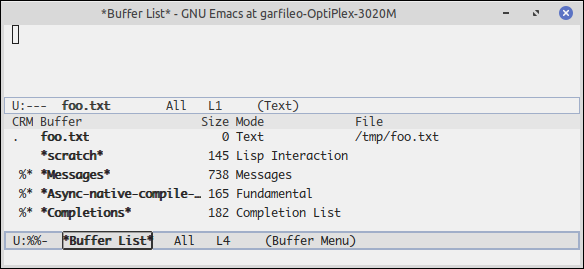
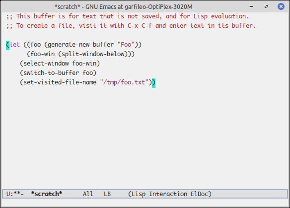

---
title: 虚相
abstract: 虚而不屈，动而愈出。
date: 2025 年 05 月 30 日
...

# 前言

我们总是习惯于说，用 Emacs 编辑某文件。对于其他文本编辑器，我们也是习惯如是说。实际上用文本编辑器编辑文件，只是一种假象。我们总是在内存里编辑着文件的虚相，并在某个时机将虚相写入文件，从而变为实相。这个事实，倘若你从未用 C/C++ 之类的语言写过程序或者对计算机运作原理近乎一无所知，通常难以体会。一些能够自动保存文件内容的编辑器——Emacs 也可以如此——，很容易给你造成错觉，以为你正在编辑硬盘里文件的内容。Emacs 极为擅长营造虚相，可谓文字编辑行当的 PhotoShop。

# 缓冲区

每次当你运行 Emacs 时，即使你只用 Emacs 打开了一份文件，例如 foo.txt，Emacs 会在内存空间创建名为 foo.txt 的缓冲区并将 foo.txt 现有内容复制到该缓冲区，除此之外，Emacs 还有一些缓冲区隐藏在幕后。

执行 `M-x list-buffers`，你可以看到 Emacs 当前的所有缓冲区的名字，其中有些缓冲区关联着硬盘上的文件，例如上述的 foo.txt 缓冲区，也有一些缓冲区并不关联任何文件，例如 `*scratch*`、`*Messages*` 以及`*Completions` 等缓冲区，还有一个缓冲区，甚至不会显示在 `list-buffers` 的结果中，它就是微缓冲区。需要注意的是，`*Messages*` 就是 `message` 函数用于输出信息的缓冲区。



在当前窗口里，可以使用 `C-x b` 切换缓冲区，倘若你不知道要切换的缓冲区的名字，可以 `C-x b TAB`，开启 `*Completions*` 缓冲区及其窗口，然后从中选择你要切换的缓冲区。`TAB` 即制表键，亦即 Tab 键。在 Emacs 里以及 Unix 或 Linux 的 Shell 里，Tab 键通常用于自动补全命令，故而在 Emacs 里，通过它，能开启 `*Completions*` 缓冲区及其窗口。

倘若你只是想试验一下，并不想切换缓冲区，只需将光标定位到 `*Completions*` 缓冲区所在窗口，摁 `q` 键退出该窗口，然后使用 `C-g` 终止 `C-x b` 操作。

使用 `C-k 缓冲区名` 可以关闭指定的缓冲区，也可以用 `C-k TAB` 补全的方式，从打开的 `*Completions*` 缓冲区所在窗口选择要关闭的缓冲区。

# 创建缓冲区

在 Elisp 语言中，缓冲区是一种数据类型，通过默认绑定于在 `C-x C-f` 的 `find-file` 函数便可为该类型创建实例或对象。例如，表达式 `(find-file "/tmp/foo.c")` 与 `C-x C-f /tmp/foo.c` 等效。再例如

```lisp
(let ((foo-c-buf (find-file "/tmp/foo.c")))
    (message "此刻我在缓冲区 %s 里" (buffer-name foo-c-buf)))
```

上述代码是通过 `let` 表达式，将 `find-file` 创建的缓冲区对象记为 `foo-c-buf`，然后用函数 `buffer-name` 获取 `foo-c-buf` 所记缓冲区对象的名字，最后用 `message` 表达式输出该名字。在 Emacs 里对上述表达式求值，即在其尾部执行 `C-x C-e`，所产生的效应是，Emacs 会创建名为 `foo.c` 的缓冲区，并将其设置为当前缓冲区，然后在微缓冲区中显示了该缓冲区的名字。

使用更为基础的 `generate-new-buffer` 可创建无文件绑定的缓冲区对象。例如

```lisp
(let ((foo (generate-new-buffer "Foo")))
    (message "缓冲区 %s" (buffer-name foo)))
```

上述表达式可以创建名为 `Foo` 的缓冲区对象，并将其记为局部变量 `foo`，然后在微缓冲区（或 `*Message*` 缓冲区）输出该缓冲区对象的名字 `Foo`。

将创建的缓冲区对象记为变量，是为了后续通过变量访问该对象，为了便于叙述，我们对二者不作区分，例如一旦将某个缓冲区对象记为某变量，就相当于一个人有了名字，我们可以用此名指代此人。名字不过是符号，用于指代某物。事实上，Elisp 语言里，变量名的确只是符号，为一个变量赋值的本质是用一个符号绑定一个值。

# 当前缓冲区

Emacs 运行期间，可以创建多个缓冲区。这些缓冲区可以在某个窗口中呈现，也可以隐藏在幕后，但无论何时，只有一个缓冲区可作为当前缓冲区。可以使用 `set-buffer` 函数将某个缓冲区对象设为当前缓冲区，例如

```lisp
(let ((foo (generate-new-buffer "Foo")))
    (set-buffer foo))
```

上述表达式创建了缓冲区对象 `foo` 并将其设为当前缓冲区。

倘若你希望缓冲区的内容能永久保存下来，在将缓冲区对象设为当前缓冲区后，可使用 `set-visited-file-name` 将其关联指定的文件，例如

```lisp
(let ((foo (generate-new-buffer "Foo")))
    (set-buffer foo)
    (set-visited-file-name "/tmp/foo.txt")
    (message "缓冲区 %s" (buffer-name foo)))
```

当缓冲区对象 `foo` 与文件 /tmp/foo.txt 关联后，缓冲区对象的名字便会由 `Foo` 变为 `foo.txt`。使用 `with-current-buffer` 可以将某个缓冲区对象变为当前缓冲区，并关联一组相关的操作。例如，上述代码可等效修改为

```lisp
(let ((foo (generate-new-buffer "Foo")))
	(with-current-buffer foo
		(set-visited-file-name "/tmp/foo.txt")
		(message "缓冲区 %s" (buffer-name foo))))
```

使用 `with-current-buffer` 表达式的好处是，你无需时刻记住当前缓冲区是谁。

# 内容转移

缓冲区，也许是 Elisp 语言里最为重要的数据类型了，其功用令其他编程语言所提供的字符串类型难以企及。在当前缓冲区内，你可以移动光标，在任意位置插入文字，可以随时将缓冲区内容保存到文件，也可以将一个缓冲区中的内容复制到另一个缓冲区。

`insert-buffer` 可将指定的缓冲区的内容插入到当前缓冲区光标所在位置。例如

```lisp
(let ((foo (generate-new-buffer "Foo"))
	  (bar (generate-new-buffer "Bar")))
	(with-current-buffer foo
		(insert "i am foo!"))
	(with-current-buffer bar
	    (insert-buffer foo)))
```

上述代码创建了两个缓冲区对象 `foo` 和 `bar`。在 `foo` 中，我们随意插入了文字「i am foo!」。然后，我们将 `foo` 中的内容插入到了 `bar` 中。

不过，`insert-buffer` 是可交互函数，亦即它需要通过 `M-x` 的方式调用，在 Elisp 程序里直接调用它，Emacs 不太同意这种行为。正确的方式是使用 `insert-buffer` 的非可交互版本，即 `insert-buffer-substring`，后者可以将给定的缓冲区及其内容的子域插入到当前缓冲区。例如

```lisp
;; 将 foo 缓冲区全部内容插入到当前缓冲区
(insert-buffer-substring foo)
;; 将 foo 缓冲区的第 1 至第 7 个字符插入到当前缓冲区
(insert-buffer-substring foo 1 7)
```

`erase-buffer` 可以清除当前缓冲区的内容，若在上述示例中使用这个函数，实现的效果便是，`foo` 中的内容被转移到了 `bar`。

```lisp
(let ((foo (generate-new-buffer "Foo"))
	  (bar (generate-new-buffer "Bar")))
	(with-current-buffer foo
		(insert "i am foo!"))
	(with-current-buffer bar
	    (insert-buffer-substring foo)
		(with-current-buffer foo
		    (erase-buffer))))
```

函数 `point-min` 和 `point-max` 可分别获取当前缓冲区的开始和末尾的位置。例如，若当前缓冲区一共含有 100 个字符，则 `(point-min)` 的求值结果为 1，而 `(point-max)` 的结果为 100，借助前者，我们可以将光标移动到缓冲区首部，借助后者不仅可将光标移动到缓冲区尾部，而且也能获知缓冲区的长度。函数 `point` 可以获取当前缓冲区中，光标的当前位置。当前缓冲区的光标可以通过 `goto-char`、`forward-char` 以及 `backward-char` 移动。想必你还记得我们曾经用过它们。

基于上述的缓冲区内的光标定位功能，可以自由地将一个缓冲区中的内容插入到另一个缓冲区中指定的位置，也许你此刻还不理解有何必要如此。很快，我会向你证明它的意义。

# 赋以窗口

当前的缓冲区未必在当前的窗口里呈现。不过，当输入焦点落入某窗口，亦即该窗口被激活，则与该窗口关联的缓冲区会自动成为当前缓冲区。

`selected-window` 可获得当前被激活的窗口。例如

```lisp
(let ((live-window (selected-window)))
    (when (windowp live-window)
	    (message "这是一个窗口"))
	(when (window-live-p live-window)
	    (message "这是一个激活的窗口")))
```

`windowp` 和 `window-live-p` 皆为 Elisp 谓词函数，分别用于判定一个对象是否为窗口以及是否为激活的窗口。`when` 表达式，想必你还记得，它表达「若……为真，则……」的逻辑。

如同总有一个缓冲区对象是当前的，也总有一个窗口是激活的。在激活的窗口里，可以使用 `switch-to-buffer` 将指定的缓冲区对象呈现于窗口中并使之成为当前缓冲区。例如

```lisp
(let ((foo (generate-new-buffer "Foo")))
	(switch-to-buffer foo)
	(set-visited-file-name "/tmp/foo.txt"))
```

上述表达式与 `(find-file "/tmp/foo.txt")` 等效。

也许你还记得 `C-x 2` 和 `C-x 3`，它们可以构造新窗口，它们分别绑定函数 `split-window-right` 和 `split-window-below`。这意味着，在 Elisp 程序里，可以利用这两个函数创建新窗口，并使用 `select-window` 函数（注意，它不是 `selected-widow` 函数）将其激活。例如

```lisp
(let ((new-window (split-window-below)))
	(select-window new-window))
```

对上述表达式求值，产生的效果是，当前窗口从正中间被横向一分为二，上方是原有窗口，下方是新建窗口，且输入焦点落在下方窗口里。

结合上述缓冲区的函数，我们可以让创建新窗口的示例更为生动。例如，创立缓冲区，将其关联到某个文件，然后为该缓冲区新建窗口。

```lisp
(let ((foo (generate-new-buffer "Foo"))
	  (foo-win (split-window-below)))
	(select-window foo-win)
	(switch-to-buffer foo)
	(set-visited-file-name "/tmp/foo.txt"))
```



# 总结

我们已经步入 Emacs 世界里我认为最为有趣的地方。在此处，你能直观深切感受到，天地之间，其犹橐龠乎？虚而不屈，动而愈出。你在 Emacs 窗口中的一切所见，不过是幕后的缓冲区在各种命令揉捏雕琢的形状在某个时间剖面上的投影。人类对 Emacs 可作出的配置，是不可穷尽的，但缓冲区机制是非常容易把握的，故曰多闻数穷，不若守中。
