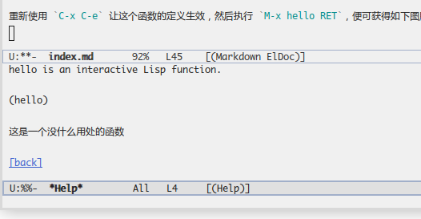

---
title: 命令
abstract: 负阴抱阳，冲气为和。
date: 2025 年 05 月 29 日
...

# 前言

计算机上古时代，大概是上个世纪 70 年代中期，有一种计算机，名曰 Lisp 机，其 CPU 可作为 Lisp 语言的解释器，亦即在这种计算机里，Lisp 程序可以直接运行。譬如，你所写的每个 Lisp 表达式，CPU 可对其求值，于是单个表达式即可为程序，就像地球上最早的生命体——单细胞生物以及后来的多细胞生物。

时间到了 80 年代初期，Lisp 机在市场上败给了运行着 Unix 操作系统的计算机。之后年轻的黑客 Richard Stallman 在 Unix 系统里复活了 Lisp 机。这个重生的 Lisp 机便是 Emacs，是 Richard Stallman 领导的自由软件革命事业的一部分。Stallman 的理想是创造一个可供人类自由使用的 Unix 系统。他和一些志同道合的黑客奋斗数年，创造了可与 Unix 系统适配的软件生态，万事俱备，唯缺内核，相当于他们创造出来一辆尚不具备引擎的汽车。

90 年代初，又一位年轻的黑客，Linus Torvalds 创造了 Linux 内核。在当时的自由软件精神的感召下，他将 Linux 内核也以自由软件的形式公诸于众，于是 GNU 项目夙愿得偿，一个完整的 Unix 系统的替代品 GNU/Linux 就此诞生。不过，为 GNU 伟大胜利欢呼的余音尚在绕梁之时，自由软件阵营发生了严重分裂。以 Eric Raymond 为首的一部分自由软件开发者认为贫穷不是社会主义，必须拥抱市场，于是创建了开源软件理念，与 GNU 项目分道扬镳。

无论风云如何变幻，时至今日，Emacs 依然是一个非常重要的软件，且顽强进化着。它活在 Linux 里，活在 macOS 里，活在 Windows 里，活在 Android 手机里。Lisp 机不复存在，而我们可以通过 Elisp 语言感受其灵魂。你依然可以像当初在 Lisp 机器上的黑客那样，对一个表达式求值，相当于运行了一个程序。

# 可交互函数

在 Unix 以及后来的 Linux 系统中，一个程序通常意味着是一个可以在 Shell 中运行的命令。实际上，Emacs 的微缓冲区也可以视为 Shell，只是它运行的并非 Unix 或 Linux 中的命令，而是一种特殊的 Elisp 函数，即可交互函数。

你可以在 init.el 添加一个 hello 函数，其定义如下：

```lisp
(defun hello ()
    (interactive)
    (princ "Hello world!"))
```

将光标移动到上述函数定义的末尾，执行 `C-x C-e`，然后执行 `M-x hello RET`，便可在微缓冲区里看到「Hello world!」字样。或者，保存上述对 init.el 的内容，重新打开 Emacs，执行  `M-x hello RET`。

若一个函数的定义里，第一个表达式是 `(interactive)`，便意味着这个函数可以作为命令使用，甚至可以通过 `C-h f` 查看其说明。Elisp 函数定义中，若第一个表达式是字符串，该字符串便是函数的说明。例如，重新定义上述 `hello` 函数：

```lisp
(defun hello ()
    "这是一个没什么用处的函数"
    (interactive)
    (princ "Hello world!"))
```

重新使用 `C-x C-e` 让这个函数的定义生效，然后执行 `C-h f hello RET`，便可获得如下图所示的帮助信息：



# 参数

`(interactive)` 并非仅仅是让函数变成可在 `M-x` 中执行的命令，它更重要的功能是从微缓冲区接收命令执行者提供的参数并为参数提供提示信息，参数的类型只有两种形式——字符串和数字。

以下代码定义了可接收两个参数的函数 `foo`，令其定义生效后，倘若你执行 `M-x foo RET hello RET 3 RET`，结果可在缓冲区看到「hello 3」字样。当输入 `foo` 命令并回车后，Emacs 会在微缓冲区显示「输入文字：」。在输入「hello」并回车后，Emacs 会在微缓冲区显示「输入数字：」。在输入「3」并回车后，`foo` 便获得了参数 `a` 和 `b` 的值。

```lisp
(defun foo (a b)
    "这是一个没什么用处的函数。"
    (interactive (list
	                 (read-string "输入文字：")
					 (read-number "输入数字：")))
    (princ (format "%s %d" a b)))
```

上述函数定义中的 `interactive` 表达式也可写为更为直接的形式：

```lisp
(interactive
"s输入文字：
n输入数字：")
```

`s` 表示字符串，`n` 表示数字。这种直接获取参数的方式有些丑陋，切不可为了美观将其写为

```lisp
(interactive
    "s输入文字：
    n输入数字：")
```

不过，写成以下形式是可行的，其中的 `\n` 是换行符，而不是数字示意符，其后的 `n` 才是数字示意符。

```lisp
(interactive "s输入文字：\nn输入数字：")
```

# 长缨小试

倘若你经常编写 C 程序，应该知道 C 程序的头文件通常要加入三条预处理指令，以保证该文件在 C 程序编译过程中不会被重复载入。例如，在 foo.h 文件，其前两行通常要写为

```c
#ifndef FOO_H
#define FOO_H
```

最后一行要写为

```c
#endif
```

我们可以定义一个 Emacs 命令 `c-header`，它接受一个字符串参数，自动生成上述的预处理执行。

```lisp
(defun c-header (name)
    "初始化 C 程序头文件。"
	(interactive "s头文件名: ")
	(insert (format "#ifndef %s_H\n" (upcase name)))
	(insert (format "#define %s_H\n\n" (upcase name)))
	(insert "#endif"))
```

上述代码中使用的 `upcase` 函数，可将字符串中的小写字符转换为大写。

当 `c-header` 定义生效后，执行 `M-x c-header RET foo_bar RET` 便可在缓冲区内自动插入以下内容：

```c
#ifndef FOO_BAR_H
#define FOO_BAR_H

#endif
```

# 变量

善于编程的你，想必已经敏锐的觉察到上一节定义的 `c-header` 函数是低效的，它对 `upcase` 表达式进行了重复求值。我们可以用一个变量保存 `upcase` 的结果，然后重复使用该变量，便可提高 `c-header` 的性能。想必你还没有忘记 `setq`。

```lisp
(defun c-header (name)
    "初始化 C 程序头文件。"
	(interactive "s头文件名: ")
	(setq name (upcase name))
	(insert (format "#ifndef %s_H\n" name))
	(insert (format "#define %s_H\n\n" name))
	(insert "#endif"))
```

# let 表达式

在 Elisp 语言中，除了函数的参数，其他变量默认是全局变量。这一点也许与你所熟悉的那些编程语言不同，而且想必你也清楚全局变量的危险，它会给程序带来不确定性。例如

```lisp
(defun foo ()
    (setq bar 3)
	(message (format "%d" bar)))

(foo) ;; 显示 “3”
(message "%d" bar) ;; 显示 "3"
```

上述代码定义了函数 `foo`，然后对 `foo` 求值，继而在微缓冲区打印在 `foo` 内部定义的变量 `bar` 的值 `3`。你应该发现了诡异之处，即在函数内部定义的变量，竟然可以在函数外部访问，原因在于 `bar` 是全局变量。

另外，需要注意的是，`message` 是一个可以在微缓冲区显示内容的函数，它比之前多次用过的 `princ` 更适合做这件事，因为用后者在微缓冲区显示信息时，Emacs 会将 `princ` 自身的求值结果也显示在微缓冲区，导致信息重复显示。

除了将变量作为函数的参数外，有一种办法可以定义局部变量，即 `let` 表达式。例如，可将上述函数 `foo` 重新定义为

```lisp
(defun foo ()
    (let ((n 3))
	(message "%d" n)))
```

若试图在 `foo` 外部访问变量 `n` 的值，Emacs 便会抱怨 `n` 是无效变量。

`let` 表达式可以定义多个局部变量，但是需要注意，访问局部变量的代码必须在 `let` 表达式内。例如

```lisp
(let ((a "Hello")
      (b 3.1415926))
    (message "%s %f" a b))
```

# 定位光标

`goto-char` 函数可将光标定位在指定位置。`point` 函数可以获取当前的光标位置。基于这两个函数，我们可以让 `c-header` 更好用一些，可以让它在完成第三条预处理指令 `#endif` 的插入之后，将光标定位到该预处理指令之前，即将光标定位在以下代码的 `▌` 所示位置。

```c
#ifndef FOO_BAR_H
#define FOO_BAR_H
▌
#endif
```

以下代码重新定义 `c-header`。

```lisp
(defun c-header (name)
    "初始化 C 程序头文件。"
	(interactive "s头文件名: ")
	(setq name (upcase name))
	(insert (format "#ifndef %s_H\n" name))
	(insert (format "#define %s_H\n" name))
	(let ((a "\n#endif"))
		(insert a)
		(goto-char (- (point) (length a)))))
```

上述代码中所用的 `length` 函数，用于计算字符串长度。表达式 `(- (point) (length a))`，是用 `(point)` 减去 `(length a)`。在 Elisp 里，像 `+-*/` 这些数值运算符，它们都是函数，必须像 Elisp 函数那样使用。例如

```lisp
(+ 1 2) ;; 结果为 3
(- 1 2) ;; 结果为 -1
(* 3 4) ;; 结果为 12
(+ 1 (/ 6 3)) ;; 结果为 3
```

也许你不习惯上述的前缀形式的数值运算表达式，更习惯传统的中缀表达式，例如 `(1 + 3 * 4)`。然而，凡事有弊必有利。我们之所以能够在函数名中使用 `-`，例如 `foo-bar`，正是因为 Emacs 并不会将这样的函数名理解为 `foo` 减去 `bar`。你可以在函数的名字中使用很多特殊符号，除了 `+-*/`，你也可以使用 `?^&*$@` 等符号。

`goto-char` 基于绝对位置定位光标，例如若缓冲区共有 100 个字符，而 `goto-char` 的参数是 95，则 `goto-char` 便将光标定位在第 95 个字符所在的位置。Emacs 也提供了基于相对位置定位光标的函数，即 `forward-char` 与 `backward-char`，分别用于向前和向后移动光标。这里所谓的向前移动光标，含义是向缓冲区尾部移动光标，而向后移动光标，含义是向缓冲区首部移动光标。我们可以用 `backward-char` 将上述的 `c-header` 函数定义中的 `let` 表达式简化为

```lisp
(let ((a "\n#endif"))
	(insert a)
	(backward-char (length a)))
```

# 总结

通过亲手编写一个可作为命令使用的 Elisp 函数，你也许已经感受到了，在 Emacs 朴素的表象背后隐藏着一股神秘且巨大的力量，犹如可缚苍龙的长缨。

Emacs 的神秘力量由 C 语言实现的文本编辑器核心以及同样以 C 语言实现 Elisp 语言的解释器构成。Emacs 的外围部分，是我们最为常用的部分，可称为应用层，主要由 Elisp 语言实现。Emacs 用户可以继续使用 Elisp 语言在 Emacs 应用层面编写程序，通过它们完成复杂的文字编辑工作，亦可将这些程序与他人共享，亦即 Emacs 不仅是一台计算机，也是一个完备的操作系统，如同它的先祖 Lisp 机，而你可以是它的用户，也可以是它的开发者。

在 Emacs 里，我经常能感受到这样一幅画面，一个人出走了半生，归来时仍是少年。
