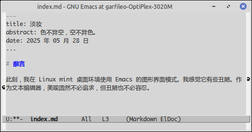
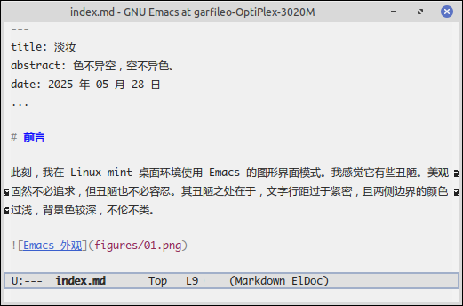

---
title: 淡妆
abstract: 色不异空，空不异色。
date: 2025 年 05 月 28 日
...

# 前言

此刻，我在 Linux mint 桌面环境使用 Emacs 的图形界面模式。我感觉它有些丑陋。美观固然不必追求，但丑陋也不必容忍。其丑陋之处在于，文字行距过于紧密，且两侧边界的颜色过浅，背景色较深，不伦不类。



# 行距

Emacs 缓冲区里的文字行距是由变量 `line-spacing` 控制，其值默认为 `nil`。

在 Elisp 中，可使用 `setq` 为变量赋值，例如

```lisp
(setq a 1
      b 2
	  c 3)
```

上述代码为变量 `a`，`b` 和 `c` 分别赋以 1，2 和 3，亦即 `setq` 表达式可为一组变量赋值。

用 `setq` 可将 `line-spacing` 值设为 4 个像素，如下

```lisp
(setq line-spacing 4)
```

不过，`line-spacing` 是缓冲区局部变量（Buffer-local variable），若对上述表达式求值，只有当前缓冲区的文字行距会发生变化，其他缓冲区则不受影响。

倘若你不想每次开启缓冲区，都要设定一次 `line-spacing` 的值，对于此类缓冲区局部变量的赋值，一劳永逸的方法是使用 `setq-default` 直接为此类变量设定默认值。`setq-default` 的用法与 `setq` 相同。

```lisp
(setq-default line-spacing 4)
```

# 缩进

若主要是用 Emacs 编写代码，可能会遇到制表符不一致而导致的代码缩进混乱，原因是制表符的宽度并不固定，有的软件将其设为 4 个空格宽度，有的则设为 8 个空格宽度。故而，你在 Emacs 里编写的代码，在其他软件里打开，可能会出现缩进混乱的情况。为了避免这种情况，建议禁用制表符，让 Emacs 自动以空格作为代替，亦即在 init.el 中添加以下设定：

```lisp
(setq-default indent-tabs-mode nil) ;; 用空格代替 Tab
```

由于 `indent-tabs-mode` 是缓冲区局部变量，倘若用 Emacs 编辑诸如 Makefile 之类必须使用制表符的文件，对应的编辑模式会主动将这个变量设为 `t`，从而启用制表符。

**练习**：执行 `C-h v tab-width RET`，查看缓冲区局部变量 `tab-width` 的说明。

# 颜值

Emacs 的 `set-face-attribute` 函数能够修改缓冲区背景、边框以及模式行的颜色，所谓模式行即缓冲区与微缓冲区之间的工具条，用于显示缓冲区的名字、文字行号、编辑模式等信息。若在图形界面模式下，模式行提供了可与鼠标交互的菜单功能。

Emacs 默认的缓冲区背景色较深，可以使用以下代码将其修改为银色：

```lisp
(set-face-attribute 'default nil :background "#f0f0f0")
```

`set-face-attribute` 的第一个参数表示要修改的颜面（Face）类型，若该参数为 `'default`，表示默认的颜面，或者最大的颜面，不妨将其理解为主颜面，即框架的外观。第二个参数是颜面所在的框架，若其值为 `nil` 则表示当前框架。其余参数皆为键值对，例如 `:background` 是键，表示颜面的背景，`#f0f0f0` 是值，是银白色。

接下来，继续用 `set-face-attribute` 设置框架两侧边框的颜色：

```lisp
(set-face-attribute 'fringe nil :background "#f0f0f0")
```

框架两侧的边框叫作 `'fringe`，其背景色与 `'default` 颜面相同，亦即边框颜色与框架背景色相同。

以下代码设置模式行的背景，并将其边框线宽设为 2 个像素，边框颜色设为蓝灰色。

```lisp
(set-face-attribute 'mode-line nil
                    :background "#e0e0e0"
                    :box `(:line-width 2 :color "#a1afc9"))
```

当 Emacs 存在多个窗口时，每个都会有一个模式行，但是只有输入焦点所在的窗口，其模式行是激活状态，其他窗口的模式行皆为非激活态。Emacs 也允许定制非激活态的模式行外观，如下：

```lisp
(set-face-attribute 'mode-line-inactive nil
                    :background "#f0f0f0"
                    :box `(:line-width 1 :color "#a1afc9"))
```

这一切应该不难理解，动手一试，便知其意。

`set-face-attribute` 能修改 Emacs 中的一切颜面，前提是你需要知道它们的名字。`M-x list-faces-display` 可以查看全部颜面的名字。

# 函数

上文对框架外观的设定，有几处使用了相同的颜色值 `#f0f0f0`，即框架的背景、框架两侧边框的背景以及非激活态模式行的背景，所用颜色相同，激活态模式行的背景色是 `#e0e0e0`，较 `#f0f0f0` 略深一些。模式行的边框颜色相同，只是线宽有差异。我们可以将整个外观设定过程定义为一个函数，将颜色值作为函数的参数传入，不仅是的外观定制过程更为集中，也便于以后修改外观颜色。

Elisp 函数定义形式如下

```lisp
(defun 函数名 (参数表)
    函数体)
```

将上文对 Emacs 外观的所有设定封装为函数 `my-theme`：

```lisp
(defun my-theme (bg-color mode-line-bg-color)
    (setq-default line-spacing 4)
    (set-face-attribute 'default nil :background bg-color)
	(set-face-attribute 'fringe nil :background bg-color)
	(set-face-attribute 'mode-line nil
                        :background mode-line-bg-color
                        :box '(:line-width 2 :color "#a1afc9"))
	(set-face-attribute 'mode-line-inactive nil
                        :background bg-color
                        :box '(:line-width 1 :color "#a1afc9")))
```

需要注意的是，函数的定义也是一个表达式，Emacs 对其求值结果是函数名，你不妨在函数定义后面 `C-x C-e` 一试。`my-theme` 的用法如下：

```lisp
(my-theme "#f0f0f0" "#e0e0e0")
```

Emacs 对上述代码求值，便可完成外观设定。

# 新颜

上文所作的一切设定，只对 Emacs 的图形界面模式有效，故而相关代码应当放在 init.el 文件里的 `when` 表达式中。希望你没有忘记，我们已在 `when` 表达式里设定了字体。现在若加入文字行距与框架组件背景色的设定，代码应当如下：

```lisp
(when window-system
    ;;配置中英文字体
    (set-frame-font (font-spec :name "Monaco" :size 12))
    (dolist (script '(han cjk-misc bopomofo))
        (set-fontset-font 
            (frame-parameter nil 'font) 
            script
            (font-spec :name "Microsoft YaHei" :size 12)))
    ;;配置 Emacs 框架外观
    (my-theme "#f0f0f0" "#e0e0e0"))
```

上述代码中的分号，是 Elisp 语言的注释符。每行注释，只需以一个分号作为开头即可。我习惯写两个分号，是为了让注释更醒目一些。现在，我的 Emacs 外观变成了如下图所示的样子，我已对它已基本满意。



# 总结

许多人的 Emacs 外观配置得远比我的精美，这意味着他们的 `(when window-system ...)` 表达式中增加的代码会多一些，故而他们的 init.el 的可维护性会差一些，于是他们的 Emacs 启动速度会慢一些，应变的能力也会弱一些。

也许任何事物，其外观和性能本质上是混而为一的，即所谓的，色不异空，空不异色；色即是空，空即是色；受想行识，亦复如是。倘若你需要将 Emacs 作为礼器，可执着于色相。倘若你需要将 Emacs 作为工具甚至武器，需守着它的空性。
