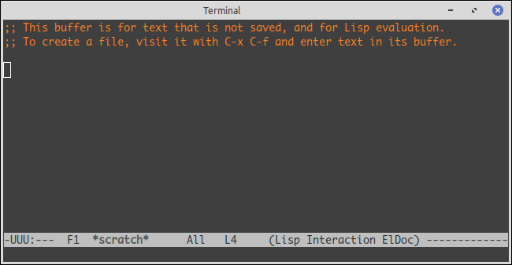

---
title: 字体
abstract: 移花接木，非我所愿。
date: 2025 年 05 月 28 日
...

# 前言

在古代……计算机文明的古代——大致从上个世纪 80 年代算起，无论是操作系统，还是文字处理软件，对汉字的支持，都是极为困难的。无数前辈，不论中西，前仆后继，在大多数软件里，汉字的问题已得以妥善解决，以致今日的你我，在软件里输入汉字，几乎像呼吸与喝水一样自然。

Emacs 还残存着一些古老的记忆，以致于当你尝试为 Emacs 配置你喜欢的字体时，依然能触摸到些许苍凉的历史。此外，你应该有些心理准备，为 Emacs 配置字体，本质上是在编写一个 Elisp 程序。

# 等宽字体

适合用于文本编辑器的字体，通常是等宽（Mono）字体。所谓等宽，是指每个西文字符的宽度相同。有些场景里也称等宽字体为打字机字体，原因也是打字机产生的字符是等宽的。

为什么强调是西文字符呢？因为汉字的宽度本来就是相同的。西文的等宽字体，主要是用于排版或显示程序代码。如下图所示，同样一段代码，左侧为非等宽字体排版，右侧为等宽字体排版，程序员群体倾向于右侧，而文本编辑器的主要应用场景通常与编程密切相关，故而适合使用等宽字体。


我喜欢的西文等宽字体是 Monaco。至于汉字字体，黑体较楷体、宋体更适合文本编辑器，我喜欢微软雅黑（Mircrosoft YaHei）字体。不过，这两个字体，前者是苹果公司开发的，后者是微软公司开发的，而我一直以来使用的操作系统是 Linux，于道德上，不应从 macOS 和 Windows 里获取它们，放在 Linux 里用。

倘若你是君子，在 Ubuntu 系统里能够找到 Ubuntu Mono 字体，它与 Monaco 相似。至于汉字的黑体，在十几年前若不使用国内开源社区的一款众创作品文泉驿黑体，只能不讲武德，从 Windows 系统里偸取了。现在 Ubuntu 里有 Google 主导开发的一系列 Noto 字体，其中 Noto Sans CJK SC，亦称简体思源黑体，足以显示或排版简体汉字。除了思源黑体外，Google 也开发了思源宋体。此外，文泉驿黑体现在依然可用。

不知此刻，你是否还像以往那样，觉得在软件里输入汉字，几乎像呼吸与喝水一样自然的事。虽然我直至现在，依然在 Linux 里使用 Monaco 和微软雅黑，一直不曾有过任何良心的谴责，不过我还是应当告诉你，该如何为 Emacs 配置合乎道德的字体，且以容易获得的 Ubuntu Mono 和 Noto Sans CJK SC 为例。

# Elisp 程序

用 Elisp 编写可由 Emacs 运行的程序并不困难。例如，倘若你在 init.el 文件里添加以下代码：

```lisp
(insert "Hello world!")
```

之后每次当你开启 Emacs 时，都能看到缓冲区的开头是「`Hello world!`」，此即 Elisp 的 Hello world 程序。`insert` 是 Elisp 函数，它可以将字符串写入 Emacs 缓冲区。

**练习**：在 Emacs 里编写上述代码，然后将光标移到该行代码的末尾，执行 `C-x C-e`，观察发生了什么。

Elisp 程序可由一个或一组表达式构成，每个表达式都是一对小括号包围的文本。Emacs 运行 Elisp 程序的过程便是对表达式求值。`C-x C-e` 可临时驱使 Emacs 对光标之前的表达式求值。对于上述的代码中的表达式，其求值结果为空，Elisp 用 `nil` 表示空值。用 `C-x C-e` 对表达式求值时，求值结果会显示于微缓冲区里。由于 `insert` 函数是将字符串插入到光标所在的位置，故而上述练习在缓冲区里的结果是

```lisp
(insert "Hello world!")Hello world!
```

现在，将上述代码从 init.el 里删除。

# 设置主字体

为 Emacs 配置字体原本并不难，难的是，在古代知道一个字体的名字异常困难。例如下面的代码，是 Ubuntu Mono 字体在 Emacs 里的名字，希望它不会让你做噩梦。

```
-DAMA-Ubuntu Mono-regular-normal-normal-*-12-*-*-*-m-0-iso10646-1
```

现在，我们可以不必面对这些像噩梦的字体名了，它们是古老的 X11 时代的怪物。在现代的 Emacs 里，可以用 `font-spec` 函数自动生成这些噩梦。例如，

```lisp
(font-spec :name "Ubuntu Mono" :size 12)
```

即使你完全不懂 Elisp 编程，单从字面上也能看出，上述的代码指定了字体 `Ubuntu Mono`，字号为 12pt。

`font-spec` 中使用的字体名，与现代的桌面操作系统中的字体名是一致的。例如，假设你在微软的 Word 软件里能找到 `Ubuntu Mono` 字体，则该字体名便可用于 `font-spec`，从而让 Emacs 在操作系统中找到这款字体。在 Linux 桌面环境里，可以使用 fc-list 命令查看系统里的所有字体。例如，查看 `Ubuntu Mono`，只需

```console
$ fc-list | grep "Ubuntu Mono"
/usr/share/fonts/truetype/ubuntu/UbuntuMono[wght].ttf: Ubuntu Mono:style=Regular
/usr/share/fonts/truetype/ubuntu/UbuntuMono-Italic[wght].ttf: Ubuntu Mono:style=Medium Italic
... ... ... ... ... ...
```

UbuntuMono[wght].ttf 便是 `Ubuntu Mono` 的正体（Regular）字体。西文字体，往往不是单一字体。每种字体，通常又分为正体、斜体、粗体、粗斜体等，故而通常以字族（Font Family）指代西文字体。上述的 `font-spec` 函数的应用，将 `:name` 换成 `:family` 便可为 Emacs 生成一个字族的信息。

`font-spec` 函数构造的信息，传递于 `set-frame-font` 函数，便可完成 Emacs 字体的配置工作，即

```lisp
(set-frame-font (font-spec :family "Ubuntu Mono" :size 12))
```

上述代码是嵌套形式的表达式。Emacs 对该表达式求值时，会先对内部的 `font-spec` 函数求值，然后将求值结果作为 `set-frame-font` 的参数，再对 `set-frame-font` 求值。最终的求值结果是，将当前窗口的字体修改为 `Ubuntu Mono`。将上述代码复制到 init.el 里，之后每次启动 Emacs 时，Emacs 缓冲区所用的字体便是 `Ubuntu Mono` 了。

倘若不信，可在 Emacs 里当场写下以下代码：

```lisp
(insert (frame-parameter nil 'font))
```

将光标移动上述代码的尾部，然后执行 `C-x C-e` 便可得到当前框架所用字体的噩梦之名。`frame-parameter` 函数可获得指定框架（Frame）所用字体的名字，若其第 1 个参数为空值，即 `nil`，则获取当前框架所用字体的名字。

需要注意，上文用的术语是「框架」，而非「窗口」。在 Emacs 的图形界面中，框架是最外层的结构。一个框架，可以包含 1 个或多个窗口。还记得吗？Emacs 可通过 `C-x 2` 或 `C-x 3` 将当前窗口分割为多个窗口。更严谨说法应该是，Emacs 可通过 `C-x 2` 或 `C-x 3` 将当前框架分割为多个窗口。

# 字体替补

Ubuntu Mono 是西文字体，只包含字母、数字和少量符号，并不包含任何汉字。现在的 Emacs 足够智能，遇到框架字体缺乏的字符时，会从系统中自动搜索一个包含该字符的字体作为替补（Fallback）字体。倘若你不想亲手设定替补字体，那么本文阅读至此便可结束了。

我们可以在 init.el 中设定我们所期望的替补字体，而非 Emacs 自作主张胡乱找到的某个字体。设定替补字体的函数是 `set-fontset-font`，该函数的用法如下：

```lisp
(set-fontset-font 主字体 字符集脚本 替补字体)
```

亦即 `set-fontset-font` 可将主字体中的部分字符更改为替补字体。所谓的字符集脚本，要理解它，前提是需要理解 Unicode 编码范围。不过，在此我可以基于我的理解大致概括一下。

Unicode 为这个世界上几乎所有的文字赋予了编码。你可以将 Unicode 理解为一个编码空间，其中任何一个编码都表示着某个文字。在这个空间里，整个汉字集合被规划为多个子集，散布在这个空间里。每个汉字子集，可以通过对应的脚本选取。常用的汉字子集，在 Emacs 里，可通过 `'han` 这个脚本选取。故而，若用 `Noto Sans CJK SC` 作为常用汉字子集的替补字体，只需在 init.el 中作以下设定：

```lisp
(set-fontset-font (frame-parameter nil 'font) 'han (font-spec :name "Noto Sans CJK SC" :size 12))
```

上述代码看似复杂，但实际上所有内容，你应该都有所理解了。`frame-parameter` 函数可获取当前框架的主字体。`'han` 是 Unicode 脚本，用于指定常用汉字子集。`font-spec` 用于构造 Emacs 能理解的字体名，就是那种像噩梦一样的字体名。倘若将上述代码的形式修改为

```lisp
(set-fontset-font 
    (frame-parameter nil 'font) 
    'han 
    (font-spec :name "Noto Sans CJK SC" :size 12))
```

也许会更容易理解，这一切无非是将一些函数的求值结果作为参数传递于某个函数而已。

用 `'han` 从 Unicode 空间里选出常用汉字子集还不够，一些中文标点符号并不在这个子集内，它们需要用 `'cjk-misc` 这个脚本获取。故而，在 init.el 里，需要再添加以下代码：

```lisp
(set-fontset-font 
    (frame-parameter nil 'font) 
    'cjk-misc 
    (font-spec :name "Noto Sans CJK SC" :size 12))
```

实际上，`'han` 和 `'cjk-misc` 还不足以指定全部的中文字符。台湾地区还有一些注音符号，也是中文字符，如「ㄅ、ㄆ、ㆠ、ㆺ」等。为了统一大业，需要用 `'bopomofo` 脚本从 Unicode 空间选出它们，也用替补字体予以支持，故而在 init.el 中需添加

```lisp
(set-fontset-font 
    (frame-parameter nil 'font) 
    'bopomofo
    (font-spec :name "Noto Sans CJK SC" :size 12))
```

这些重复的代码也许已经让你有所厌烦了，甚至开始担心还需要再引入更多的 Unicode 脚本……在 Elisp 里，可以用列表简化这些代码。

# 列表

Elisp 语言是 Lisp 语言的一种方言，亦即它本质上是 Lisp 语言。Lisp 这个名字，实际上是 List Programming 的简写，即列表编程。顾名思义，Lisp 是很擅长处理列表的一种编程语言，事实的确如此。

以下表达式构造了一个数字列表：

```lisp
'(1 2 3 4 5)
```

单引号是必须的。倘若去掉它，Emacs 在对表达式求值时，会错以为 `1` 是个函数。单引号可以让 Emacs 明白，括号表达式表示的是列表，而非函数。不过，列表表达式也可以写为函数的形式。例如下面这个表达式，与上述表达式等价。

```lisp
(list 1 2 3 4 5)
```

事实上，带引号的列表构造表达式，只是以下表达式

```lisp
(quote (1 2 3 4 5))
```

的简写。你可以用 `C-x C-e` 对上述表达式求值，在微缓冲区里观察求值结果，应该是同一个结果，即 `(1 2 3 4 5)`。

`dolist` 函数可以遍历列表中每个元素，并对其作出处理。例如

```lisp
(dolist (i '(1 2 3 4 5))
    (princ (format "%d " i)))
```

执行上述表达式，可在微缓冲区输出 `1 2 3 4 5 nil`。`princ` 函数可将某个 Elisp 对象的内容输出到微缓冲区。`format` 函数能够以格式化的方式构造字符串对象，上述代码是将数字对象转化为字符串对象。倘若你懂一些 C 语言，可将上述代码理解为

```c
int a[] = {1, 2, 3, 4, 5};
for (int i = 0; i < 5; i++) {
        printf("%d ", a[i]);
}
```

需要注意的是，微缓冲区输出内容中，末尾的 `nil` 并非 `princ` 的输出，而是 Emacs 对 `dolist` 函数的求值结果。请记住，Elisp 的每个表达式必须有一个结果，没有结果的结果便是 `nil`。

在充分理解列表的构造以及遍历过程的基础上，可以将多个 Unicode 脚本写为列表的形式，然后在遍历这个列表的过程中完成替补字体的设定：

```lisp
(dolist (script '(han cjk-misc bopomofo))
    (set-fontset-font 
        (frame-parameter nil 'font) 
        script
        (font-spec :name "Noto Sans CJK SC" :size 12)))
```

# 条件表达式

Emacs 有两种工作模式，一种是图形界面模式，一种是终端模式。我们直接以命令 `emacs` 开启的 Emacs，便是图形界面模式，其终端模式对应的命令是

```console
$ emacs -nw
```

或 

```console
$ emacs --no-window-system
```



由于终端通常有自己的字体配置方式，无需在 Emacs 中配置字体，故而上文所述的字体配置程序在 Emacs 的终端模式下无效。

Emacs 提供了一个变量 `window-system`，用于表征当前模式是否为图形界面模式。若 `window-system` 的值为空值，即 `nil`，便表明 Emacs 正处于终端模式。我们可以用这个变量作为条件，有选择的实现 Emacs 字体配置。

Elisp 语言可以用 `when` 构造条件表达式。例如

```lisp
(when window-system
    (set-frame-font (font-spec :family "Ubuntu Mono" :size 12))
    (dolist (script '(han cjk-misc bopomofo))
        (set-fontset-font 
            (frame-parameter nil 'font) 
            script
            (font-spec :name "Noto Sans CJK SC" :size 12))))
```

上述的代码，使用 `when` 探测变量 `window-system` 的值是否为真值，若为真值，则对其后的表达式逐一求值。在 Elisp 语言中，若一个值非 `nil`，即为真。上述代码，在 Emacs 处于图形界面模式时，此时 `window-system` 的值非 `nil`，字体配置代码便会被 Emacs 求值，而 Emacs 处于终端模式时，`window-system` 的值为 `nil`，`when` 表达式的条件无法满足，故而其后的表达式便会被 Emacs 忽略。

请将上述代码作为最终的 Emacs 字体配置程序，写入 init.el 吧，或者将字体换成你喜欢的其他字体，只要你知道它们的名字。


# 总结

为 Emacs 配置字体并不困难，不过是在 init.el 中写入区区 7 行代码。我们觉得这一切很难，原因是，我们希望 Emacs 能像其他软件那样，打开一个对话框，从下拉列表里选出一个字体作为西文字体，再选出一个字体作为中文字体，而 Emacs 却至今也不肯如此。也许它在等待，在未来能有一款完美的字体，让中文用户不需要使用这种替补字体机制。

也许你会觉得奇怪，为何舍近求远，为何不直接将 `Noto Sans CJK SC` 这样的中文字体作为 Emacs 主字体，难道中文字体没有包含西文字符吗？你的疑问，实际上就是现实的无奈。迄今为止，的确还没有一款字体，其西文部分和汉字部分都能让我们满意。我们面对的现实很长时间以来，一直是西文字体不支持汉字，中文字体支持西文字符，但是西文字形设计远逊于西文字体。

无论如何，Emacs 字体的问题，暂且一劳永逸地解决了。更重要的是，我们已经掌握了 Elisp 编程的一些基本知识。倘若你觉得 Elisp 编写程序，似乎是有趣的。这种感受的意义远大于一种完美的中文字体。

