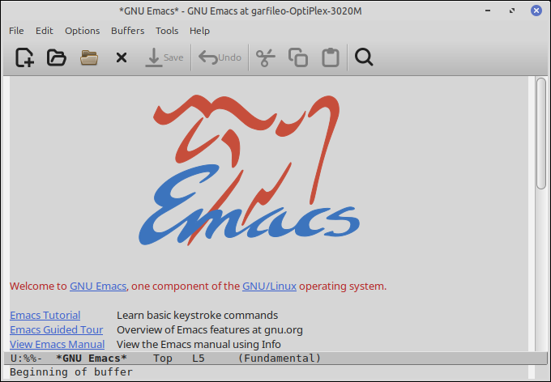
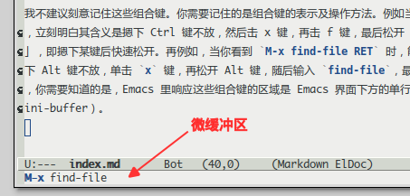
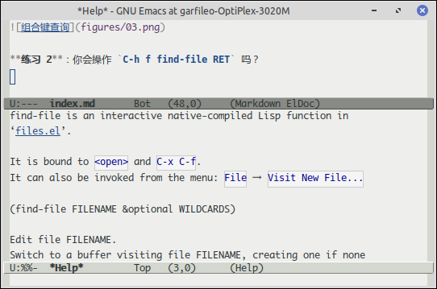
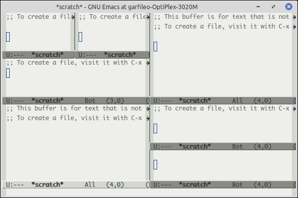
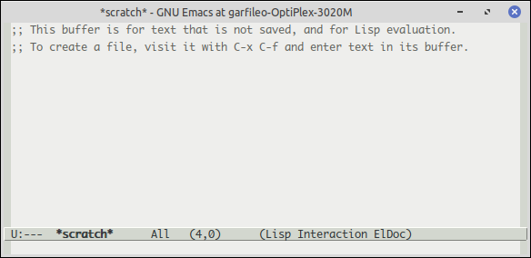

---
title: 无住
abstract: 应无所住，而生其心。
date: 2025 年 05 月 26 日
...

# 前言

作为 Emacs 的资深新手，我见过很多人立下宏愿，要学会 Emacs，甚至希望成为个中高手。我也曾有此奢求。现在我已明白，凡持此心者，注定极有可能学不会 Emacs。

你可能会觉得自己是个有毅力的人，只要你想做，这世上没有你做不好的事。然而对于学习 Emacs 这件事而言，毅力反而是有害的。毅力只能让你比寻常人晚一些放弃 Emacs，但无论你坚持多久，最终还是会放弃，甚至最终你会以自身为反面教材，谆谆教诲他人放下 Emacs，改入 Vim 或 VSCode 的门庭。

其他文本编辑器也不乏可与 Emacs 媲美的优秀之处，但是学过 Emacs，却不知为何学不会，这恰是 Emacs 独有的优秀之处。

你每天活着，活在这个你已经觉得异常熟悉的世界里。你可曾想过，要学会这个世界？倘若你从未有过这样的念头，那么为什么你会觉得 Emacs 是可以学会的呢？那些发现自己学不会 Emacs 的人，非常可惜的是他们选择放弃 Emacs，而不是放弃学习 Emacs。

Emacs 并非文本编辑器，而是一个完整且开放的世界。文本编辑器功能只是这个世界的门户而已。世界不可学，却可进入，可感受。若你从未尝试进入和感受 Emacs，而是试图学会它，掌控它，注定会徒劳而返。

# 本质

Emacs 的特点是，其形易得，其神难求。

最让初学者难以自持的是 Emacs 在文本编辑方面过于强大的功能且得之甚易。你总是能直接将他人对 Emacs 所作的配置化为己有，如同用北冥神功或吸星大法，直接吸收他人的内力。你化用他人的配置越多，越会觉得 Emacs 高深莫测，难以掌控，最终会被一种难以克服的巨大挫败感吞噬。

Emacs 其神非常简单，在 Linux 里，即位于 $HOME/emacs.d 目录下的 init.el 文件。当你第一次启用 Emacs 时，这份文件尚不存在，你需自行创建它。

```bash
$ emacs    # 运行 Emacs。用鼠标关闭 Emacs 窗口，便可结束该命令。
$ cd $HOME/emacs.d    # 进入 $HOME/emacs.d 目录
$ touch init.el    # 创建空的 init.el 文件
```



每次启用 Emacs 时，它也会自动载入 init.el，以得其神，亦即 Emacs 其神需要你亲手塑造。若你的 init.el 是空的，或者照搬他人的 init.el 的内容而不知其意，那么你的 Emacs 终归徒具躯壳而无其神。

# 组合键

任何一份 Emacs 教程都会先传授你一堆组合键的功能和用法。诸如 `C-x C-f` 用于打开或创建文件，`C-x C-s` 用于保存文件内容，`C-x C-c` 用于退出 Emacs。有耐心且希望学会 Emacs 的人，也许会制作一些卡片，记下这些快捷键及其功能，作为备忘，随时查看。

我不建议刻意记住这些组合键。你需要记住的是 Emacs 组合键的表示及操作方法。例如当你看到 `C-x C-f` 时，立刻明白其含义是按下 Ctrl 键不放，击 x 键，再击 f 键，然后松开 Ctrl 键。所谓的「击键」，即摁下某键后快速松开。再例如，当你看到 `M-x find-file RET` 时，能立刻明白其含义是，摁下 Alt 键不放，单击 x 键，再松开 Alt 键，输入 `find-file` 命令，击回车键。你需要知道的是，Emacs 里响应这些组合键的区域是 Emacs 界面下方的单行区域，即微缓冲区（minibuffer）。



**练习 1**：你会操作 `C-h k C-x C-f` 吗？若你能通过这个组合键开启如下图所示的帮助区域——Help 缓冲区，便意味着你的操作是正确的。用鼠标将输入焦点定位到 help 缓冲区，击 q 键便可关闭该缓冲区。


**练习 2**：你会操作 `C-h f find-file RET` 吗？若你能通过这个组合键开启如下图所示的帮助区域——Help 缓冲区，便意味着你的操作是正确的。



`C-h k` 可用于查询组合键所绑定的命令。默认情况下，`C-x C-f` 绑定的命令是 `find-file`。`C-h f` 可用于查询某个命令的帮助文档，以了解其功用。`C-x C-f` 与 `M-x find-file RET` 是等效的，前者通过组合键隐式调用 `find-file`，后者是通过 `M-x` 显式调用 `find-file`。组合键绑定的命令并非固定不变，事实上你可以用 `C-x C-f` 绑定其他命令，Emacs 对此并无禁止。这就是我建议你不要刻意去记组合键的原因。一些常用的组合键，其功用在频繁使用时，自然能记住，而那些不常用的组合键，它们所绑定的命令往往是变动的。

**练习 3**：执行 `M-x find-file RET foo.txt RET`，在执行过程中，输入 `find` 后，单击空格，观察所发生的现象，然后再单击 Tab 键，观察所发生的现象。

Emacs 的组合键是虚的，命令是实的。在 Emacs 的世界里，虚实相生是非常普遍的现象。

# 窗口

Emacs 输入焦点所在的窗口可称为当前窗口。`C-x 2` 和 `C-x 3` 可分别将当前窗口横向和纵向分割为两个窗口。反复使用这两个组合键，可将 Emacs 界面分割得七零八落，不过，这些窗口显示的内容却是相同的，亦即在任一窗口里对内容所作的修改，会同时作用于其他窗口，这种特性自然没什么用处。不过，Emacs 允许在每个窗口里用 `C-x C-f` 打开或新建文件，如此便可实现在单个 Emacs 进程中编辑多份文件，亦即无需为每份文件的编辑任务单独开启一个 Emacs 进程。



Emacs 会在内存中为它所编辑的每份文件开辟一个缓冲区，缓冲区的名字即文件的名字。Emacs 的每个窗口都可以关联一个缓冲区，但后者可随时切换。这又是一种虚实相生的现象。窗口是虚的，缓冲区是实的。无论你在 Emacs 里打开了多少个窗口，破除虚幻，万物归一的法门是 `C-x 1`。

# 守拙

Emacs 的图形界面，默认有菜单、工具栏、滚动条等组件。这些组件，如同儿童单车上的辅助轮。当你初步熟悉了如何骑单车时，这些辅助轮就该拆除了。当你知道如何使用 `C-c C-f` 打开一份文件时，你还需要在菜单里找到 `File`，再从中找到 `Open` 么？不需要的组件，需要拆除，否则它们的存在不仅会分散你的注意力，甚至可能会让你对它们产生依赖。

现在，在你的 Emacs 里执行 `C-x C-f ~/emacs.d/init.el RET`，打开 init.el 文件，在其中添加以下内容：

```lisp
;;关闭菜单、工具栏、滚动条
(tool-bar-mode -1)
(menu-bar-mode -1)
(scroll-bar-mode -1)

;;关闭 Emacs 启动时的 “开机画面”
(setq inhibit-startup-message t)
```

然后，`C-x C-s` 保存对 init.el 的修改，再 `C-x C-c` 退出 Emacs。以后每次开启 emacs 时，默认的界面是朴素的，除了一个 `scratch` 缓冲区，便只有微缓冲区了。倘若你足够细心，应该早已发现上文中的一些插图表明，我的 Emacs 早已去除了这些辅助组件。



你可能并不理解上述 init.el 中每条配置语句的形式或语法，但是你大致可以猜出它们的用途。`tool-bar-mode`，`menu-bar-mode` 以及 `scroll-bar-mode` 皆为命令。以 `tool-bar-mode` 为例，你可以通过 `M-x tool-bar-mode RET` 随时打开或关闭 Emacs 的工具条组件。`inhibit-startup-message` 是什么呢？它是一个变量，用 `setq` 将它的值设为 `t`，即 `true` 的简写，便可关闭 Emacs 的开机画面。

**练习 4**：你会操作 `C-h v inhibit-startup-message RET` 吗？请阅读这个操作打开的 Help 缓冲区里对 `inhibit-startup-message` 变量的介绍。若英文不好也无妨，现在的 AI 时代了，语言隔阂已不再是问题。


# Elisp

倘若你懂得一些编程，应该能够有所察觉，在 init.el 里居然可以执行一些命令，也能设置变量，这意味着 init.el 似乎是一个程序。倘若你有此觉悟，前途可谓不可限量，至少在 Emacs 的世界里不可限量。

init.el 的确是一个程序。Emacs 是一台计算机，它在启动时，会运行 init.el 这个程序。init.el 所用的编程语言是 Emacs Lisp，简称 Elisp，故而其后缀是 `.el`。

现在你是否能够明白，为什么很多人学不会 Emacs 了么？计算机，可以学会么？事实上，没任何一个人能学会计算机，包括 Linux 之父 Linus。于是，也没有人能学会 Emacs，包括 Emacs 之父兼自由软件之父 Richard Stallman。如同你在荒原上点着了一团火，接下来这团火会如何燃烧和蔓延，你无法控制。

使用 Emacs，本质上是用 elisp 语言编程，即使你只是在缓冲区里插入一个字符，或移动一下光标，也是 Emacs 计算机在运行一条 elisp 命令，更确切地说，是一个 elisp 函数。例如，上文的 init.el 的配置：

```lisp
(menu-bar-mode -1)
```

实际上是对函数 `menu-bar-mode` 求值，该函数接受 1 个参数且其值为 -1，求值结果是 `nil`，求值过程产生的效应是 Emacs 菜单被关闭。

# 总结

若某种事物是可学习的，意味着该事物是静止的，学习它，即熟悉它，测量它。Emacs 并非静止之物，它是活动的。倘若你以为记住一些组合键，从别处获得一些 init.el 的配置——这些配置也许异常强大，便是在学习 Emacs，结果是可预料的，迟早有一天你会发现，你耗费了大量的时间，学到的一切皆是僵死之物，它们从来都不是 Emacs。

真正的 Emacs 是一台完备的计算机，其中最根本的静物是 Elisp 语言。你可以学习 Elisp，通过一个又一个 Elisp 程序与 Emacs 交流。这些程序可以是你亲手写的，也可以是他人写的，然而它们不是 Emacs。如同 Windows 系统虽然用户众多，但它不过是运行在计算机实体上的软件，而非计算机本身。计算机上的操作系统也不止 Windows，还有 macOS，还有 Linux。甚至有些计算机，没有操作系统。大学里会设立计算机专业，却从不会出现 Windows 专业……

我们的现实世界何尝不是如此呢？无论你是成功者，还是失败者，你应该保持清醒，这个世界未必如你所见，如你所想，也未必如他人所见，如他人所想。故而佛教经典《金刚经》说，应无所住而生其心。倘若你不明白这句话，Emacs 应当能让你明白它。
