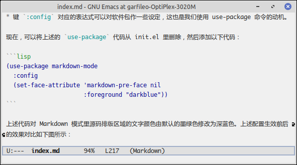

---
title: 用兵
abstract: 兵者，不得已而用之。
date: 2025 年 06 月 02 日
...

# 前言

Emacs 有大量的第三方软件包，这些包大多数是用 Elisp 语言编写，也有少量用 C 语言编写。Emacs 可以通过 init.el 载入它们，以增强自身功能。这些软件包犹如一支强大的军队，你可以调动它们去征服一切文档。不过，在试图学习如何调动军队之前，先接受老子泼的一盆冷水：兵者，不祥之器，非君子之器，不得已而用之，恬淡为上。

# Markdown

假如你需要用 Emacs 编辑 Markdown 格式的文档，如同此刻我之所为，你可以为 Emacs 安装名为 markdown-mode 的包，它能让 Emacs 对 Markdown 语法产生高亮效果，也提供了一些便捷命令，让你在编写 Markdown 文档是更有效率。使用以下命令

```
M-x package-install RET markdown-mode RET
```

便可安装 markdown-mode 包，前提是你的机器已联网且可以访问以下网址：

* [https://elpa.gnu.org/packages/](https://elpa.gnu.org/packages/)
* [https://elpa.nongnu.org/nongnu/](https://elpa.nongnu.org/nongnu/)

上述网址即 Emacs 内置的软件源，即软件仓库。elpa 即 elisp package 的简写。

一旦 Emacs 从软件源安装成功了某个包，它会向 init.el 的尾部自动写入一些配置。例如 markdown-mode 包安装后，init.el 的尾部会自动出现以下内容：

```lisp
(custom-set-variables
 ;; custom-set-variables was added by Custom.
 ;; If you edit it by hand, you could mess it up, so be careful.
 ;; Your init file should contain only one such instance.
 ;; If there is more than one, they won't work right.
 '(package-selected-packages '(markdown-mode)))
(custom-set-faces
 ;; custom-set-faces was added by Custom.
 ;; If you edit it by hand, you could mess it up, so be careful.
 ;; Your init file should contain only one such instance.
 ;; If there is more than one, they won't work right.
 )
```

这部分内容 Emacs 会自己管理，你无需去改动它。去掉注释，上述代码最为关键之处在于

```lisp
(custom-set-variables
 '(package-selected-packages '(markdown-mode)))
```

这与我们之前所接触的 Elisp 语法有些区别，你只需要知道 `package-selected-packages` 是列表类型的变量，用于记录我们通过 `package-install` 从 Emacs 软件源中安装的所有包。

之后，每次你用 Emacs 编辑 Markdown 格式的文档时，只要文档对应的文件名以 `.md` 为后缀，Emacs 便会自动开启 Markdown 模式。


# 字节码文件

我们安装的 markdown-mode 包，默认存放于 ~/.emacs.d/elpa 目录，倘若你对其实现有些好奇，可进入包目录，查看其源码文件，即 markdown-mode.el，同一目录下还有同名的 .elc 文件，即 markdown-mode.elc，它是 Emacs 编译 markdown-mode.el 文件生成的字节码文件。当我们在 Emacs 里启用 markdown 模式时，Emacs 会自动加载 markdown-mode.elc，而非 markdown-mode.el，原因是前者的载入和执行速度都比后者更快。

Emacs 有两种执行 Elisp 程序的方式，一种是对 .el 文件中的全部表达式逐行读取，并在该过程中，对所得表达式解释和求值，这是我们已经非常熟悉的方式，因为我们也经常用 `C-x C-e` 对一些表达式求值。只是之前，我们察觉不到 Emacs 对表达式解释的过程。

所谓的，Emacs 对表达式的解释过程，你可以理解为，当你看到 `(+ 1 2)` 的时候，若你不懂 Elisp 语言，你心里想的是，这是一个左括号，一个加号，一个空格，数字 1，又一个空格，数字 2 以及一个右括号构成的一小段文字，而当你已经懂得 Elisp 语言时，你心里想的则是，这是一个表达式，在计算 1 + 2。你心里想的东西，从不懂 Elisp 语言时的状态到你懂了 Elisp 语言的状态，这便是对 Elisp 表达式解释的过程。

我们用 Emacs 将一份 .el 文件编译为 .elc 文件时，这个编译过程，便是对 .el 文件里所有表达式的解释过程，而 .elc 文件存放的便是解释结果。Emacs 载入 .elc 文件，便是第二种执行 Elisp 程序的方式，这种方式之所比第一种要快，是因为在开始载入 .elc 文件的那个瞬间就意味着对 Elisp 的程序的解释已经完成，剩下的只是对 Elisp 程序里的一个又一个表达式的求值过程。

还记得吗？我们曾将 init.el 里我们最为熟悉的那部分配置转移到 ~/.my-emacs 目录里的 my-config.el。现在，你可以做一个试验。用 Emacs 打开 my-config.el 文件，然后执行 `M-x byte-compile-file RET RET`，便可在 ~/.my-emacs 目录得到 my-config.elc 文件。然后，在 init.el 文件里，将原来的

```lisp
(load "my-config.el")
```

修改为

```lisp
(load "my-config.elc")
```

之后每次你在启动 Emacs 的时候，它便会快一点，大概是几纳秒吧……

# 特性

现在，在 my-config.el 文件的末尾添加以下代码：

```lisp
(provide 'my-config)
```

然后将 init.el 文件里的 

```lisp
(load "my-config.elc")
```

修改为

```lisp
(require 'my-config)
```

`require` 函数的作用与 `load` 相似，但是它会优先加载 my-config.elc，倘若没有 my-config.elc，它会加载 my-cofig.el，亦即 `require` 是聪明的 `load`，只是需要与 `provide` 函数配合使用。

`provide` 的作用是向 Emacs 注册特性，表示该文件的某些功能已就绪。例如上述示例中的 ``'my-config` 便是一个特性。一份 .el 文件里可能含有多个特性。Emacs 在执行 .el 文件中的程序时，遇到 `provide` 表达式，便认为一项特性已加载完成，但仍会执行后续代码，只是后续代码不是特性，或者它们属于另一个特性。

`require` 可以加载给定特性对应的代码。由于 `'my-config` 特性是在 my-config.el 文件尾部提供的，故而 `require` 能加载 my-config.el 文件里的一切内容。

# 模式关联

每次编辑 .md 文件时，Emacs 便会自动开启 Markdown 模式，对此你不觉得诡异吗？安装 markdown-mode 包之后，我们在 init.el 里并未作任何配置。Emacs 是如何将 .md 文件与 Markdown 模式关联起来的呢？秘密在于 Emacs 的全局变量 `auto-mode-alist`，其类型为关联列表。

倘若你打开 markdown-mode 包中的 markdown-mode.el 文件，搜索 `auto-mode-alist`，应该能找到以下代码：

```lisp
;;;###autoload
(add-to-list 'auto-mode-alist
             '("\\.\\(?:md\\|markdown\\|mkd\\|mdown\\|mkdn\\|mdwn\\)\\'" . markdown-mode))
```

上述代码将 `.md`，`.markdown` 和 `.mkd` 之类的后缀名与 `markdown-mode` 命令关联了起来，并将其添加到 `auto-mode-alist`。函数 `add-to-list` 可向列表首部添加元素，它与之前我们用过的 `cons` 和 `push` 函数的区别是，它在向列表中添加元素之前，会先检测待添加的元素在列表中是否已经存在，若存在，则放弃添加。

可能有一些包在实现中，并未将其所实现的模式命令与文件扩展名关联起来，或者他们所作的关联并不合乎我们的要求，这时便需要我们在 init.el 文件里用 `add-to-list` 向 `auto-mode-alist` 添加我们所定义的模式关联了。注意，文件的后缀名可以是正则表达式。


# 软件包管理

在 Emacs 里，执行 `M-x package-list-packages`，可以打开软件列表。

在软件列表中，若将光标移动到某一行，执行 `i`，即单击 `i` 键，Emacs 便会将该行对应的软件包标记为待安装状态，在 Emacs 界面左侧边栏会显示 `I` 字样。你可以用 `i` 键将多个软件包标记为 `I` 状态。然后执行 `x`，Emacs 便会安装所有被标记为 `I` 的软件包。

执行 `M-x package-refresh-contents`，可以从 Emacs 软件源获取最新的软件信息。该操作完成后，在软件列表中，执行 `r`，便可刷新软件列表。

每次更新完软件信息后，你可以执行 `U`，即 `Shift + u` 或将键盘切换为大写模式，单击 `U`，该操作会在软件列表中将你之前安装的包标记为更新，然后执行 `x`，Emacs 便会为你更新软件包。

将光标移动到你之前安装的软件包所在的行，执行 `d`，Emacs 便可将该行软件包标记为 `D` 即待删除状态。然后执行 `x`，Emacs 便会删除所有被标记为待删除的包。

# 增加软件源

除了 Emacs 内置的两个软件源之外，也有一些第三方软件源，其中翘楚是 melpa 源。与 Emacs 内置的软件源相比，melpa 源更为激进，软件包的版本通常较新。倘若你觉得，更新的，是更好的，可以在 init.el 中，将 melpa 源添加到 Emacs 软件源列表里，例如

```lisp
(use-package package
  :config
  (add-to-list 'package-archives '("melpa" . "https://melpa.org/packages/"))
  (unless (bound-and-true-p package--initialized)
    (package-initialize)))
```

上述代码，你应该能看懂第三行，即 `add-to-list` 表达式。

`unless` 表达式，是我们之前没有学过的，它表达的逻辑与 `when` 相反。上述代码中的 `unless` 表达式实现的逻辑是，若软件源尚未初始化，则进行初始化。

`bound-and-true-p` 用于判断一个变量是否绑定到了某个值。如果 Emacs 的软件源已经初始化了，`package--initialized` 便会绑定到一个值，此时 `bound-and-true-p` 表达式的求值结果便为真，即 `t`，于是上述 `unless` 表达式即

```
(unless t
  (package-initialize)
```

上述表达式里的 `(package-initialize)` 是不会被求值的。倘若用 `when` 替换 `unless`，则 `(package-initialize)` 便会被求值。于是，`unless` 表达的逻辑就是，除非条件为真，否则便如何。

上述表达式，若改为 `when` 实现，需要写为

```lisp
(when (not (bound-and-true-p package--initialized))
    (package-initialize))
```

实际上，上述代码中的 `unless` 表达式，除了能帮助你理解 `unless` 的用法外，并无意义。我们在使用 `package-install` 或 `package-list-packages` 等命令时，Emacs 会自动初始化软件源。故而，我们不需要它。在 init.el 文件里，你只需像下面这样设定，便可将 melpa 源添加到软件源列表：

```lisp
(use-package package
  :config
  (add-to-list 'package-archives '("melpa" . "https://melpa.org/packages/")))
```

那个 `unless` 表达式之所以存在，是因为那段代码是我从别人那里抄来的。

现在，你唯一不明白的应该是 `use-package` 了。

# 软件包配置

`use-package` 是 Emacs 内置的软件包配置命令。实际上，它在 Emacs 29.1 时才被 Emacs 内置。在此之前，它是第三方软件包 use-packaeg 包里的命令。Emacs 29.1 将 use-package 包内置，成为了自身的一部分。

在 `use-package` 命令诞生之前，在 init.el 里配置 Emacs 软件包，基本是每个软件包都有有其专属的配置方式。在网上你现在应该随意便能搜到一些 Emacs 用户共享的 init.el 文件，从这些文件里应该能看到很多过去的时光。现在，Emacs 软件源里的大多数（我猜测的）软件包，皆可用 `use-package` 命令统一配置。例如，我们可以对 markdown-mode 包做一些配置，如下

```lisp
(use-package markdown-mode
  :ensure t
  :mode ("\\.md\\'" . markdown-mode)
  :init 
  (message "开始载入 Markdown 模式")
  :config 
  (message "你可以对 Markdown 模式作一些定制"))
```

倘若你将上述代码添加到 init.el 文件里，之后你每次用 Emacs 打开 .md 文件时，`*Messages*` 缓冲区便会出现以下信息

```
开始载入 Markdown 模式
你可以对 Markdown 模式作一些定制
```

`use-package` 命令的第一个参数是软件包的名字，之后的参数皆为键值对，键的形式都是 `:key`，值则是 Elisp 表达式。这里，你需要将其与之前我们接触过的关联列表里的键值对有所区分。下面对上述代码中出现的键值对予以说明：

* 键 `:ensure` 对应的值为 `t`，表示所配置的软件包尚未安装，则自动从 Emacs 软件源安装它，然后再予以配置。
* 键 `:mode` 对应的表达式可用于构造模式关联。对于 markdown-mode 包而言，这个键值对是可以省略的，因为前面我们探索过 markdown-mode 包的模式关联。
* 键 `:init` 对应的表达式可在 Emacs 载入软件包前执行一些初始化工作。
* 键 `:config` 对应的表达式可以对软件包作一些设定，这也是我们使用 use-package 命令的动机。

**练习**：执行 `C-h f use-package RET`，阅你之所见。

现在，可以将上述的 `use-package` 代码从 init.el 里删除，然后添加以下代码：

```lisp
(use-package markdown-mode
  :config 
  (set-face-attribute 'markdown-pre-face nil
                      :foreground "darkblue"))
```

上述代码对 Markdown 模式里源码排版区域的文字颜色由默认的墨绿色修改为深蓝色。上述配置生效前后的效果对比如下图所示：




# 总结

现在，你有了一支强大的军队了，甚至有着对它基本的掌控能力。如何运用这支军队，除了勿忘老子所言，也可以研读一些孙子兵法……现在，我们可以相忘于江湖了。将来惹出祸来，不把我说出来。
