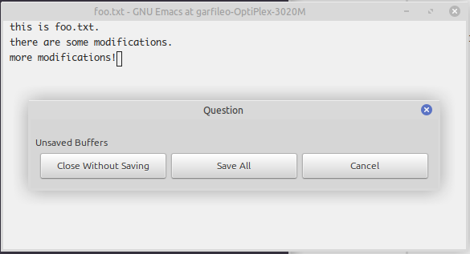

---
title: 保护
abstract: 居安思危，有备无患。
date: 2025 年 05 月 30 日
...

# 前言

也许你早已注意到，当你用 Emacs 编辑文件时，例如编辑 foo.txt 文件，在完成编辑后，你会使用已颇为熟悉的组合键 `C-x C-s` 将 Emacs 的 foo.txt 缓冲区里的内容保存至 foo.txt 文件。此时，你会发现，在 foo.txt 文件所在的目录里，会出现名为 `foo.txt~` 的文件。

也许你还注意到了另一个事实。当你在编辑 foo.txt 文件的过程中，若有所停顿，偶尔你会看到微缓冲区会闪过「Auto-saving...done」字样，同时在 foo.txt 文件所在目录下，会出现名为 `#foo.txt#` 的文件，其内容与 foo.txt 缓冲区内容相同。当你对 foo.txt 缓冲区执行 `C-x C-s` 后，#foo.txt# 文件便自动消失。

这两件事实际上是 Emacs 的文件保护机制的外在表现。很多 Emacs 教程对文件保护机制似乎不以为然，有一些嫌弃像 `foo.txt~` 这样的文件有碍观瞻，便在 init.el 文件里作以下设定：

```lisp
;; 禁用自动备份功能
(setq make-backup-files nil)
```

你可以如此设定，这是 Emacs 赋予你的自由，不过我还是建议你知悉详情后再作定夺，而不是从一些 Emacs 高手的 init.el 中抄来这一设定，并以为自动备份机制是 Emacs 无用甚至不好的功能。

# 备份

像 foo.txt~ 这样的文件，是 Emacs 为 foo.txt 文件自动生成的备份。你可以基于以下试验，理解其存在的意义和用法。

在某个目录下，用 Emacs 新建一份文件 foo.txt，亦即在 Emacs 里开启一个名为 foo.txt 的缓冲区，其内容如下：

```
this is foo.txt.
```

当你用 `C-x C-s` 将上述内容保存至文件 foo.txt 后，此时 Emacs 并不创建 foo.txt~ 文件。

现在，用 Emacs 再次打开 foo.txt 文件，将其内容修改为

```
this is foo.txt.
there are some modifications.
```

然后，再次保存，此时 Emacs 便会创建 foo.txt~ 文件，其内容为

```
this is foo.txt.
```

亦即 foo.txt~ 文件存储的内容是修改前的 foo.txt 文件内容，故而可以认为 foo.txt~ 文件是 foo.txt 文件的上一个版本。

倘若你对 foo.txt 所作的修改并不满意，希望能回退到它的上一个版本，在 Unix 或 Linux 系统里，只需在 Shell 里执行以下命令：

```console
$ mv foo.txt~ foo.txt
```

然后用 Emacs 重新打开 foo.txt 文件，再作编辑即可。

**练习**：倘若你刚才修改了 foo.txt 文件并予以保存，但此时 Emacs 并未退出，即依然存在 foo.txt 缓冲区，请执行 `C-x x g`，观察所发生的现象。

# 补丁

倘若你懂得如何使用 diff/patch 工具，那么 Emacs 为文件保存的上个版本，也能帮助你制作文件补丁。例如

```console
$ diff -u foo.txt~ foo.txt > foo.patch
```

diff 命令可以分析 foo.txt~ 和 foo.txt 的差异，并将分析结果写入 foo.patch 文件。你可以将 foo.patch 发送给他人。若后者的机器上同样存在 foo.txt 文件，且其内容与你机器上的 foo.txt~ 文件相同，他可使用 patch 命令，引入你对 foo.txt 所作的全部修改。

```console
$ patch foo.txt < foo.patch
```

对于打了补丁的 foo.txt，只要补丁文件尚在，也可以使用 patch 命令撤销补丁，例如

```console
$ patch -R foo.txt < foo.patch
```

diff 和 patch 都是源自 Unix 系统的伟大的小工具，有必要用一些时间熟悉它们的用法，并在与他人在合作编写同一份文档时使用它们，可以有效实现工作同步。

# 关联列表

Emacs 会自动为你编辑的文件备份上一个版本，即使你从未使用过这个备份，但只要它存在，你便会有一些肆意妄为的底气。让你觉得难以接受的，并非是这种机制，而是你不希望文件目录里有一堆备份文件。

实际上，Emacs 允许你设定一个目录，统一存放所有备份文件。例如，你可以在 $HOME/.emacs.d 目录创建 backups 目录：

```console
$ cd ~/.emacs.d
$ mkdir backups
```

在 Linux 的 Shell 里，`$HOME` 通常可以简写为 `~`。

然后在 init.el 里添加以下配置：

```lisp
;; 备份文件存放目录
(setq backup-directory-alist '(("." . "~/.emacs.d/backups")))
```

上述表达式中的 `setq`，你已经很熟悉它了。你应该还不懂 Elisp 的关联列表。`backup-directory-alist` 便是一个关联列表，其值是只包含一个元素的列表：

```lisp
'(("." . "~/.emacs.d/backups"))
```

你可以通过以下代码，明白何为关联列表。

```lisp
(let ((this-list '(("foo" . "i am foo!")
                   ("bar" . "i am bar!")
		           ("hello" . "Hello world!"))))
    (dolist (it this-list)
	    (message "%s: %s" (car it) (cdr it))))
```

在上述代码中，`this-list` 是局部变量，其值是三个键值对构成的列表，这样的列表即为关联列表。键值对的形式为

```lisp
(键 . 值)
```

之前，在配置字体时，我们曾用 `dolist` 遍历过 Unicode 脚本列表。虽然 `this-list` 是键值对元素构成的列表，但终归是列表，故而可用 `dolist` 遍历。遍历过程中，`it` 指向 `this-list` 的每个元素，用 `car` 可以获得 `it` 所指代元素的「键」的部分，而 `cdr` 可获得该元素的「值」的部分。

在 Emacs 里对上述代码求值，求值过程中，会输出多行信息，而微缓冲区只能看到最后一行。在 Emacs 图形界面里，倘若你用鼠标左键点一下微缓冲区，Emacs 便会自动开启新窗口，显示 `*Messages*` 缓冲区中的所有内容，在该缓冲区里，可以看到上述表达式求值过程中的全部输出，如下：

```
foo: i am foo!
bar: i am bar!
hello: Hello world!
nil
```

前三行信息是 `message` 输出。最后的 `nil` 是 Emacs 对 `let` 表达式的求值结果。将光标定位到 `*Message*` 缓冲区，摁 q 键便可关闭该缓冲区所在的窗口。

当你明白何为关联列表后，对上述 init.el 中的文件备份目录的设置代码所剩的疑惑应该是键值对

```lisp
("." . "~/.emacs.d/backups")
```

表示什么？键 `"."` 表示所有的备份文件，值 `"~/.emacs.d/backups"` 表示存放所有备份文件的目录。

当上述 init.el 的设定生效后，Emacs 便会将所有文件的备份存放于 ~/.emacs.d/backups 目录。例如，倘若我在 ~/test/emacs 目录内编辑 foo.txt 文件，则该文件在 ~/.emacs.d/backups 目录里对应的备份文件是

```
!home!garfileo!test!emacs!foo.txt~
```

倘若你将 `!` 理解为 `/`，那么上述文件名便可理解为，这份文件是 /home/garfileo/test/emacs 目录中的 foo.txt 文件的备份。

# 自动保存

默认情况下，Emacs 会在每输入 300 个字符（可通过 `auto-save-interval` 变量修改此值）或在 30 秒内无操作（可通过 `auto-save-timeout` 变量修改此值），便会自动将缓冲区内容保存。本文前言所述的名为 `#foo.txt#` 的文件，便是 Emacs 对 foo.txt 缓冲区内容自动保存的结果。

也许你会觉得奇怪，为何 Emacs 不直接将缓冲区内容自动保存到对应的文件里呢？例如，将 foo.txt 缓冲区的内容自动保存到 foo.txt 文件里。实际上，Emacs 可以如你所愿，只是需要你在 init.el 里予以配置：

```lisp
;; 直接保存到正在编辑的文件（非临时文件）
(auto-save-visited-mode 1)
```

但是我不建议你如此设定，原因是，若 Emacs 每次按这一设定，将缓冲区内容保存到所编辑的文件，则意味着要对文件的上一个版本作一次备份，而整个过程是在你毫无察觉的情况完成的。有时，你需要的某个备份，会被 Emacs 的自动保存机制悄无声息的篡改了，而 Emacs 默认的自动保存机制，可以完美兼容文件的自动备份机制。

倘若你决定继续使用 Emacs 默认的基于临时文件的自动保存机制，你需要掌握如何基于该临时文件对抗一些意外风险。例如，当你正在编辑一份文件时，可能会有一些意外发生，导致计算机突然关机，你对文件的许多改动会因未能及时保存而丢失。当你重新开机后，便可基于 Emacs 自动保存的临时文件，恢复这些改动。

以下试验，可以模拟上述的意外场景。用 Emacs 编辑前文所述的 foo.txt，令其内容变为

```
this is foo.txt.
there are some modifications.
more modifications!
```

然后略等约 1 分钟，知道你看到在 foo.txt 文件所在目录出现 #foo.txt# 文件，然后记住，不要保存 foo.txt 缓冲区，而是直接关闭 Emacs。这时，Emacs 会提醒你，是否保存对文件的修改，你选择「Close Without Saving」，如此便模拟了类似计算机突然关闭，而你来不及保存文件内容的场景。



之后，你在 #foo.txt# 文件所在的目录里，重新打开或创建 foo.txt 文件时，Emacs 会在微缓冲区里提示：

```
foo.txt has auto save data; consider M-x recover-this-file
```

当你执行 `M-x recover-this-file` 后，Emacs 会在微缓冲区询问：

```
Recover auto save file /home/garfileo/test/emacs/#foo.txt#? (yes or no)
```

此时，在微缓冲区输入 `yes RET`，便可在 foo.txt 缓冲区里恢复在意外关机前 Emacs 为你自动保存的内容，然后再正常将其保存至 foo.txt 文件，之后 #foo.txt# 便事了拂衣去，深藏功与名，除非下一次意外关机，你才能再一次看到它。

# 总结

我虽身为 Emacs 多年的资深新手，但是和你一样，也是初次使用 Emacs 的文件自动备份与保存机制。我们也学习了 Elisp 的关联列表，它像一个词典，只是缺乏索引，无论从中查找什么，都需要对整个列表遍历一次。
