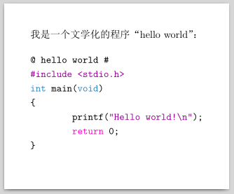

---
title: Orez 1.0 指南
subtitle: 
abstract: 介绍重写的文学编程工具 orez 的用法。
date: 2025 年 01 月 03 日
...

# 前言

2016 年夏天，我用 C 语言写了一个文学编程工具，起名叫 zero，因为它貌似做了一些事，但实质上它什么也没有做。秀才造反，三年不成，文人行事，大抵如此。之后很快实现了 zero 的自举，即采用 zero 所支持的文学编程的方式重新实现了它自身。这个自举版本，我取名为 orez，并为它写了一份用法指南「[orez 的故事](https://segmentfault.com/a/1190000008137846)」——现在读来，发现该文有些自恋。

之后许多年，我对 orez 一直都很满意。在此期间继续对文学编程有所践行，基于 orez 编写了一个用于处理三维点云数据（理论上也支持 N 维）的几何库。这个几何库的实现过程时断时续，得益于文学编程，每次当我想继续工作时，都能很快地重温项目的结构和代码。去年，当我想继续为这个几何库写代码时，距离上一次为它写代码已间隔 2 年有余，而且我甚至对 orez 的用法都有些遗忘了。在温习 orez 的用法时，我顺便回顾了它的源码，心里生出了一些不满，从而引发了重写的念头。

去年（2024 年）三月，我开始重写 orez，采用的依然是文学编程的方式。上一次实现 orez 时，文档部分皆为英文，当时是想为写论文而锻炼英文写作，文档很丑，大概举世只有我能看得懂，故而从未释出。此次对 orez 的重写，断断续续，跨度长达十个月，最后赶在 2024 年的最后一日完成，其文学化程序的文档也用中文写成，即 [orez-v1.pdf](../../old-posts/share/orez-v1.pdf)。本文除了介绍 Orez 原有的功能之外，对新的功能也予以说明。行文不工，甚为随意，我希望文学编程也应如此。

# 文学编程

几乎所有程序都需要文档，缺乏文档的程序是因程序员的懒惰，无力或无能所致。文档的缺乏会导致程序难以被他人理解。文学编程强调程序首先应该易于人类理解，其次才是在计算机中正确运行。按照计算机软件领域的习俗——强调什么，即面向什么——，故而可将文学编程理解为面向文档编程。

下面是文学编程的一个简单示例：

```c
我是一个文学化的程序“hello world”：

@ hello wolrd # [C]
#include <stdio.h>
int main(void)
{
        printf("Hello world!\n");
        return 0;
}
@

假设本文档名为 foo.txt，以下命令可提取我的实现代码并将其保存为 hello.c：

$ orez -t foo.txt -e "hello world" -o hello.c

可用 gcc 编译 hello.c，生成 hello 程序：

$ gcc hello.c -o hello

这个 hello 程序就是我，我能在屏幕上显示“Hello world!”，这份文档也是我！
```

对于上述简单的示例，使用 C 语言的注释可以代替文学编程形式，但是对于复杂一些的程序，代码注释很难勾画程序的整体架构以及细枝末节并使之易于理解，而后者却是文学编程所长。

几乎所有编程语言的注释功能皆是纯文本形式，倘若它们能代替文学编程形式，意味着任何一种排版语言或标记语言（例如 TeX、HTML、XML、Markdown）皆无存在的必要，这也是文学编程的一个重要前提——面向的文档需需基于某种排版语言或标记语言生成。例如，orez 的文档基于 ConTeXt 语言（与 LaTeX 类似，皆为 TeX 格式）生成。上述的文学编程简单示例，虽然没有用到排版语言，但是若将文本文档本身视为最为朴素的排版结果，它依然可归为文学编程。一个反面的例子是，在 MS Word 或金山 WPS 之类的字处理软件（大多数人将其视为排版软件）中无法或难以直接进行文学编程。

上述文学编程的示例虽然简单，但它表现了程序源码和文档的统一性。这种统一性便是文学编程要致力构建和维持的，它甚至在商朝时期负责占卜的贞人时代便已出现了。一旦建立了这种统一性，文学编程工具，例如本文的主角 orez 便可将文学化程序源码蕴含的信息分别导向文档排版和源码编译过程，从而完成程序文档的编排和程序本体的生成。

# 安装

在 Linux 环境中，编译和安装 orez 较为容易。编译 orez 所需的依赖是 libcyaml 和 glib 库以及 pkg-config 工具。

通过以下命令可编译 orez 源码，并将所得 orez 程序以及两份后端 Python 脚本 orez-ctx 和 orez-md 安装至 /usr/local/bin 目录：

```console
$ git clone https://github.com/liyanrui/orez.git
$ cd orez
$ make
$ sudo make install
```

至于其他操作系统环境，上述过程可作为借鉴，自行尝试。

# 初识

本节基于一个简单的文学编程示例讲述 orez 的在类 Unix 环境（Linux、FreeBSD、macOS 以及 Windows 的 Linux 子系统（WSL））中的基本工作流程。

## 有名片段

在程序源码和文档的统一性的构建方面，orez 期望程序源码以有名片段的形式嵌入在程序的文档中，基本的嵌入格式如下

```
@ 片段名 #
... 片段内容 ...
@
```

嵌入在文档中的程序源码可通过语言标记予以指明，例如在文档中嵌入一段名为“hello world” 的 C 语言代码：

```
@ hello world # [C]
#include <stdio.h>
int main(void)
{
        printf("Hello world!\n");
        return 0;
}
@
```

语言标记可用于帮助 orez 输出能够被排版软件进行渲染的源码片段，例如上述代码片段在本文的排版结果中被渲染为

```c
@ hello world #
#include <stdio.h>
int main(void)
{
        printf("Hello world!\n");
        return 0;
}
```

## 程序源码抽取（tangle）

orez 的 `-t` 参数用于从文档中提取指定的源码片段，为程序的编译/解释作准备。例如，对于以下以 ConTeXt 文档为主体，嵌入了一个源码片段的文学化程序源码文档 foo.orz

```tex
\starttext
我是一个文学化的程序“hello world”：

@ hello wolrd # [C]
#include <stdio.h>
int main(void)
{
        printf("Hello world!\n");
        return 0;
}
@
\stoptext
```

从 foo.orz 中提取源码片段“hello world”并将其保存为 hello.c 文件的 orez 命令为

```console
$ orez -t foo.orz -e "hello world" -o hello.c
```

orez 的参数 `-e` 向 orez 提供了片段名，`-t` 驱役 orez 提取该片段。`-o` 设定了输出文件，用于保存 orez 提取的片段内容。倘若不提供 `-o` 参数，orez 便将提取到的片段内容发送到标准输出，亦即屏幕。

对于 c/c++ 之类的语言，为方便程序调试时错误的出现位置定位到文学化程序源码文档，可在命令中添加 `-l` 选项，例如

```console
$ orez -t foo.orz -l -e "hello world" -o hello.c
```

`-l` 选项可将文学化程序源码文档中源码片段出现的位置以预处理语句的方式添加到提取的源码中。

## 排版元文档生成（weave）

orez 的参数 `-w` 则是为程序文档的排版作准备，它可将文学化程序源码转换为 YAML 格式的结构化文档——排版元文档。例如，上一节作为示例的 foo.orz 文档，以下命令可将其转化为 YAML 文档 foo.yml：

```console
$ orez -w foo.orz -o foo.yml
```

上述命令中通若未出现 `-o` 参数，亦即

```console
$ orez -w foo.orz
```

orez 会将生成的 YAML 文档内容发送到标准输出，亦即屏幕。上述命令生成的 YAML 文档内容如下：

```yaml
- type: snippet
  content: |-
    '\starttext
    我是一个文学化的程序“hello world”：'
- type: snippet with name
  name: |-
    'hello wolrd'
  hash: 'hellowolrd'
  language: 'C'
  content: 
    - text: |-
        '
        #include <stdio.h>
        int main(void)
        {
                printf("Hello world!\n");
                return 0;
        }'
- type: snippet
  content: |-
    '\stoptext'
```

若看不懂 orez 生成的排版元文档，可阅读「[YAML 简介](../../old-posts/output/libyaml-tutorial/yaml-intro.html)」一文。

## 排版后端

目前，随 orez 一起发布的还有两个脚本程序，一个是 orez-ctx，另一个是 orez-md，对于 orez 生成的排版元文档，前者可将其转化为 ConTeXt 源文件，后者可将其转化为 Markdown 源文件，二者用法相似。

使用 orez-ctx 将上述 foo.yml 文件转化为 foo.tex：

```console
$ orez-ctx foo.yml > foo.tex
```

在类 Unix 系统中，使用管道，能够让 orez 及其后端更为紧密的结合。例如以下命令可避免输出 foo.yml 这个中间文件，直接将 foo.orz 转换为 foo.tex：

```console
$ orez -w foo.orz | orez-ctx > foo.tex
```

对所得 foo.tex，使用 context 命令进行编译（系统中需要安装 ConTeXt 环境，其版本 >= MkIV）：

```console
$ context foo.tex
```

最终可得 foo.pdf，它便是文学化程序源码 foo.orz 的排版结果，如下图所示：



对于其他排版系统，只要它支持纯文本形式的排版文档，可根据 orez 生成的排版元文档格式，模仿 orez-ctx 和 orez-md 脚本进行编写相应的后端程序。

# 片段引用

有名字的片段，可被其他有名字的片段引用。例如在有名片段 foo 中引用另一个有名片段 bar 的内容：

```
有名片段 foo：

@ foo #
我是 foo。
    # bar @
@

有名片段 bar：

@ bar #
我是 bar。
@
```

使用 orez 提取片段 foo 的内容，结果为

```
我是 foo。
    我是 bar。
```

对一个有名片段的引用，所用标记在默认情况下与定义有名片段时所用的标记相反，即 `@ foo #` 是定义片段 foo，而 `# foo @` 是引用片段 foo 的内容。

需要注意，有名片段不能在自身内容中引用自身，否则会导致 orez 在代码抽取过程中崩溃。

# 片段追加

一个复杂的代码片段通常不需要一次写成，可以采用自上而下，或自下而上的方式在文档的各处分散逐步实现。在文学编程中，这个过程可基于有名片段的追加运算实现。在 orez 的实现中，大量运用了这种方式。例如

```c
以下结构体类型表示记号:

@ 记号 #
typedef struct {
        OrezTokenType type; /* 记号类型标识 */
        gsize line_number;/* 记号对应文本在全文中的行号 */
        GString *content;/* 记号对应的文本内容 */
} OrezToken;
```

```c
其中 OrezTokenType 为记号的类型标识,为文学化源码中的文档片段
和源码片段所需要的所有标记定义了数字标识,其定义为

@ 记号 # ∧+
typedef enum {
        OREZ_SNIPPET_DELIMITER, /* 文档或源码片段界限符 */
        OREZ_SNIPPET_NAME_DELIMITER, /* 片段名字界限符 */
        ... ... ...
} OrezTokenType;
@
```

```c
orez 用户可通过 YAML 格式的配置文件定义符合自己喜好的符号。
以下结构体用于存储默认的或用户自定义的符号:

@ 记号 # +
typedef struct {
        char *snippet_delimiter;
        char *snippet_name_delimiter;
        ... ... ...
} OrezConfig;
@
```

```c
对于所获得的全部符号数据,为了后续便于使用,需将其提升为 GString 类型:

@ 记号 # +
typedef struct {
        GString *snippet_delimiter;
        GString *snippet_name_delimiter;
        ... ... ...
} OrezSymbols;
```

在上述示例中，四个有名片段的名字相同，皆为“`记号`”。在使用 orez 抽取“`记号`”片段中的内容时，orez 会从文档中出现的第一个“`记号`”片段开始抽取。遇到第 2 个“`记号`”片段时，orez 根据片段名字后面的 `^+` 算符，将其内容合并至第一个“`记号`”的内容之前。遇到第 3 个“`记号`”片段时，orez 会根据片段名字后面 `+` 算符，将其内容合并至第一个“`记号`”的内容之后。遇到第 4 个“`记号`”片段时，orez 会根据片段名字后面 `+` 算符，将其内容合并至第一个“`记号`”的内容之后。亦即，orez 对这 4 个片段的内容是按 2、1、3、4 的顺序提取并输出，结果为

```c
typedef enum {
        OREZ_SNIPPET_DELIMITER, /* 文档或源码片段界限符 */
        OREZ_SNIPPET_NAME_DELIMITER, /* 片段名字界限符 */
        ... ... ...
} OrezTokenType;
typedef struct {
        OrezTokenType type; /* 记号类型标识 */
        gsize line_number;/* 记号对应文本在全文中的行号 */
        GString *content;/* 记号对应的文本内容 */
} OrezToken;
typedef struct {
        char *snippet_delimiter;
        char *snippet_name_delimiter;
        ... ... ...
} OrezConfig;
typedef struct {
        GString *snippet_delimiter;
        GString *snippet_name_delimiter;
        ... ... ...
} OrezSymbols;
```

简而言之，有名片段的名字之后有两种算符，前向追加算符 `^+` 和后向追加算符 `+`。对于同名片段，orez 只支持这两种算符。

# 标签

有时，对于多个同名片段，会希望向其中某个片段之前或之后追加内容。例如

```
@ foo #
我是 1 号 foo。
@

@ foo # +
我是 3 号 foo。
@

@ foo # +
我是 4 号 foo。
@
```

我希望向内容为“我是 3 号 foo”的片段之前追加“我是 2 号 foo”，而该需求无法通过算符 `^+` 和 `+` 实现，因为这两个算符是以同名片段中的第 1 个片段为基准进行运算。对于该问题，orez 以标签的形式予以解决。现在，可以给上述第 2 个 `foo` 片段添加标签：

```
@ foo # +
<foo 3>
我是 3 号 foo。
@
```

然后，再定义一个 `foo` 片段，通过标签引用形式将其追加到含有相应标签的片段之前：

```
@ foo # <foo 3> ^+
我是 2 号 foo。
@
```

现在使用 orez 提取片段 `foo` 的内容，可得

```
我是 1 号 foo。
我是 2 号 foo。
我是 3 号 foo。
我是 4 号 foo。
```

# 语言标记

在「[有名片段](#有名片段)」一节中介绍了有名片段的语言标记的作用。在编写文学化程序时，不需要为每个有名片段都添加语言标记。假设一个带有语言标记的片段 x，orez 能够将该语言标记自动传播给与 x 同名的片段，被 x 引用的片段，以及引用 x 的片段。这一规则意味着，对于一个完整的程序，只需对其中一个有名片段添加语言标记即可。

# 片段名字续行符

有时，片段的名字可能很长，会影响后续文档排版的美观，可使用续行符 `\` 予以断行。例如

```
@ 我是名字很长很长很长很长很长很长很长很长很长很长很长很长很长很长很长的片段 #
... ... ...
@
```

可写为

```
@ 我是名字很长很长很长很长很长很长很长很长 \
  很长很长很长很长很长很长很长的片段 #
... ... ...
@
```

引用这种名字很长的片段时，也可以使用续行符进行断行处理，例如

```
@ 我很短 #
  # 名字很长很长很长很长很长很长很长 \
    很长很长很长很长很长很长很长很长很长的片段 @
@
```

片段引用中使用的续行符在哪个位置出现不会干扰 orez 查找相应的片段。

# orez 所有符号

至此，orez 的语法和符号已全部述毕。下面是一个包含了所有 orez 符号的有名片段格式：

```c
@ 片段名字 # [语言标记] <与本片段同名的某个片段标签> + 或 ^+
<本片段标签>
... ... ...
# 对其他 \
  片段的引用 @
... ... ...
@
```

# 自定义符号

上述内容所涉及的 orez 符号皆为默认符号，但这些符号可由用户通过 YAML 格式的配置文件予以修改。例如，若希望像下面这样定义有名片段

```
这份文档的文件名为 foobar.orz

>>> foobar |||
我是 foo。
    | bar >
>>>

>>> bar |||
我是 bar。
>>>
```

只需构造以下配置文件

```yaml
# 这份文档的文件名为 foobar.conf
snippet_delimiter: ">>>"
snippet_name_delimiter: "|||"
snippet_reference_beginning_mark: "|"
snippet_reference_end_mark: ">"
```

在 orez 的 `-c` 参数中提供配置文件的名字，便可令其内容生效，例如：

```console
$ orez -c foobar.conf -t foobar.orz -e "foobar" -o foobar.txt
```

orez 支持的全部符号的配置键名及其释义如下：

```YAML
snippet_delimiter: 片段界限符
snippet_name_delimiter: 片段名字界限符
snippet_name_continuation: 片段名字续行符
language_beginning_mark: 语言标记起始符
language_end_mark: 语言标记终止符
snippet_appending_mark: 前向追加算符
snippet_prepending_mark: 后向追加算符
tag_beginning_mark: 标签起始符
tag_end_mark: 标签终结符
snippet_reference_beginning_mark: 标签引用起始符
snippet_reference_end_mark: 标签引用终结符
```

# 编辑器

与 orez 相关的文本编辑器，目前尚不存在，我建议用 Emacs 或 Vim 这类编辑器。对这些编辑器足够熟悉，会有很多办法解决 orez 不存在编辑器的问题。

# 总结

无他，仅以此文，缅怀我的 2024 年，用爱发电的一年……
