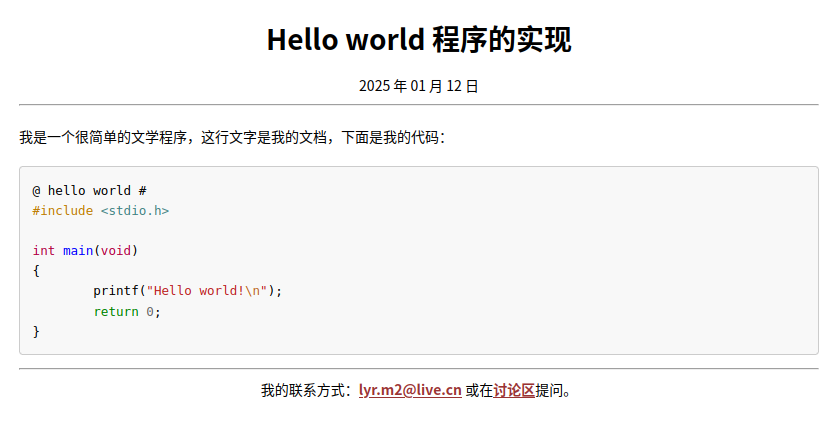

title: Hello world 程序的实现
lang: zh-Hans
date: 2025 年 01 月 12 日
abstract: 
category: 
footer: 我的联系方式：<lyr.m2@live.cn> 或在[讨论区](https://github.com/liyanrui/liyanrui.github.io/issues)提问。
...
```

文学程序应该在文档首部下方，即 `...` 之后撰写。现在，在当前目录下，不妨再观察一次 foo 目录的结构：

```console
$ lmd tree
foo
├── appearance
│   ├── lmd.css
│   └── pandoc
│       └── data
│           └── templates
│               ├── homepage.template
│               └── post.template
├── figures
│   └── hello-world
│       └── main       # 新建
├── index.md
├── lmd.conf
├── output
│   └── hello-world
└── source
    └── hello-world
        ├── index.md
        └── main.md    # 新建
```

现在，将以下内容

```markdown
我是一个很简单的文学程序，这行文字是我的文档，下面是我的代码：

@ hello world # [C]
#include <stdio.h>

int main(void)
{
        printf("Hello world!\n");
        return 0;
}
@
```

添加到 main.md 文件首部之后，你便有了可能是你的第一个文学程序。

# 变过来，变过去

现在，使用以下命令处理 main.md：

```console
$ mv main.md main.orz
$ orez -w main.orz | orez-md > main.md
```

现在，main.md 的内容变为

```Markdown
---
title: Hello world 程序的实现
lang: zh-Hans
date: 2025 年 01 月 12 日
abstract: 
category: 
footer: 我的联系方式：<lyr.m2@live.cn> 或在[讨论区](https://github.com/liyanrui/liyanrui.github.io/issues)提问。
...

我是一个很简单的文学程序，这行文字是我的文档，下面是我的代码：

<pre id="helloworld" class="orez-snippet-with-name">
<span class="orez-snippet-name">@ hello world #</span>
<span class="cp">#include</span><span class="w"> </span><span class="cpf">&lt;stdio.h&gt;</span>

<span class="kt">int</span><span class="w"> </span><span class="nf">main</span><span class="p">(</span><span class="kt">void</span><span class="p">)</span>
<span class="p">{</span>
<span class="w">        </span><span class="n">printf</span><span class="p">(</span><span class="s">&quot;Hello world!</span><span class="se">\n</span><span class="s">&quot;</span><span class="p">);</span>
<span class="w">        </span><span class="k">return</span><span class="w"> </span><span class="mi">0</span><span class="p">;</span>
<span class="p">}</span>
</pre>
```

简而言之，即之前 main.md 中的结构

```
@ ... #
... ... ...
@
```

转换成了嵌入在 Markdown 文本中的一段 HTML 文本。

以下命令可将 main.md 转化为 HTML 文件 main.html：

```console
$ lmd convert main.md
```

生成的 main.html 位于 `foo/output/hello-world` 目录，它在 Web 浏览器的样子大致如下图所示：


并不好看，因为缺乏色彩。

也可以使用以下命令实现 main.md 向 main.html 的转化：

```console
$ lmd view main.md
```

上述命令除了生成 main.htmL，还会根据 lmd.conf 中 `BROWSER` 定义的浏览器打开 main.html。

# 代码渲染

在 foo/appearance/lmd.css 中添加以下代码

```css
/* 渲染文学编程的代码片段 */
pre {line-height: 1.6em; max-height: 40em;}
.orez-snippet-name, .orez-symbol {font-weight:bold; color: #cc3333;}
.orez-label {font-weight:bold; color:#008000;}
.orez-snippet-with-name .hll { background-color: #ffffcc }
.orez-snippet-with-name  { background: #f8f8f8; }
.orez-snippet-with-name .c { color: #408080;} /* Comment */
.orez-snippet-with-name .err { border: 1px solid #FF0000 } /* Error */
.orez-snippet-with-name .k { color: #008000;} /* Keyword */
.orez-snippet-with-name .o { color: #666666;} /* Operator */
.orez-snippet-with-name .ch { color: #408080;} /* Comment.Hashbang */
.orez-snippet-with-name .cm { color: #408080;} /* Comment.Multiline */
.orez-snippet-with-name .cp { color: #BC7A00;} /* Comment.Preproc */
.orez-snippet-with-name .cpf { color: #408080;} /* Comment.PreprocFile */
.orez-snippet-with-name .c1 { color: #408080;} /* Comment.Single */
.orez-snippet-with-name .cs { color: #408080;} /* Comment.Special */
.orez-snippet-with-name .gd { color: #A00000;} /* Generic.Deleted */
.orez-snippet-with-name .ge {} /* Generic.Emph */
.orez-snippet-with-name .gr { color: #FF0000;} /* Generic.Error */
.orez-snippet-with-name .gh { color: #000080;} /* Generic.Heading */
.orez-snippet-with-name .gi { color: #00A000;} /* Generic.Inserted */
.orez-snippet-with-name .go { color: #888888;} /* Generic.Output */
.orez-snippet-with-name .gp { color: #000080;} /* Generic.Prompt */
.orez-snippet-with-name .gs {} /* Generic.Strong */
.orez-snippet-with-name .gu { color: #800080;} /* Generic.Subheading */
.orez-snippet-with-name .gt { color: #0044DD;} /* Generic.Traceback */
.orez-snippet-with-name .kc { color: #008000;} /* Keyword.Constant */
.orez-snippet-with-name .kd { color: #008000;} /* Keyword.Declaration */
.orez-snippet-with-name .kn { color: #008000;} /* Keyword.Namespace */
.orez-snippet-with-name .kp { color: #008000;} /* Keyword.Pseudo */
.orez-snippet-with-name .kr { color: #008000;} /* Keyword.Reserved */
.orez-snippet-with-name .kt { color: #B00040;} /* Keyword.Type */
.orez-snippet-with-name .m { color: #666666;} /* Literal.Number */
.orez-snippet-with-name .s { color: #BA2121;} /* Literal.String */
.orez-snippet-with-name .na { color: #7D9029;} /* Name.Attribute */
.orez-snippet-with-name .nb { color: #008000;} /* Name.Builtin */
.orez-snippet-with-name .nc { color: #0000FF;} /* Name.Class */
.orez-snippet-with-name .no { color: #880000;} /* Name.Constant */
.orez-snippet-with-name .nd { color: #AA22FF;} /* Name.Decorator */
.orez-snippet-with-name .ni { color: #999999;} /* Name.Entity */
.orez-snippet-with-name .ne { color: #D2413A;} /* Name.Exception */
.orez-snippet-with-name .nf { color: #0000FF;} /* Name.Function */
.orez-snippet-with-name .nl { color: #A0A000;} /* Name.Label */
.orez-snippet-with-name .nn { color: #0000FF;} /* Name.Namespace */
.orez-snippet-with-name .nt { color: #008000;} /* Name.Tag */
.orez-snippet-with-name .nv { color: #19177C;} /* Name.Variable */
.orez-snippet-with-name .ow { color: #AA22FF;} /* Operator.Word */
.orez-snippet-with-name .w { color: #bbbbbb;} /* Text.Whitespace */
.orez-snippet-with-name .mb { color: #666666;} /* Literal.Number.Bin */
.orez-snippet-with-name .mf { color: #666666;} /* Literal.Number.Float */
.orez-snippet-with-name .mh { color: #666666;} /* Literal.Number.Hex */
.orez-snippet-with-name .mi { color: #666666;} /* Literal.Number.Integer */
.orez-snippet-with-name .mo { color: #666666;} /* Literal.Number.Oct */
.orez-snippet-with-name .sb { color: #BA2121;} /* Literal.String.Backtick */
.orez-snippet-with-name .sc { color: #BA2121;} /* Literal.String.Char */
.orez-snippet-with-name .sd { color: #BA2121;} /* Literal.String.Doc */
.orez-snippet-with-name .s2 { color: #BA2121;} /* Literal.String.Double */
.orez-snippet-with-name .se { color: #BB6622;} /* Literal.String.Escape */
.orez-snippet-with-name .sh { color: #BA2121;} /* Literal.String.Heredoc */
.orez-snippet-with-name .si { color: #BB6688;} /* Literal.String.Interpol */
.orez-snippet-with-name .sx { color: #008000;} /* Literal.String.Other */
.orez-snippet-with-name .sr { color: #BB6688;} /* Literal.String.Regex */
.orez-snippet-with-name .s1 { color: #BA2121;} /* Literal.String.Single */
.orez-snippet-with-name .ss { color: #19177C;} /* Literal.String.Symbol */
.orez-snippet-with-name .bp { color: #008000;} /* Name.Builtin.Pseudo */
.orez-snippet-with-name .vc { color: #19177C;} /* Name.Variable.Class */
.orez-snippet-with-name .vg { color: #19177C;} /* Name.Variable.Global */
.orez-snippet-with-name .vi { color: #19177C;} /* Name.Variable.Instance */
.orez-snippet-with-name .il { color: #666666;} /* Literal.Number.Integer.Long */
```

有了上述样式表的加持，Web 浏览器对 main.html 新的渲染结果如下图所示：



# 源码片段的引用和被引用

现在，对 main.orz 的内容稍加变动，结果如下（省略了文件首部）：

```markdown
我是一个很简单的文学程序，这行文字是我的文档，下面是我的代码：

@ hello world # [C]
# 头文件 @

int main(void)
{
        printf("Hello world!\n");
        return 0;
}
@

上述源码片段引用的头文件片段，内容如下：

# 头文件 @
#include <stdio.h>
@
```

使用以下命令再次将 main.orz 转换为 HTML 文件：

```console
$ orez -w main.orz | orez-md > main.md
$ lmd view main.md
```

结果如下图所示：


一个源码片段中对另一个源码片段的引用，最终呈现为一个链接，通过它可从前者跳至后者，而后者的尾部会有一个回到前者的链接。

# 同名片段与标签

继续保留 main.orz 文件的首部不变，将剩余部分修改为

```markdown
我是一个很简单的文学程序，这行文字是我的文档，下面是我的代码：

@ hello world # [C]
<main>
int main(void)
{
        printf("Hello world!\n");
        return 0;
}
@

上述源码片段需要包含头文件 stdio.h，

@ hello world # <main> ^+
#include <stdio.h>
@

使得 C 编译器能够获知 `printf` 函数是已定义的函数。
```

main.orz 再经过 orez 和 orez-md 管线的处理，生成的 main.md 再经过 lmd 命令转化为 main.html，结果如下图所示：


第 1 个 hello world 片段首部存在标签 `<main>`。第 2 个 hello world 片段引用了这个标签，在 main.html 中引用的标签呈现为链接，通过它克跳至含有该标签的源码片段。引用的标签后面可存在 `+` 和 `^+` 运算符，分别用于告知 orez，将该片段的内容追加到含有这个标签的源码片段的尾部和首部。

# 各级页面的关联

现在，先查看一下 foo 目录的解构：

```console
$ lmd tree
foo
├── appearance
│   ├── lmd.css
│   └── pandoc
│       └── data
│           └── templates
│               ├── homepage.template
│               └── post.template
├── figures
│   └── hello-world
│       └── main
├── index.md
├── lmd.conf
├── output
│   └── hello-world
│       └── main.html
└── source
    └── hello-world
        ├── index.md
        ├── main.md
        └── main.orz
```

如何将 main.html 访问路径写到网站首页呢？即如何在 foo/index.html 插入一个可以跳转至 foo/output/hello-world/main.html 的链接？

假设当前工作目录是 foo/source/hello-world，使用以下命令可将 main.html 的路径写入到与它同目录的 index.html：

```console
$ lmd appear main.md index.md
```

再查看 foo 目录的结构：

```console
$ lmd tree
foo
├── appearance
│   ├── lmd.css
│   └── pandoc
│       └── data
│           └── templates
│               ├── homepage.template
│               └── post.template
├── figures
│   └── hello-world
│       └── main
├── index.md
├── lmd.conf
├── output
│   └── hello-world
│       ├── index.html    # 新增文件
│       └── main.html
└── source
    └── hello-world
        ├── index.md
        ├── main.md
        └── main.orz
```

可以看到，在 foo/output/hello-world 目录出现了 index.html，可将其视为 Hello world 项目的首页。现在，再次使用 `lmd appear` 命令将 foo/output/hello-world/index.html 添加到 foo/index.html：

```console
$ lmd appear index.md $(lmd root)/index.md
```

形如 `$(lmd root)` 的命令，在 Bash 中称为子 Shell 命令，即在当前的 Shell 中开启一个新的 Shell 并执行某些命令，并将所得结果回传于当前的 Shell。`lmd root` 命令可在当前工作目录中获得 foo 目录的相对路径，然后以 `$(lmd root)` 这种子 Shell 命令形式将该结果递于当前 Shell，使得 lmd 脚本根据 foo 目录的相对路径，找到 foo/index.md，将当前目录中 index.md 对应的 foo/output/hello-world/index.html 路径写入 foo/index.html。

现在可再次查看 foo 目录的结构：

```console
$ lmd tree
foo
├── appearance
│   ├── lmd.css
│   └── pandoc
│       └── data
│           └── templates
│               ├── homepage.template
│               └── post.template
├── figures
│   └── hello-world
│       └── main
├── index.html    # 新增文件
├── index.md
├── lmd.conf
├── output
│   └── hello-world
│       ├── index.html
│       └── main.html
└── source
    └── hello-world
        ├── index.md
        ├── main.md
        └── main.orz
```

foo/index.html 便是 foo 这个文学编程静态站点的首页：


在 foo/index.html 页面点击链接 “Hello world”，便可跳转至 Hello world 项目的首页 foo/output/hello-world/index.html：


在 foo/output/hello-world/index.html 页面点击“Hello world 程序的实现”，便可跳转至文学程序文档 foo/output/hello-world/main.html。


注意，foo/output/hello-world/main.html 页面右侧有“回到上级页面”链接，通过它可返至 foo/output/hello-world/index.html 页面，后者右侧也有同样的链接，通过它可返至 foo/index.html。如此便实现了 foo 站点中各级页面的关联。

# 结束语

工具有了，剩下的事情，是用它创造或改变一些事物。
