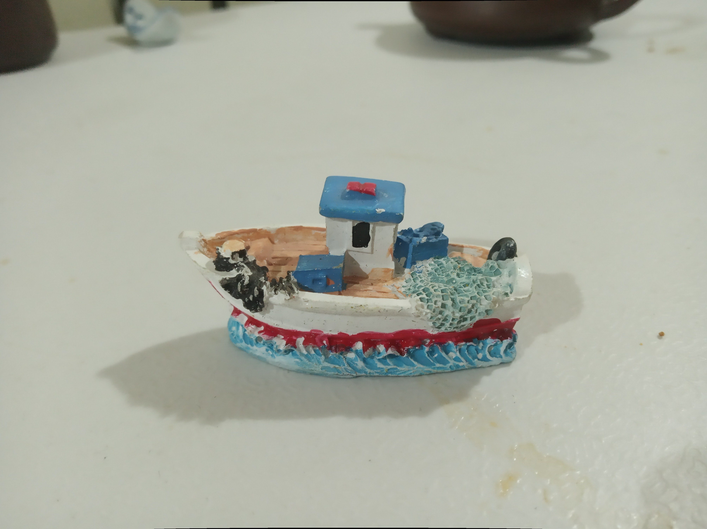
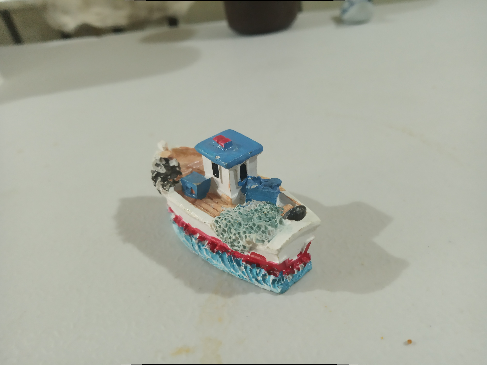

---
title: 基于 OpenMVG 和 OpenMVS 的三维重建示例
lang: zh-CN
date: 2024 年 02 月 24 日
abstract: 
category: ./index.html
footer: 我的联系方式：<lyr.m2@live.cn> 或在[讨论区](https://github.com/liyanrui/liyanrui.github.io/issues)提问。
...

OpenMVG 库实现了增量式和全局式 SFM（Structure from Motion）算法。OpenMVS 库可基于 openMVG 库估计的相机参数和特征点集，生成稠密点云及其网格模型。二者皆提供了一些程序，基于这些程序可构造出易于使用的三维重建管线，本文仅介绍该管线在 Linux 系统中的基本用法。

# 准备

我的实验环境是 Linux Mint（版本 21.3，相当于 Ubuntu 22.04），软件仓库中未提供 OpenMVG 和 OpenMVS 安装包，需从二者的项目主页下载源码自行编译安装。

OpenMVG 编译安装过程可参考「<https://github.com/openMVG/openMVG/blob/develop/BUILD.md#linux>」。OpenMVS 的编译安装过程可参考「<https://github.com/cdcseacave/openMVS/wiki/Building>」。

使用 cmake 构建编译环境时，可根据 cmake 的系统环境检测结果，安装缺乏的依赖包，该过程需要一些耐心。

用相机（手机摄像头亦可）从多个角度拍摄某个静物，获得一组照片。拍摄时，以静物表面最好不反光且以色彩丰富为要，且拍摄角度勿跨度过大，即保证每个角度拍摄的场景与邻近角度的场景有较大范围的重合。例如


<figure style="text-align: center">
  
  
  
</figure>

<figure style="text-align: center">
  
  
  
</figure>

# SfM 管线

假设在 openMVG_Build 目录里构建了 openMVG 的编译环境并编译无误，则在该目录下的 software/SfM 目录提供了两份 python 脚本 
SfM_GlobalPipeline.py 和 SfM_SequentialPipeline.py。这两份脚本分别提供了 OpenMVG 的全局 SfM 管线和增量 SfM 管线，可作为 OpenMVG 管线的用法参考，即我们无需编写程序，调用 OpenMVG 的库以实现 SfM 程序，而是直接运行 OpenMVG 提供的一组程序求解 SfM 问题。

进入 openMVG_Build/software/SfM 目录，可以如下方式执行上述 python 脚本：

```console
$ python3 SfM_SequentialPipeline.py 或 SfM_GlobalPipeline.py  图片数据目录  求解结果目录
```

例如，假设图片数据位于 `$HOME/data/ship-images`，希望使用 SfM_SequentialPipeline.py 脚本进行计算且结果存于 `$HOME/data/ship-3d` 目录，命令如下：

```console
$ python3 SfM_SequentialPipeline.py $HOME/data/ship-images $HOME/data/ship-3d
```

需要注意的是，无论是 SfM_SequentialPipeline.py 还是 SfM_GlobalPipeline.py 脚本，在求解 SfM 问题时，求解过程分为 7 个阶段。在第 1 阶段，需要提供相机焦距参数。倘若不知该参数，可使用一个公式简单估算，即照片的宽度和高度（像素）值的最大值乘以 1.2。例如，我拍摄的一组照片，宽度为 4016 像素，高度为 3008 像素，则焦距参数为 4016 * 1.2，即 4819.2。估算出相机焦距后，在
 SfM_GlobalPipeline.py 或 SfM_SequentialPipeline.py 脚本中找到以下代码：
 
 ```python
print ("1. Intrinsics analysis")
pIntrisics = subprocess.Popen( [os.path.join(OPENMVG_SFM_BIN, "openMVG_main_SfMInit_ImageListing"), 
    "-i", input_dir, "-o", matches_dir, "-d", camera_file_params] )
 ```

为 `OPENMVG_SFM_BIN` 代表的程序增加 `-f` 参数，令其值为 `4819.2`，即

```python
print ("1. Intrinsics analysis")
pIntrisics = subprocess.Popen( [os.path.join(OPENMVG_SFM_BIN, "openMVG_main_SfMInit_ImageListing"),  
    "-i", input_dir, "-o", matches_dir, "-d", camera_file_params, "-f", "4819.2"] )
```

若执行 SfM_GlobalPipeline.py 或 SfM_SequentialPipeline.py 脚本无误，在求解结果目录中存在 reconstruction_global 或 reconstruction_sequential 目录，该目录中包含了 SfM 求解结果，其中 colorized.ply 即为 SfM 算法求解的三维重建稀疏点集（特征点集）以及相机位置。对于上例，求解的稀疏点集在 MeshLab 软件中如下图所示：


其中，绿色的点为相机位置，其他彩色点集为 SfM 算法重建的稀疏点集。

还需要注意的是，SfM_GlobalPipeline.py 脚本构造的 SfM 管线对图像数据的要求较为严格，倘若该管线求解失败，可考虑使用 SfM_SequentialPipeline.py 脚本。

# 构建稠密点集

OpenMVG 仅实现了三维场景的稀疏重建，若需要生成场景的稠密点集，需要将 OpenMVG 的求解结果提供给 OpenMVS 管线，由后者生成稠密点集。

我的 OpenMVS 编译后默认安装在 /usr/local/bin/OpenMVS 目录，将该目录添加到系统 PATH 变量后，进入 OpenMVG 的求解结果目录，例如上一节示例中的 $HOME/data/ship-3d/reconstruction_global 目录。该目录中的 sfm_data.bin 文件存储了 SfM 算法求解的相机参数以及场景稀疏点集信息。

首先使用 OpenMVG 程序 openMVG_main_openMVG2openMVS 将 sfm_data.bin 文件转换为 MVS 文件格式：

```console
$ cd $HOME/data/ship-3d/reconstruction_global
$ openMVG_main_openMVG2openMVS -i sfm_data.bin -o sfm_data.mvs
```

然后使用 OpenMVS 提供的 DensifyPointCloud 程序在当前目录下生成稠密点集：

```console
$ DensifyPointCloud sfm_data.mvs
```

结果为 sfm_data_dense.mvs 和 sfm_data_dense.ply，前者保存相机参数、稀疏点云以及图像信息，后者保存稠密点集数据。上例生成的 sfm_data_dense.ply 在 MeshLab 软件中显示如下


# 网格化

OpenMVS 提供了基于稠密点集生成 Delaunay 网格的程序 ReconstructMesh，接上一节示例，该程序用法如下：

```console
$ ReconstructMesh -i sfm_data_dense.mvs -p sfm_data_dense.ply
```

上述命令可在当前目录生成 sfm_data_dense_mesh.ply，其中保存稠密点集的三角网格化结果，在 MeshLab 中显示如下


# 纹理映射

生成的网格模型，可基于图像数据为其构造纹理（贴图），OpenMVS 提供的 TextureMesh 程序实现了该过程。接上一节示例，TextureMesh 的用法如下：

```console
$ TextureMesh sfm_data_dense.mvs --mesh-file sfm_data_dense_mesh.ply
```

上述命令在当前目录生成 sfm_data_dense_texture.ply 文件，在 MeshLab 中显示为


# 体会

目前，基于多个视角的照片数据重建三维场景（单目视觉）已经具备较为成熟的开源环境，构造具体的应用程序并不困难，但 SfM 三维重建结果缺失物理尺寸信息，重建结果的精确性依赖照片数量和质量，且仅适合静物场景重建。
